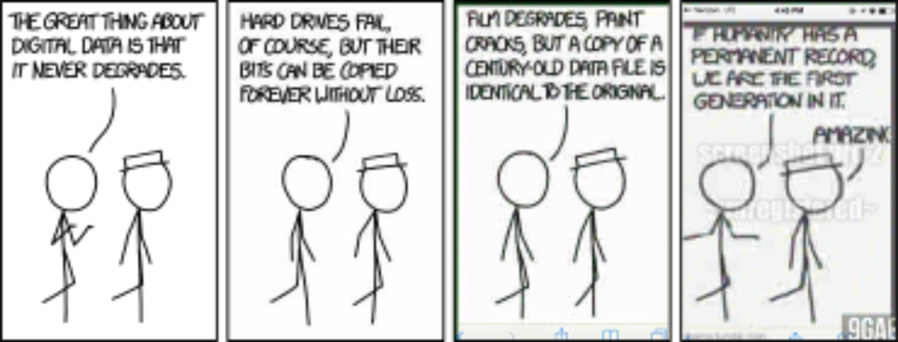

# Data, Formats, Backups, and Digital Purgatory

Yunno' what really grinds my gears?

Okay, yes, the current political climate, the idea of Software As a Service, and about a thousand other things given that I've literally got the word opinionated in this sites name...

But today, today I want to rant about digital data storage- formats, backups, and the like.

* No good backup software
* Phone<->PC is the fucking worst
  * MTP needs to die a very painful death
* All the best formats are a pain in the ass
  * format shifting sucks, opening them sucks, patents suck
* People use some really, really shit formats
* A lot of formats are needlessly complicated and not human or computer readable to anyone but the software vendor
* Data get's compressed, saved, and recompressed (ref xkcd)
  * Using Waifu-2x to unfuck images still blows
* sorting through data blows
* no 'transaction history' or global text search
* lack of file system based versioning
* why the fuck are we still using NTFS and EXT4 and not ZFS and LVM
* Hard drive vendors are a bag of dicks
  * RPM != RPM
  * SMR
  * DRamless SSDs
* Hard drives are just, bad
  * Screaming at them makes them run worse
    * I have a subwoffer right next to mine
  * Feeling the inertia in a laptop
* Cloud storage is a terrible idea

> XKCD: https://xkcd.com/1683/