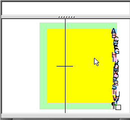

!> You are on a page that is a heavy work in progress. I don't necessarily stand by anything I've written here and this page should effectively be considered not yet published. I have decided to put it up while it is in development to encourage contributions

[TOC]

# The Way We Interact With Computers Sucks.

**What do you see when you sit down to work?** My guess is a desk pressed against a wall, maybe a few shelves, one, maybe two monitors in front of you, and a keyboard and mouse dominating the work area of your desk. How do you access information? Do you simply Google something and if it's not on the first page give up? How do you get reliable information when you have a question? How do you interpret results that you find? How do you store information you've collected? How do you filter information to get exactly what you're looking for?

If you're reading this, I'd wager that you've at least thought about this a little. Maybe you're a Linux user, deep into the tiling window manager rabbit hole. Maybe you already have a fancy keyboard, monitors surrounding you on all sides. But I'm here to tell you that no matter how hard you've tried, **what you're using still probably sucks**.

I think we, as individuals and as business, need to invest more in our work spaces, probably well beyond what most people would even consider. I'm not talking about adding a third monitor or giving everyone an artistic environment. I'm talking about setting up a work environment that's conducive to productivity as instead of merely being the medium on which it takes place, the work environment should actively contribute to finding, accessing, retrieving/storing, consuming, and creating. - where data can be anything: art, documentation, code, whatever.

# HCI?

**Human Computer Interaction** or [HCI](https://en.wikipedia.org/wiki/Human%E2%80%93computer_interaction) is an interesting topic to me. So many people spend a crazy amount of time in front of a screen , you'd think we'd have some *damn* good hardware and software to use while we further deepen the permanent butt-shaped indentation into our seats, but alas, instead most people use *ˢʰᵘᵈᵈᵉʳ* Windows.

Back in late 2018 I wrote the first version of this post and basically everything in there has been restated here but better. Since then I've talked to many others about this, read *many* other blog posts, and just generally done a lot of new things with computers and learned a lot, so here's HCI2: Electric Boogaloo.

# Why What we have sucks

## Our Input Methods Suck.

What the fuck is this shit?

[TODO, normal TKL membrane keyboard and two button mouse]

Come on, we can do better.

[TODO gaming keyboard, gaming mouse]

Really? That's the best we can do?

[TODO ergodone and Tyon]

Alright, so this is what I use. For me, this is great. It's still attainable and usable by meme mortals without infinitely deep wallets<a class="ptr">(1)</a> and using software as it exists today, but I think that's largely still because it's the furthest edge you can go from normal before things start being a royal pain in the ass, and don't get me wrong. It's not that there's not some PITA incurred from using this weird of a keyboard. Switching to a traditional keyboard will always feel weird, other people can't easily use your computer (not sure this is reallllly a downside...), configuration still basically requires you understand the basics of C programming, and some things that expect keys to be in certain places (games) will often be awkward.

But, that's not where I want to go with this blog post. There's plenty of people that have gone on for like 20 pages about how amazing [QMK](https://qmk.fm) and the Ergodox are, I want to go **deeper**.

Let me start by lubing your brain up a little.



This is [Dasher](http://www.inference.org.uk/dasher/DasherSummary2.html), a software keyboard using predictive text that should sort of blow your mind. Cool init'? Now, your thoughts probably went something like this

1. What *the fuck* am I looking at?
2. Oh damn that's really cool, I want to try it.
3. Oh, hmm, but honestly even with tons of practice I can still probably type faster on a normal keyboard...

And Yep, that's about the right conclusion. End of story, let's all go home, blog post over.

But wait?

What if -->**insert your preferred mechanical keyboard here**<-- wasn't the best possible typing experience? What would something better look like?

Here is where our story really begins. You have to start asking some questions that sound like you just smoked a bowl, please feel free to read all of the following with the mental voice of a stoned dude saying "Like, man, " before each point:

* Why do we even need to type?
* What is it we want to input in the first place?
* What makes something good as an input device?

Effectively, Just keep asking Why's and What's until we're at the core of the question.

So, let's start at the top:

**Q: Why do we even need to type?**

A: We don't. We can draw, dictate, or use any of a number of other methods. Typing is convenient because it can be kept semi-private, is tactile (assuming you're keeb isn't a 💩), and generally fast enough to keep up with the speed of thought if you know how to touch type.

**Q: What do we want to input in the first place?**

A: Text (in multiple languages), Links, Images, Diagrams, Code, Commands? Dates? Our wandering thoughts? Spur of the moment ideas? Everything. Keyboards happen to be a decent input device for some of these things, and tend to pretty much suck for others. (Come on, make art by typing in RGB values for every pixel. 𝐼 𝒹𝒶𝓇𝑒 𝓎𝑜𝓊)

**Q: What makes something good as an input device?**

A: Now I'm asking myself a hard question. It's easy to list off good qualities of the familiar: Tactile, Responsive (low latency), Customizable, No αɯƙɯαɾԃ movements, keeps the users *hands and arms (hmmmm...) in a natural position, characters laid out well for the users language (and able to be switched live). But how do you get down to the core of this question without just listing traits of 'goodness' in existing things, what actual goals should we strive for. Should it be one unified device? (Hint: Touchscreens are great, but no.) What goals out weigh others? Is ergonomics more important than tactility? **Can there even be a defined list that makes an input deice good?**

**No.**

That's why this topic is so interesting. My hands are not your hands. I play music, make art, write stories (and blog posts) and code. Part of the reason I got an Ergodone keyboard in the first place is because I was starting to experience some nasty hand cramps that were particularly bad if I was switching between guitar and typing a lot. I was willing to try just about anything, which I did. I switched to Dvorak<a class="ptr">(2)</a>, an alternative keyboard layout. That didn't do the trick so I tried the ergodone (still using Dvorak, my layout is [here](https://github.com/qmk/qmk_firmware/blob/master/keyboards/ergodone/keymaps/vega/keymap.c)) and haven't looked back. But that's left a few interesting points, ignoring the obvious reason of price, why are people still using something seems to be obviously *worse* - in a word: Familiarity.

**Frankly, fuck that.**

We can do so much better. Our phones have auto correct and limited [text expansion,](https://github.com/ianzhao05/textshot) why do our beefier systems not do something a thousand times better with their superior on board resources? Why are we not doing natural language processing so that I can verbally or textually describe to you a graph or math equation without needing to have committed to memory some archaic set of $\LaTeX$ symbol names <a class="ptr">(3)</a>. Why are so many fields limited to ASCII, or maybe UTF-8, giving us those sweet, sweet emoji 🔥🔥🔥💯💯💯💯 when we could have something that allows text, diagrams, pictures, videos, etc.

**But there's more than just the keyboard**

Oh. I know. Thank you for me for bringing me to my next points so I can get back to ranting.

**Mice and Touch pads and track balls**

Take your hand off your phone screen or mouse for a second and hold your hand in front of your face. Wiggle you fingers, move your wrists. With that last instruction what did you do? Did you rotate your hand, move it up and down, or twist it? Now, consider how each of your fingers possess such fine motor controls. Is a mouse really made to take advantage of this?

What would be better? Clearly pointing with a mouse is actually already pretty good. If you just need more functions a gaming mouse with a plethora of buttons goes a long way, but I think that's more of a stop-gap. What could we do better?

Well, There's already the Leap Motion

[TODO, Insert picture of LEAP diagnostics]

and the Lexip 3D mouse - https://www.lexip.co

[TODO, gif]

However, using the Leap for everything would require you hold your hands out to point, something that anybody who ever owned a wii can tell you gets very tiring very quickly.

I honestly don't know what the pointing device of the future looks like. Maybe it involves a mix of a mouse, finger tracking, eye control, and joysticks.

As for issues with current tech, mouse acceleration and touch pad responsiveness, and touch pad dead zone are all big problems and, like, I don't understand how that's a problem in 2020?

To give credit where credit is due, there have been minor changes that are trending positive, such as Logitech's MX Master Line with the infinite scroll wheels, and a general trend for reducing latency and increasing customization options of higher-end mice.

Unfortunately, the drivers for configuring these options are still largely proprietary and anything but standardized, meaning making **native integration** all but **impossible**. Of everything listed up to this point, I actually think this is the biggest problem. Without a consistent, extendable interface about the best that can be exposed is awkward hacks where joysticks are mapped as if they're on a full game controller or keys just mapped to a macro of keyboard keys or existing but unused keys like the F13 though F24 keys or scroll lock. This is a massive problem. 

**Foot Controllers**

I have multiple foot based inputs on my system. The most notable is probably the [Stinky Footboard](http://www.stinkyboard.com) in which I have swapped the controller to run aforementioned QMK - it's effectively just a 4-key mechanical keyboard. I also have a [MorningStarMC6](https://www.morningstarfx.com/mc6), a MIDI foot controller that can also take expression-pedal inputs (see the below picture:)

[TODO pic of both MC6 and Stinky]

And, don't get me wrong, both are great. Being able to use my feet to control my system really allows for a lot of flexibility; however, your feet can only do so fine-grained of control. Unlike keyboards where our fingers are great at hitting a bunch of individual keys, we're better at hitting smaller buttons or controlling pedals (think pressure sensitive like a gas pedal) with our feet. So, with that in mind, you only get a limited number of inputs you can practically control, so those inputs really need to count. That's the problem. They really don't.

Even with all the power that using QMK gives and all the configuration options exposed in the MC6's config editor, they lack one big thing: **Context sensitivity.**

Essentially, if my inputs are limited, there's a limited number of solutions. The MC6 does offer multiple pages of inputs by stepping on two buttons at once to either page up or page down, but that's not as good as just sending messages to the device to let it know that I've switched what I'm doing and that it should switch it's active page/profile/whatever accordingly, the problem there is that has to be set up manually. With context sensitivity in theory devices could change the way they behave to be optimal for what you're working on. Right now I have the Stinky Footboard set to control media playback (⏯️, ⏭️, ⏮️, 🔇) but that's currently *all* it is set to, and that seem like a bit of a waste. Sure, I could set up multiple profiles, but without them being context aware that's a bit of a moot point. And, alright, I think the original driver software for it as well as the software for most of my 'gaming' peripherals supports checking what the running program is, but that seems like a really bad solution and instead should be something the OS handles by letting the devices send generic button up/down events and doing **ALL of the mapping in software**.

The other relevant point would be the ability for inter-peripheral communication - basically, your mouse should be able to 'talk' to your keyboard and vis-versa. This becomes a bit redundant if as mentioned above all the mapping and meaning of buttons is defined in software, but the point would be that a key-combo could change your mouse's DPI, or holding a button on your mouse could put your keyboard into a one-handed mode.

**Pen Tablets**

Honestly, most pen tablets are reasonably good. Not all of them have great latency, map super well between the pen's nibb and the actual pointer on the screen, and the majority *don't* support touch, which probably isn't ideal.

*Waring, the following is a rant about drivers on Windows:* This is interesting as the hardware is actually reasonably competent, while the software is largely so incredibly god awful that it is somehow impressive. While I realize this is totally anecdotal, one pen tablet I've used on Windows the driver software is so bad that it actually randomly takes over as the focused application about once every 15 minutes, meaning whatever line you were in the middle of drawing just *stops* and you have to click on the program again to keep going. But, like, even with more competent driver stacks there's like a 6 different options for pen pressure: Wintab, Windows Ink, the option to 'Use the device as a mouse pointer' ... It's so incredibly confusing and the required options per application vary wildly. To make matters worse, most of the drivers completely shit themselves if one display is scaled for HiDPI and another isn't. On Linux, ironically, I've actually had very good luck with pen tablets. 

But even then most don't handle pressure in a way that's customization in a good way, instead relying on software to do pressure-mapping, which just isn't great. It's often a serious pain in the ass to get it set  𝘫𝘶𝘴𝘵 𝘳𝘪𝘨𝘩𝘵  so that you don't get crazy pressure jumps and even if the driver has in-driver calibration, you still usually have to tweak it more in the specific art/drawing/art application so now you have TWO pressure maps and it begins to feel like trying to balance a double pendulum.

I do still think there's more room for improvement in the hardware too. I think [Microsoft's Surface Studio 2](https://youtu.be/RmVAbB3M-4Y?t=45) actually had some really interesting and innovative ideas albeit it's a *weee bit* on the expensive side at 3,500 USD. I also think the [HP Sprout](https://www8.hp.com/us/en/campaigns/sprout-pro/overview.html) did some really neat things too. Unfortunately, I highly suspect both will suffer from poor long term support.

I also think there's room to allow for workflows that rely more on the physical, possibly something like [Dynamic Land](https://dynamicland.org) or even just the [iskn](https://www.iskn.co) Slate or Repaper (Note, I tried the slate and it really, really sucked. But the *idea* was interesting.)

**Audio And Video**

Your **webcam** is shit. You know how I know? Because it's a webcam. Even the everybody's go-to, the Logitcech C920, is shit<a class="ptr">(8)</a>. You know what else is shit? Your microphone. When you type on a laptop it sounds like damn earthquake, and if you get comfortable and lean back in your chair you suddenly get quiet. But more than anything it sounds like I'm carry a call over cans on a string. Maybe you have a gamer headset. Cool, the boom mic sounds about as good somebody screaming through a cardboard tube.

But, better cameras do exist, and if you are willing to shell out the cash you can get a decent mic, but either way they have a problem.

The default settings are still shit.

On webcams you have auto-white balance, auto-focus, auto-gain, etc. and everything it tries to do is awful. On a laptop where it will legitimately be in a different setting regularly, that's some-what forgivable, but on a desktop webcam? Like, the only variable here is if there's a window letting light in. Make calibration easy and give me a white-balance slider. Please. Or just make better cameras and let the open source community make better drivers. I assure you there are pleanty of rage-filled nerds willing to make your product not suck so hard.

Your mic is also shit for the same reason. When doing audio mixing for a video or podcast there's some basic things that will almost always be in the mix chain: A noise supressor, A De-Esser, A Compressor (or multiple), and an Equalizer. For the most part, the settings on these things can be determined pretty algorithmically, or, better, a database of settings for hardware can be created and maintained - You'd still need to adjust for your voice (particually for if you have a low or high pitch voice) but it could massively help.

If you have gone out and gotten an expensive mic or audio interface to plug you mic into, you may have decided to get one that connects to the computer and is **powered by** USB. This is really, really dumb. I think every audio device I've ever used that connects via USB has had some sort of noise issuse because of the USB power. Stop it.

Though, probably the most obnoxious thing that results from this is the inablity to route audio in any reasonable way. Linux and Mac it seems have this done semi-well, Mac with Core Audio and Linux with Jack, but on Windows if you want to use a nice mic to talk on VOIP you better hook up your mic on the the first input on the audio interface or you're shit outta' luck my friend. 

I'll expand on this thought later, down in the **Your Audio Sucks** Section.

Finally, *nobody* has ever wanted their notifications to show up when sharing their screen. Why are notifications not deemed as a sort of 'draw over' elment by default?

**Aplication Specific Controllers (MIDI Controllers, Video Editing, etc)**

First of all, this is done in a stupid way in most circumstances<a class="ptr">(9)</a>. There's no reason you should have single use hardware that sends specific commands that are not programmable by the user. Like I said, let's do all the mapping in software. This lets feauters be added later and users make better use of their controllers.

But, let's look at some of what exists, and why I'm saying this. While other devices exist to pick on, I'm gong to focus on MIDI controllers as they're what I know.

First though, for those unfamiliar, what is a MIDI controller? MIDI, or Musical Instrument Digital Interface is a bloody ancient standard that's still (mostly) 7-bit and let's you send contol messages about actions on a controller made for music, often a piano keyboard, so, something like Key C4 Down, Velocity 8 or twisting a knob may be on a MIDI Control Channel (CC) and will be like CC43 changed to 127. Obviously in 2020 having a 7 bit standard is a bit archeic, and it's a rather stupid that it's taken until earlier this year for the improved MIDI 2.0 standard to even be ratified, but I digress.

MIDI controllers come in all shapes and sizes, from a grid of RGB buttons to traditonal keyboards to just a large array of knobs, so, naturally people took notice, and MIDI can therefore be used to control things it was never, ever meant for. People often try to use it to control video editors, 3D modeling software, and generally anything that Adobe<a class="ptr">(10)</a> makes.

[TODO Picture of MIDI Controllers]

So now we have a crazy amount of controllers using a shitty standard instead of something that actually exposes more data and allows for finer control being used in ways that abuse the protocol instead of just exposing raw button down/up events and knob twists to the OS.

> Note, I'm being careful to say button up and down events instead of button press. This is because it makes a lot more sense to exrpess the events as raw as possible so the OS can do things like detect a double-press, long-hold, etc.

**Voice Control**

The first thing I want to point out is how incredibly English centric voice control is. I only speak English so I lack any more to say on the subject, but come on.

Next, why can my phone do voice control but my computer either can't or just really sucks at it. I know you can use OkGoogle from Chome, That Cortanna is a thing, and that there's multiple open source projects that impliment voice control. But, they all sorta suck. None of them can do much beyond just setting a timer or working with a limited set of supported applications in a way that fails more often than not. 

If anything, I think Alexa is a bit ahead of the curve on this making it semi-easy to add custom actions, but does *anybody* actually have Alexa For PCs installed on Windows?

I want voice control that can actually -do- something. Not 15 competing standards. It's okay if they all impliment the same standard protocol, but unless there's a standard that all programs can start tieing into and it's given real, time saving capabilities nobody will use it. This mostly comes down to needing much, much better natural language processing - something that [GTP-3](https://en.wikipedia.org/wiki/GPT-3) has shown is possible - and having a way for applications to define accesible inputs and outputs. Think the Unix Philosophy where things can be piped and IO redirected but applied to larger applications and controled via voice or text entry.

**Object Tracking**

What if everything you did was an actionable input? What if you could finger-drum on your desk and get real drum sounds, have your computer pause a video if you get out of you chair, or give the user a warning if they've been sitting with a bad posture for a long time? Between the Kinect, [Leap Motion,](https://www.ultraleap.com) and [Tobii Eye Tracking](https://www.tobii.com) we're staring to get close to this.

I think https://dynamicland.org has a lot of interesting thoughts on this idea and if this vision of the future interests you, you should check it out.

[ReacTable](https://www.youtube.com/watch?v=Mgy1S8qymx0&ab_channel=ReacTj) is another interesting concept in the relm of pyhsical computing

**Game Controllers**

Re everything above. Something something make sure they're rechargeable, ergonomic, and simply fun to use. My award for Not Sucking™ goes to the Steam Controller and my award for Best For People With Three Hands™ goes to the N64 Controller.

**RFID Tags**

I have RFID tags from Dangerous Things in each hand, I have an RFID based access card for my University, and my parking lot uses RFID tags for entry. Ignoring the obvious security problems with RFID authentication, It's also just not great to have people carry around a card when their phones can already act as an RFID device anyway, it just makes for a very mis-placeable access token which seems rather stupid.

**Document Scanners**

I will not take this opportunity to rant about printers, no matter how much I want to.

To keep this short: Higher default DPI, options to output via OCR (Optical Character Recognition) directly to the document so you don't have to even store the original document, built in de-noising (remove the dust specs), live scanning of paper via camera for things like helping with math.

**What's worse is half this shit already exists, and it is shit.**

Want to look up $LaTeX$ Symbols? [Done.](https://detexify.kirelabs.org/classify.html) Want to have Optical Character Recognition on your screenshots? [Textshot has that covered.](https://github.com/ianzhao05/textshot) But while I could go on with this list the big problem is of *integration* While having an OS like Linux that is tweakabe to the nth degree is unmistakably *fucking incredible*. I also **shouldn't have to**. I should be able to use any computer and trust the OS to have built in methods for getting text from a picture, to trust the OS will let me remap keys so that tapping the [shift keys types perentheses](https://docs.qmk.fm#/feature_space_cadet) or that I can bind the keys to type arbitrary Unicode. The OS should have a **local** - *don't you fucking dare collect all of this data* - store of everything I've looked at so I can go back and search for "mostly purple images" or "links clicked on October 12th". And like, there's about a dozen different chrome extensions that try to do this under the very stupid assumption that essentially all of that interaction will be in browser.

## Our Physical Environments Suck

### Your Chair Sucks

Did you get a gaming, racing chair that cost like $65 off of ebay? Yeah, you'll regret that one soon enough.

Even if you got a normal office chair, if it wasn't exorbinantly expensive it probably sucks. I did like two weeks of stressing about finding something good and thankfully finally got a good recomendation from a friend, but otherwise it's like $500 SteelCase chair or having a bolt poke though the butt-foam until it's leaving a premanent identation.

It's not like we even *need* innovation here, (as proven by the influx of hot garbage 'gaming' chairs) we just need something affordable that's not garbage or plauged by fake reviews or reviews from another product attached to the new listing (Fix your shit amazon.)

But, I'm here to talk about the future, so what do I think can be better than anything I've even seen? Well, a good start would be threshold latches. Nicer office chairs often have a lock for allowing leaning back or not, but it'd be great if it was 'locked' until a pressure threshold so you can lean back and streach without un-locking and necessiting re-adjusting the chair, a sort of temorary un-lock done by just leaning back harder.

But the biggest reason your chair sucks? It's a chair. I'm not advocating for a treadmill desk, or sitting on one of those big ball things, I'm simply saying having the only reasonable way of interacting with our second-brains being in a seated, unmoving position does nasty things to our bodies. While it would make more sense to adapt our peripherals and input methods, it's worth considering how we may re-shape our seats to work with us. A little while ago ["I built a lay down desk"](https://blog.luap.info/drafts/i-built-a-lay-down-desk.html?hnn) was trending on Hacker News, and it's something I'd considered before too, but I want to think bigger: What if our desk and chair acted as one piece of furniture, one that was flexible between sitting, laying, and standing positions, and the chair bent to an appropiate shape to match the position of the desk? [Design doesn't have to be static](https://youtu.be/xN9hTo3iR6A?t=182).

### Your Desk Sucks

**or 'why the fuck is it so hard to find a deep desk with a keyboard tray'**

I've gone though wayyyy to many desks. What I'm currently using is a nice big un' with a surface that is 5' x 2'4" and it's still. not. big. enough. (for reference, a 'normal' cheap desk seems to be ~3' x 1'8").

And, alright, I admit, I'm not a typical computer user. I have enough devices hooked up that `lsusb` gives me 28 lines of output, I have 3 monitors + a pen display, and my desk is also home to a whole host of lab equipment, a eurorack setup, and other various things. 

[TODO, picture here]

But even I think my desk sorta sucks.

Hear me out. First of all, I have a bad knee. Not like I'm walking around with a cane bad, but more like if I sit in one position for more than ~20 minutes and then move it I get a sharp pain like someone just drove a hot knife directly into it, but it only lasts a second. Yunno' what would be a major help with that? A sit / stand desk (height adjustable) desk.

But that won't work for me, and probably a lot of other nerds reading this for one big reason. **Wire. Hell.** Like, maybe you're thinking *"Pssh, what, so you have like a dozen cables down there, power, display, USB mouse/keeb, and audio"

Ha. No.

I won't try to list it out, but Oh. My. God. A sit stand desk wouldn't be possible because that wire hell is truly **untameable** in it's current state, so, we're gonna take a brief detour from the desk stuff:

**You Are Now Entering: The Cable Abyss.**

I could rant to you about how USB-C with it's 42 different standards is a god damn nightmare, and that'd even be pretty relevant here. But that's not the rabbit hole I want to fall down right now, instead I want to introduce you to my friend, MIDI.

MIDI Is a fucking shit of a standard. It's 7 bit, ancient, and the 'standard' <a class="ptr">(4)</a> cable for it has (ᵈᵉᵖᵉⁿᵈᶦⁿᵍ ᵒⁿ ʰᵒʷ ʸᵒᵘ ˡᵒᵒᵏ ᵃᵗ ᶦᵗ) 3 more pins than it even uses. By all metrics it fucking sucks. ***However***, They did do one thing right.

This, beautiful, beautiful port:

[TODO, MIDI THRU pic]

This, is a midi through. On most gear, it's accompanied by (at least) a MIDI IN, so, you can take your MIDI info in, and then, because a single midi cable carries 16 channels, chain other gear on.

```
From this,                             To This.
                 +--------+
          +------>Device 1|
          |      +--------+
          |
 +----------+    +--------+            +----------+   +--------+   +--------+   +--------+
 |Controller+---->Device 2|   +----->  |Controller+--->Device 1+--->Device 2+--->Device 3|
 +----------+    +--------+            +----------+   +--------+   +--------+   +--------+
          |
          |      +--------+
          +------>Device 3|
                 +--------+

```

And, okay, so what? Well, I'll tell you what. This is rad as hell. I currently have 3 6' Display Port cables running from my desktop on the floor up to my displays on my desk. The monitors are 4k and get pissy if I go over a 6' cable, so with my tower on my right, the left-most monitor has to have this perfectly 45' cable making the connection, so I can't even organize the cables in the first place. But what if I could just route all of that to one monitor then piggy-back each one going forward?

I'm not going act like this doesn't have issues. I get it. There's questions of signal integrity, making sure everyone follows the same standard (obviously can't do that...), and realistically it would probably mean adding more conductors and increasing cost. I get it. But I also see a ton of other benefits, especially if we made that same monstrosity of a cable capable of a fair amount of power. The same 12V ATX PSU in the desktop could justifiably power the monitors, giving us the efficiency gain inherit in using 1 PSU over the god only knows how many fire hazards that are currently on chained power strips down there.

**Departing Cable Abyss Hell, Back to your Regularly Scheduled Ranting** 

Where was I? Ah, right. Desks.

Next is adequate space for interruptions. While I'm a strong proponent of [separating a space's responsibilities](https://www.youtube.com/watch?v=snAhsXyO3Ck&ab_channel=CGPGrey)- (not eating where you work, not working where you consume media, not consuming media where you sleep, etc. - I understand that sometimes it's necessary, and there's nothing worse than not having a flat surface to put your bowl of soup on.

So, why are these not more common?

[TODO, picture of desk with pull out shelves/wings on the sides]

More practically though, as mentioned before, it's ideal if the mouse and keyboard aren't in the way of desk space that would otherwise be used for physical craft, note taking, art, etc. So I think three spaces total are ideal: one for primary input devices- today that's a mouse and keyboard; a second for papers, a main project, etc; and a third that is easily accessible added for the interruptions and side projects in life.

### Your Audio Sucks

There's a huge range of audio systems. You might not be able to have speakers at all and have to use headphones, maybe you have an awesome setup running [Dolby Atmos](https://en.wikipedia.org/wiki/Dolby_Atmos) like [Deadmau5's](https://www.magneticmag.com/2016/05/deadmau5-shows-off-the-completion-of-his-new-home-studio-finally/) where the room and speakers have been engineered he can virtually drop an instrument on the sound stage wherever he wants.

But nothing like that is even needed in order to make things suck less.

How many times have you watched a YouTube video where the speakers voice had far too much bass or masked by a high pitch whine? How many streams have you heard where there's some hum or annoying background noise? I'm sure you've turned up your audio because something is quiet only to have your ears ravaged as soon as the audio is fixed in the stream.

All of these things are totally fixable using a mix of hardware and software.

!> before I get into all the following, I'm not saying all of these things should always be in use. For example when somebody is making music all of this obviously needs to be able to bypassed.

**Why *the fuck* do we not have a system-wide limiter?**

And not just a dumb decibel limiter, but a [loudness (Wikipedia)](https://en.wikipedia.org/wiki/Loudness) limiter. There's no reason there shouldn't be a toggle-able limiter to protect your ears

**Why *the fuck* do we not have per-stream audio compression?**

Not file-compression but volume-compression. the 'make loud sounds quieter and quieter sounds louder' kind. Generally this is something the music industry over-uses and it doesn't sound great on music, but for voice it can make a huge difference for keeping things understandable and not distracting. Ideally this would be done before the content is ever published or sent though the network, but that won't ever be the case. So, you should be able to easily take any audio stream (say, a YouTube video playing in a tab) and apply a compressor to it.

**Why do we not have live Speech to Text?**

Not all systems will be able to do this live without completely shitting the bed because of lack of processing power, but as our graphics cards are now including specific hardware for doing AI/ML based computation, there's no reason we sholudn't be using in the OS for the sake of grabbing the text out of all audio that goes in or out of the system. (of course, storing it securely and locally, nobody wants to wiretap themselves)

**Why is Audio and Video Not Routable?**

Alright, so this is mostly a dig at Windows, where everything is Garbage. Mac has CoreAudio which is pretty cool, and Linux can mostly do this for audio via [Jack Audio](https://jackaudio.org/faq/about.html) and work is being done to make something for both audio and video with [Pipewire](https://pipewire.org).

[TODO example pic of catia and pipewire]

The reason this is necessary is with routable audio and video you can do things like route your webcam's video first though software that does some video effects, then to a recording program and to a streaming program easily. Sure, this can be done anyway right now, but it often means creating a 'virtual' webcam in the middle, and this scenario was already a fairly basic one. If you add in the aforementioned limiting and compressing as options you can see where this starts to matter.

**Why are we not calibrating our audio devices?**

[TODO] https://github.com/jaakkopasanen/AutoEq

### Your Displays Suck

[TODO : Eink displays, display tech, non-pixel displays are good]

I'm going to assume that if you're reading this you're probably using at minimum a 1080p, 60hz monitor. And like, yeah 2073600 is a ton of pixels. If you assume the normal 8-bit per R-G-B (24bit color) then you get ~2.98Gbit/s which is already pretty impressive if you think about it, but then consider that even cheap single board computers are starting to be capable of 4k, 3840x2160 which at 60hz is ~11.94Gbit/s and, alright, that's already undeniably really cool. But, unfortunately, super not enough and already causing problems. 

If you're like me and running 4k @ 60hz, you've likely had at least some issues as a result of this. Lower quality Display Port <a class="ptr">(6)</a> cables can cause occasional flickering, you're probably limited to 6' DP cables. The reason I bring all of this up at the start is because I want to fully acknowledge that every extra bit we try to push down that pipe is pushing that even further and making it even more expensive.

But, let's go to more day-to-day concerns, the things that suck even assuming everything is working fine.

The first thing is obviously **resolution**.

4k is far from normal still. 1080p just is not enough. It's super easy to see the individual pixels from even a comfortable distance and text is pretty unclear unless sub-pixel rendering<a class="ptr">(5)</a> is used, but that makes things even worse because not all displays use the same sub-pixel layout.

Another problem with resolution is that ohmygod does scaling suck. A ton of applications, especially older ones, were made with the assumption that you'd be viewing everything on a 1080p or lower resolution. In general the move to 1080p actually wasn't felt as much because the size of our displays increased with their resolution, increasing work area but keep the application size roughly the same. The problem is with the move to 4k we're dramatically increasing pixel density at often the same screen size, so everything is ᵗᶦⁿʸ. Software scaling in the OS is pretty universally garbage, with some applications scaling in a way that looks super blurry, some being double scaled as both the OS and the application try to compensate, and some applications just not scaling at all. Because this is inherently a complaint about legacy support there's no easy solutions here. Using 4k instead of other  higher-than-1080p resolutions helps, as integer scaling (scaling exactly 2x) is an option as 4k is exactly equivalent to four 1080p screens stitched together, so you can just map 4-pixels in hardware to 1-pixel of what's trying to render... or you could, if we hadn't already tried to use aforementioned sub-pixel rendering.

I'm not sure that there's really much need to go beyond 4k. While I haven't even personally seen anything higher, I also can only pick out individual pixels when there's like, one lit pixel on a dark background, and I don't know that more innovation in resolution will really matter. Instead, there's a pile of other outstanding issues.

> Little aside first. Some jackasses decided even on digital displays [interlacing](https://en.wikipedia.org/wiki/Interlaced_video) should be a thing. I don't want to lose focus here, but I want to at least mention this, which you'll often see listed as 1080i or 720i, is shit.

**Refresh Rate**

Do a little experiment for me real quick: try changing your display to 30Hz. Most displays will support it.

Now move your mouse around in circles, try doing something where you need things to respond quickly, like playing games.

You'll probably notice it directly, but if not, you will likely at the very least feel a bit motion sick.

Now, realize that the vast, vast majority of displays are only 60hz. Double that, sure, but I think you could easily see how more would be great. This is exactly why most displays sold for gaming advertise being higher refresh rate, often 144hz or more. This is where my above commentary on throughput of DisplayPort and reliability at high rates. If you look at the [Display Port (Wikipedia)](https://en.wikipedia.org/wiki/DisplayPort#1.4) you can see this problem has been mostly addressed, but that only means so much if cables are shit and monitors that are both high res and high refresh rate cost both arms and a leg. Obviously this should get better with time, but it's still a problem.

Some displays may support Freesync or Gsync <a class="ptr">(7)</a>, and both of these technologies require a supported graphics card in the system as well. These allow the display and computer to adaptively change the refresh rate so the monitor and computer both send and display frames in sync, which can make even a low refresh rate 'feel' much higher. This is a feature typically marketed to gamers and only supported in video games, but this has been changing a tiny bit. The big thing to note here is that it's dependent on the frame rate of the application that the user cares about, you could, I guess, sync to your your compositor's (the thing that draws multiple windows onto the desktop simultaneously) frame rate, but I don't think there could even be any benefit there. So, really, this is mostly applicable to games as there's a few other applications you'd even want to run in full screen where this latency and responsiveness improvement would matter.

related to refresh rate is **latency**. In general this can actually mean two things, one is how long it takes for an image sent to the screen to actually be displayed. The lower this time the better, with good screens being sub 10 millisecond. Unfortunately, there's no standard among the industry to measure this and many get it wrong.

Also with latency there's grey to grey times, this is a measure of how long it takes a pixel to go from one shade to another. The lower this is the less motion blur the screen will exhibit.

This, to me, is a big deal. Latency is something you can *feel*. If there's a long total input lag between the time you click something and that action taking place, that's a big fucking problem- and long here doesn't even mean all that much time:

> Testing has found that overall "input lag" (from controller input to display response) times of approximately 200 ms are distracting to the user.[[6\]](https://en.wikipedia.org/wiki/Input_lag#cite_note-6) [(Wikipedia Article on Input Lag)](https://en.wikipedia.org/wiki/Input_lag)

So, the time it actually takes for your display to update once it's gotten a frame is not irreverent.

**Dimming**

Unless you're a fan of melting your eyes out of their sockets, you likely do not have your display set to maximum brightness. Unfortunately, dimming on most displays is absolute garbage.

Instead of doing DC dimming, that is just lowering the voltage of the back light so it is dimmer, the majority of displays do PWM, Pulse Width Modulation, Dimming. 


> PWM image by [Thewrightstuff](https://commons.wikimedia.org/w/index.php?title=User:Thewrightstuff&action=edit&redlink=1) CC BY-SA 4.0

So instead of just lowering the level directly, the back light is turned on and off rapidly, for a varying amount of time. This might be done really fast, sometimes it's fast enough that it really does not matter or there's a reasonable amount of capacitance to smooth this out, effectively making it look like just a DC signal again, good enough. Sometimes, the manufacture sucks and uses shitty, low frequency PWM dimming and even if you can't consciously see it, it will cause headaches and generally suck over long periods.

<video width="70%" height="400" controls>  <source src="../media/pwm.mp4" type="video/mp4">  <source src="movie.ogg" type="video/ogg">  Your browser does not support the video tag.</video>

> This is PWM dimming on a fourteen-segment display captured with the 'slow-mo' camera on my phone.

In this video, because it is so incredibly slowed down, you can see the led's flash easily, but at that middle setting I can easily see it in real-time too and it is headache inducing. At the lowest or highest settings it isn't noticeable. [Persistence of vision](https://en.wikipedia.org/wiki/Persistence_of_vision) is why this even works in the first place, but obviously that has limits and crappy PWM dimming on an otherwise nice display can really, really suck.

This has put me in the crappy situation before of having to set the display to max brightness to avoid the headache from the strobing effect (Pulse width at 100% means constantly on so just DC), but dealing with being blinded by any application with a white background.

**Color and Dynamic Range**

If you have multiple displays that aren't exactly the same you know just how annoying un-matched color can be. This is a harder problem to solve than some of the others. Color calibration definitely helps, but that only means so much when the actual display technology may be different. an LCD will look different than an LED will look different than an OLED even if they're color calibrated to match. This, I think, is actually reasonable. What is totally unreasonable is how digital color looks in the first place. Let me start by linking a video:

<iframe width="100%" height="500" src="https://www.youtube.com/embed/h9j89L8eQQk" frameborder="0" allow="accelerometer; autoplay; clipboard-write; encrypted-media; gyroscope; picture-in-picture" allowfullscreen></iframe> 

This sucks. Like, why have we accepted this? Sure, things like [High Dynamic Range (Wikipedia)](https://en.wikipedia.org/wiki/High-dynamic-range_rendering) or HDR - which allows the panel to selective change the brightness in an area of the screen, giving much better dynamic range in supported applications - have helped with this problem indirectly, but it's still not great. 

What we really need is to finally step up from [24bit color](https://www.cambridgeincolour.com/tutorials/bit-depth.htm) to something better, and in fairness, this has been happening. A lot of newer monitors do support 10bit per channel ([30bit color (Wikipedia)](https://en.wikipedia.org/wiki/Color_depth#Deep_color_(30-bit))) and some do 12-bit. Unfortunately, at higher resolutions this sometimes requires trading refresh rate for color depth (want 30bit color? You'll have to run at 30hz.) 

You're also likely to notice the color gamut or what range of colors the display is actually capable of displaying.

For example, two displays may both be capable of displaying 255 levels of red, but if one display's range is only from a dingy red to a dark-ish red, while the other is from a brilliant red to a deep dark red, there's a massive difference in color availability. If this is important to you, notably as a creative professionally in photo or video, you may want to read more on the Wikipedia page for [Color Gamut](https://en.wikipedia.org/wiki/Gamut). In general, displays particularly suck at displaying a wide range of green.

Next up is **dynamic range**, or how deep the blacks are and how vivid the whites are. Here, OLED is probably the best as it can display true black by actually turning the source of the light off, but unfortunately these are quite susceptible to burn in and image persistence, plus moving the image quickly can result in a 'purple smear' - something you may have noticed when scrolling though images on your phone.

> Note, OLED isn't really ready to be used for normal desktop or laptop monitors yet, as it can suffer from really bad burn in or image persistence. Looks great for movies, but when you have un-changing elements on screen for hours at a time it's not ideal.

## Your Space Sucks

### Noise

### Lighting

[TODO] warms vs cool, brightness, ambi-light

### CO2

<iframe width="100%" height="500" src="https://www.youtube.com/embed/1Nh_vxpycEA" frameborder="0" allow="accelerometer; autoplay; clipboard-write; encrypted-media; gyroscope; picture-in-picture" allowfullscreen></iframe>

Alright, so after seeing this I went out and got a [CO2 meter](https://www.co2meter.com/collections/desktop/products/co2mini-co2-indoor-air-quality-monitor). I watched it get above **2000ppm** regularly. I took steps to lower it and now, honestly, I do feel better.

## Finding Information Sucks

## Transferring Information Sucks

### Networking Sucks

### Transferring Your Profile Sucks

 AnIdiotOnTheNet's Comment on [This Hacker New's Submission - 'Re-Thinking the Desktop OS'](https://news.ycombinator.com/item?id=24783387)

> [...]
>
> 5) Switchable "user profiles" instead of "user accounts", which are an artifact of giant shared computer systems. User profile just contains personalized settings and can be located anywhere, including removable media so you can take yours to other computers. If you want to keep things safe from others, encrypt them. Otherwise there are no permissions except those applied to applications themselves.

## Accessing Information Sucks

### Local Backups By Default

# Authentication Sucks

File Permissions

user/password/2factor

### [Storing Information Sucks](Blog/DataAndBackups)

?> This section I've put in a complete other article because It **sucks so hard** that it deserves it.

## Presentation of Information Sucks

!> I'll be the first to admit this website isn't the best on this. I put [The list of Generative Design Tools](Design/d5-gen) in a MarkDown Table for fucks sake. I know. But, We'll get to that in a bit, in the Creating New Information Sucks section below, and I hope to convince you that isn't necessarily my fault.

### 'Dark Patterns'

[This Site](https://darkpatterns.org/types-of-dark-pattern.html) has a lot of really good info on this, and I recommend heading over there and then coming back over here. 

<link rel="stylesheet" href="https://www.w3schools.com/w3css/4/w3.css">

<div class="w3-container"><p><button class="w3-button w3-green w3-round-xxlarge w3-block">DO THE THING HERE</button></p></div>

<div class="w3-container"><p><button class="w3-button w3-black w3-tiny w3-round-xxlarge">or don't and watch the world burn</button></p></div>

where the design is actively pursing an agenda. Instead the affirmative action should be stated on the button that triggers it and both actions given equal weight to the user.

<div class="w3-bar">
  <button class="w3-bar-item w3-button w3-red" style="width:50%">Don't Do Action</button>
  <button class="w3-bar-item w3-button w3-green" style="width:50%">Do Action</button>
</div>

Not here by Action I literally mean to **include the verb.** Delete. Replace. Print. Etc. Yes or No *is not* good enough.

With destructive or irreversible actions, such as deletion (not recycling), given a confirmation dialogue, and if particularly important, a dialogue that require *meaningful* user input, like this prompt when deleting a repo on GitHub


### Information Overload

ʸᵉˢ ᴵ ˢᵉᵉ ᵗʰᵉ ᶦʳᵒⁿʸ ᶦⁿ ᵃ ᵖᵒˢᵗ ᵗʰᶦˢ ˡᵒⁿᵍ


> Bobby Mikul, Times Square :CC0 -- [Source](https://www.publicdomainpictures.net/en/browse-author.php?a=2185)

### Updates after Initial Draw

re-arranging menus

### Everything needs to be more damn responsive

*Fuck your 𝒻𝒶𝓃𝒸𝓎 animations.*

## Creating New Information Sucks

**Or, People Will Only Make Stuff That Is As Good As The Tools They Have**

!> Note the **Will** and not **Can**. A very talented musician can make [a shovel](https://youtu.be/IyQOw-_H4yE) sound good, a talented photographer [doesn't need a good camera](https://www.kenrockwell.com/tech/notcamera.htm). But in general that's setting the required bar of talent - and therefore time - higher. The better and more efficient our tools are, the better content people can make without putting in more time than they're willing to. 

I think I've generally made the case that our tools suck so far, but here's where I think things can get really interesting.

## Oh, and our systems are fucking racist and suck for anyone with special needs.


# What's Else Is Needed?

## Script all the things! But Not Like That™

Visual Programming but still supporting text based programming, natural language scripting

everything is a file/folder (inc. full programs)

## Optional Security

Temple OS philosophy

## Backwards Compatibility via Compatibility Layers

 AnIdiotOnTheNet's Comment on [This Hacker New's Submission - 'Re-Thinking the Desktop OS'](https://news.ycombinator.com/item?id=24783387)

> [...]
>
> 7) Backwards compatibility should be a high priority, but accomplished via shim layers and/or emulation and/or vms when clean breaks are necessary. A wide array of such should be included with the OS from the beginning. In 2020, there is no excuse for not being able to run old software."

Excel date bug

No reason we shouldn't be able to run very old shit, but also no reason to use that as an excuse against moving forward.

Hardware compatibility via FPGA modules

## Hardware Modularity, Repairability, and Customization


## Network Transparency


## The Ability to go Back In Time

updates, file changes, or just scrolling on a screen - a refresh sholud let you return to the previous state, past notifications should be accessible 

## Open Sensors and Generators

SDRs, new IO options (something shittier than USB, cheap, and extendible), open IOT


## Software that breaks the mold

https://github.com/SolarLune/masterplan

### Hardware for Open Expirimentation

Microfluid computers, diode logic, GPIO


7) Backwards compatibility should be a high priority, but accomplished via shim layers and/or emulation and/or vms when clean breaks are necessary. A wide array of such should be included with the OS from the beginning. In 2020, there is no excuse for not being able to run old software."

<blockquote class="twitter-tweet"><p lang="en" dir="ltr">Why can’t you easily search all of the text you read on any screen (desktop + mobile) over the past day?<br><br>It’s strange how much obvious, low-hanging fruit of this form still exists.</p>&mdash; Patrick Collison (@patrickc) <a href="https://twitter.com/patrickc/status/953011978217205760?ref_src=twsrc%5Etfw">January 15, 2018</a></blockquote> <script async src="https://platform.twitter.com/widgets.js" charset="utf-8"></script>

# What points contradict

* **Having Low Level Access and High Level Useability.**

Yeah, this is always a problem. It's always been the dream to be able to describe in 'natural language' what you want and to have the computer parse what you want, infering intent, and do whatever you want for you, but naturally, this will never be totally possible. This point is only conflicting in the sense that it can be overwhelming- if a user has access to work in something as high as natural language and can manipulate those insturctions all the way down an the assembly level, that's a lot of open space. Ideally, each layer of the abstarction would be open to tinker and modify for the sake of getting the solution to work correctly, to pipe data around at any level, or to add functionality in it's most natural language: Some tasks are better suited to describing what's needed in english, some are easier to do down in the dirt.

Making everything open this way may sound complicated, but if the UI were presented right it could just be a stack of abstraction that propagates up and down. Changing the assembly could change the source could change the natural language description. Better, the cost of this could be lowered if each layer is only shown and edit-able at request, and that layer just bypassed until needed. Of course, this would mean being able to to make a set of languages that can be can go from higher level to lower level yet have a middle language introduced mid-stack without changing the meaning. This is complicated. It's like asking for a fast python interpreter that can be ran directly or spit out C, then have that C code be editable with it's changes reflected back into the python code. I'm aware of how complicated of a problem that is. Add a natural language description above the python level in the above and it just got much, much more complicated. Still, I think this is something we should aim for.

* **Latency/Speed vs Things That Are Inheritly Heavy**

I'm asking for a lot of inclusion of AI/ML tech into the OS and day-to-day use, yet also asking for much, much faster response times in general. To some extent, hardware with dedicated silicon for AI/ML will make this better, but regardless, there's no way around how much this conflicts. I think the only way to fix this is to recognize what latency is and isn't acceptable.

As mentioned above in **Presentation of Information -> Updates after Initial Draw**, there are some things that are particualy agregious to the user from a UI timing perspective. Waitinig on the computer sucks, sure, but having to **babysit** the computer while you wait on a prompt that could easily be given pre-emptively or make sure a task doesn't time out is completly unacceptable.

But even just directly looking at speed and latency, there's still a ton of room for improvement. Why does the root file system not retain at least an index of other file systems to let you browse while a HDD spins up or a network connection is established? Why do so many damn things have   *s u c h   l o n g*   animations that have to complete before the user can continue? But most of all can we *please* stop building programs with electron or other things that are just full browsers for one program? Use literally anything else. The best way to lower latency is to use as little code as possible, good data sturctures, good libraries, and good tools. I said it contradicts to keep latency down when doing things that are heavy, but a lot can be done to make so much of what we use day to day substantially lighter to begin with with no loss in functionality. I understand why projects use Electron, but if you must please just use Flutter or Neutralino or Sciter or Ultralight even a game engine. Just, not something so heavy unless you need it? Please?

* **Customizeability vs Default Inclusion**

Microsoft browser choice windows


## Everything is in the browser now anyway?

Above I said that all of this should be in the OS and not just browser extensions as people still use a lot of non-browser tools, and I think saying that was rather dismissive. It is definitely true that when using a computer today the vast majority of your use will probably be in-browser. The problem lies in that 'vast majority part' - that's likely because in general people spend a lot more time consuming than creating, and the browser is built for media consumption.

On the other hand, most creative software - be it for writing, art, video, music, etc. - is not browser based because, well, it sucks for that. Maybe that will change as WebAssembly makes things faster, but I don't see it happening, so I think we still need full OS integration for it to really matter.

The other point to make here is the browser probbbbabbllyy isn't the best place to implement a lot of what I've mentioned so far given a lot of it is performance sensitive, works with private information, and relies on deeper tie in to the OS - something which for security sake the browser shouldn't really be capable of. 

On the other hand, one of the things I mentioned repeatedly was portability. Browsers actually have this working pretty damn well at this point, syncing beautifully between devices compared to how things are on Windows or Linux (I wouldn't know about mac ¯\\_(ツ)_/¯)

## Unification vs Diversity

Or why **"I wish everybody used Linux!"** is probably not the wisest thing to say.


# What do we already have?


# What else is holding us back?

## Wheel reinvention

Microsoft has been spending a lot of time changing to the new UI, and their calculator has been updated like a dozen times for UI now but still [SpeedCrunch](http://speedcrunch.org) remains 1000x more usable and tools like [WolframAlpha](https://www.wolframalpha.com) remain superior yet. Stop spending time on shit literally nobody gives a shit about.


# What Might Radically Change Things?

## Body Modification and Bio-Engineering

## Brain Computer Interfaces

https://science.slashdot.org/story/20/10/26/2140202/no-implants-needed-for-precise-control-deep-into-the-brain

# Other hardware and software pushing things forward

https://hookproductivity.com -- Link all the things

https://techcrunch.com/2017/10/18/atlas-informatics-calls-it-quits-after-less-than-a-year/ - search all the things

https://apse.io -- a photographic memory of all the text that goes across your screen

https://desktopneo.com -- a UI mockup for a better system

http://screenl.es/why.html -- the Screenless Office

https://dynamicland.org -- computing that works with the enviroment

https://arcan-fe.com/2020/02/10/leveraging-the-display-server-to-improve-debugging/ - it's in the URL


# Other people that have ranted about similar things, but usually a bit more politely

https://mmcthrow-musings.blogspot.com/2020/04/a-proposal-for-flexible-composable.html

<ol hidden id="footnotes">
<li>alright, so, yes they're still expensive as all hell, but like if you go DIY then I think they're mostly attainable to most people. I'm sure there's a bit of privlidge talking there, but ╮(─▽─)╭</li>
<li><a href="https://en.wikipedia.org/wiki/Dvorak_keyboard_layout#/media/File:KB_Programmer_Dvorak.svg">Programmer's Dvorak</a> is a thing and honestly I want to know if anybody actually uses it? Having the numbers like that hurts my brain.</li>
<li><a href="http://tug.ctan.org/info/symbols/comprehensive/symbols-a4.pdf">Seriously,</a>  check these out. You won't believe some of what's in here.</li>
<li>MIDI is currently in a transition period from MIDI on a 5-pin Din to over TRS exactly because of this reason. Unfortunately, there's now two competing versions of MIDI over TRS called TRS-A and TRS-B where the signals on each pin are mixed around. Making it even worse, there's even a version that runs on 'mono' TS cables. It's a <a href="https://minimidi.world">mess.</li>
<li>Sub-Pixel Rendering is effectively abusing the fact that monitors will have a sort of trippled horizonal resolution, where each individual R, G, and B sub pixel is treated like an individual pixel that can be rendered to. This can make text look substantially shaper, but is why when you take a screenshot and blow it up you might see weird colors around the text. It's a hacky work around.</li>
<li>The interface on your display matters greatly as well, the most common at the are HDMI, Display Port, DVI, and VGA<br>
VGA is the worst option here, as it's an analog signal. This means the signal can do strange things, getting corrupted between your computer and the monitor. Typically this is a blue, screw in connection with many pins
DVI is still pretty common and looks like an even larger VGA connection, with a typically white, screw in connector. This signal is normally digital, though there is a variant of DVI that can be adapted into VGA. Of note, DVI can also be adapted to HDMI though you will not have audio, as DVI does not carry sound<br>
HDMI, probably the most well known connector, has multiple revisions, the revision determines many things such as the maximum resolution, refresh rate, and weather or not more obscure things such as HDR are supported. HDMI is usually considered the best of these three options<br>
Taking the crown however, is Display Port (DP). Like HDMI display port does have multiple revisions which do differentiate similar things; however, Display Port will generally support high resolutions and more features at any given point. Assuming you're running a bog-standard 60hz 1080p display however, you'll find no difference between DVI, HDMI, and DP - unless you need sound, in which case you'll want to use HDMI.</li>
<li>FreeSync is the open standard made by AMD, and, even most FreeSync monitors will work fine on Nvidia card. GSync is Nvidia only and is more expensive to impliment - in part because it uses a full damn FPGA shoved into the back of the monitor - but does offer more features except when it doesn't and it's just rebranded FreeSync with a lil' Nvidia Approved sticker. It's complicated and a mess to understand. As of the time of writing both Freesync and GSync are supported on Linux, but quite rough around the edges.</li>
<li>I will concede the C920 can be made significantly less shit by just turning off most of the 'auto' settings and setting everything by hand. This can be done on Linux with GuvcView, but on Windows I've found all the recent drivers make it impossible, so, I stand by it still being shit.</li>
<li>In the case of things that can be used standalone, not connected to a computer, like my afforementioned MorningStar MC6 midi controller, it makes some sense. </li>
<li>Fuck Adobe.</li>
</ol>


