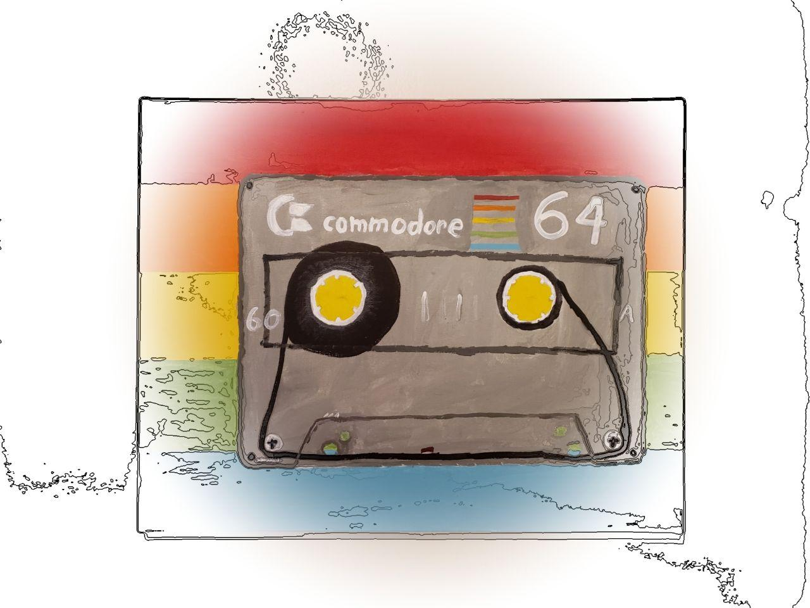

# The year is 198x.

I stare at my amber terminal. Hexadecimal fills my screen and my mind has become lost in the flow of 6502 assembly, as I hand optimize the code flow.

I'm interupted when I recieve a message from my friend, _Maverik, he's excited about the ground breaking CGI in Tron.

---

**Nostalgia is a weird feeling.** We can forget when things happened, and misttribute things to entirely different decades. But, I think there's something even more interesting going on with the now-sorta-fading nostalgia for the 80's that could be seen when 2014's Guardian's of the Galaxy (or Vol. 2 in 2017) or 2011's Ready Player One book (and 2018 movie) were a huge deal. These movies aren't just appealing to a generation of Millennials that are pissed off that the world is going to shit because of the mistakes of their parents and grandparents- they're appealing to a generation of people that has only ever known that mess. The kids, like me, that are in the awkward spot of being told just how awful it was to watch the news on September 11th, 2001 but not actually directly rembering it.

So, why would we be nostalgic for a time that we were never alive for? I think it's because we're hopeful.

The 1980's were not a better time really. The Cold War was still a thing, being publically LGBT was crazy, Chernobyl happened, Computers were still mostly 8-bit, Asbestos was still being used, and, despite the numbers declining already, cigaretts were still way more common. 

All that aside, the was something the 80's had that we don't have now. I'm hesitent to call it 'hope' or 'vision', and honestly, I'm not sure there even is a good word for it. Regardless, I wasn't even around to experiance it first hand given I wasn't born until 1998. But, from what I've seen of the remnants, the parts that people try to remember- the good stuff that people drink as heavily sweetend, carbonanted nostalgia - there was an *atmosphere of possibility*. The Demo Scene was in full swing, as people pushed the 8-bit hardware of the time to it's absolute limits. Computers were progressively being used to do more, impressive things. Culture from that era is portrayed in a way that gives you a mental image of crackin' a cold one and just enjoying life. Movies from the era- Back to The Future, Footloose, Weird Science - all told stories that were hopeful and fun and made a point of how the future is going to be better. 

It took me a while to realize all of this, but I'm not nostalgic for the 1980's. I'm nostalgic for the xx80's. A time that only exists in the minds of people like me, nostalgic for something they never experienced. The next cultural revolution where we can band together under a banner of making things better. Where technological advancements have postivie cultural impact instead of negitive. Where the talk of the year isn't about how damn partisan we are but is about the power of humanity to do amazing things. It just happens that having some sort of outlet to map that nostalgia to is helpful, and that the 1980's that kids from that era remember is the best analogy that people of my generation have. So when I wear a shirt with Rocket Raccon or put up art of the Comodore 64, I'm not showing my admiration for those things themselves. I know the *real* 1980's weren't that. Instead I'm giving myself physical reminders of a place and time that only exists in my own mind and making that much more concrete my dreams for a better future.

Instead, for now, I'm stuck in real world. I'm in 2020 where my student loan debt is piling up, there's a raging pandemic, and I fear that I'm watching the not-so-perfect union around me crumble. But, then I look around my room, and I see the 'retro' tech and art, and for a little while I feel like it might be possible that we'll do better, that maybe I'll live to see the xx80's come.

So for those that are older than me, please don't mistake our hope for blind romanticism or a warped-sense of nostalgia. We know. I don't think I was born in the worng generation because I didn't experiance the 1980's. I'm pissed that the time I did get to experiance as a kid and that I'm living in now has been ruined by giant media conglomerates, corrupt politicians, broken social values, and people that have resigened themsevles to an attidude of "it's going to hell anyway, so why bother?". You got IRC, I get spyed on and manipulated by Facebook. You got real movies, I got sequels. I'm not going to pretend my generation is unique in dealing with the mistakes of the last, but instead of having hope we have record rates of suicide and depression. It's just that it's easier to have physical attachment and hope mentally assigned to something that's already happened than it is to have blind faith in the future.

>The following response is from Nicole Replogle, born in 1984.

The 80s represented a time when the future had limitless potential. When everyone was excited to see what the next decade held in store. The boomers had the opportunity to realize that future, and instead of making something good and beautiful and exciting, they made sure they had the distinction of being the first --and *last*-- generation to ever have that kind of opportunity. There's so much 80s stuff right now... thinking about Stranger Things, and then stuff like I Am Not Okay With This which is like, present time with the serial numbers filed off in an "80s but make it gayer" kind of way... Even a lot of the "present day but with the numbers filed off" stuff feels like "present day but the future is open and maybe isn't full of possibilities, but it's not empty of it and that's the best we can imagine".

God, the future was so fucking *BRIGHT* in the 80s and I think a big part of why millennials are harder to fire up than gen Z is that we knew what life was like before and nobody knows how to process the loss of countless futures that they *witnessed* as children and young adults. We're living with grief we can't even begin to communicate and we're going to live with it until we die.

Like, you know what's had me fucked up for a couple weeks? I work so hard trying to live inflicting as little harm as possible on people and the environment, knowing it's a losing battle, and come to find out that the whole plastic recycling movement was a giant fraud, that it only existed as an anaesthetic to the guilt of our parents so they'd fuel the rise of single use plastics. And because millennials on down are recycling their waste at high levels, it's easier to drop the act rather than put in the work because society would grind to a halt without single use plastics now.

> The following response is from Krista Carlson, born in 1980.

Actually, the 80's themselves were more hopeful.  We had some problems with depression and suicide, but not like today, and the enxiety almost everyone feels today was very rare.  There was still poverty, but less pressure.  There was less crime, and more freedom.  Kids could be kids, and overall, there was a feeling of innocence about the 1980's.  The early 1990's was when we as a nation became teenagers.  We had boomboxes and were rebelious. We were loud and colorful. Then came the sobering reality of watching the twin towers crumble in 2001, and I think that, more than anything else, changed American culture.  We lost our security and innocence and faced a whole new era of sobering reality.  Now, we know the politicians are all corrupt.  Now, we know we live in a society that is crumbling.  Kids deal with adult problems.  I'm not sure you can put the genie back in the bottle, but I suppose it is nice to keep the bottle around to remember the days when there was still magic in the world.
