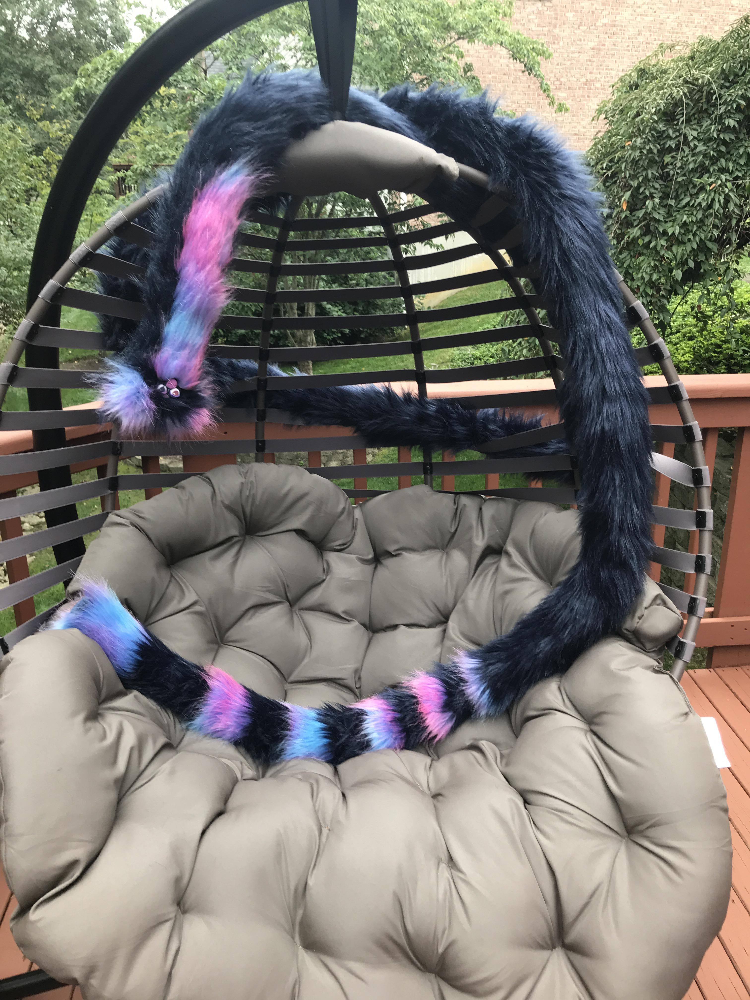

[TODO]

# What makes it 'analog'

# Pen/Pencil and Paper

# Charcol

# Paints

# Scupting

# Fabrics

> Source: https://www.reddit.com/r/LongFurbies/comments/iqwhsd/this_is_my_very_long_daughter_calliope_crayon/