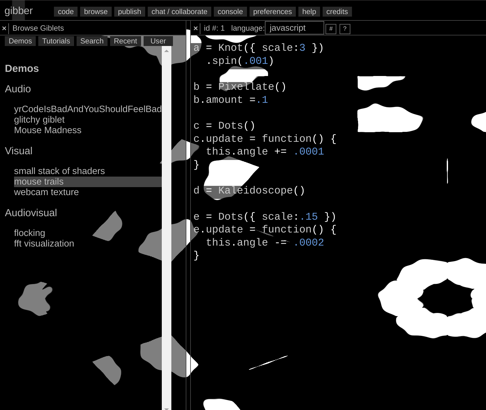

# Generative Art

https://www.reddit.com/r/proceduralgeneration/

https://www.reddit.com/r/generative

https://www.reddit.com/r/PlotterArt/

## Generative World Building

### World generation

| Name & Link                                                  | Purpose / Description                                        | Screenshot                                                   |
| ------------------------------------------------------------ | ------------------------------------------------------------ | ------------------------------------------------------------ |
| [roberthodgin - meander](http://roberthodgin.com/project/meander) | Generative maps of how rivers meander, not the tool, but at least it's the process |                              |
| [Map Generator](https://matthewtarbutton.itch.io/map-generator) | A tool for building custom maps, envisioned for use in tabletop roleplaying games. |                                |
| [One Page Dungeon](https://watabou.itch.io/one-page-dungeon) |                                                              |                                    |
| [Dungeon Scrawl](https://probabletrain.itch.io/dungeon-scrawl) | https://dungeonscrawl.com/docs/#/                            |                                     |
| [Fantasy City Generator](https://watabou.itch.io/medieval-fantasy-city-generator) | This application generates a random medieval city layout of a requested size. The generation method is rather arbitrary, the goal is to produce a nice looking map, not an accurate model of a city. |                                    |
| [Fantasy Map Generator](https://azgaar.github.io/Fantasy-Map-Generator/) | make a map with tons of customization options including some about the culture and regions |                              |
| [Space Creator](https://github.com/erdavids/Space-Creator)   | Make a lil' solar system                                     |                         |
| [Genbrush](https://mavichist.itch.io/genbrush) $15           |                                                              | <iframe width="347" height="195" src="https://www.youtube.com/embed/oF7b-uTiz74" frameborder="0" allow="accelerometer; autoplay; clipboard-write; encrypted-media; gyroscope; picture-in-picture" allowfullscreen></iframe> |
| [Random Country Generator](https://randomcountrygenerator.com) |                                                              |                                   |
| [World Machine](https://www.world-machine.com/download.php)  | !!!! NOTE THIS IS ONLY FREE FOR NON-COMERCIAL USE !!!        |                                    |
| [World Painter](https://www.worldpainter.net)                | This one is for Minecraft, but still potentially useful      |  SOURCE: https://www.reddit.com/r/ArdaCraft/comments/jaaw0v/a_lake_in_the_ered_luin/ |
| [DataCombs](https://michaelgames.itch.io/datacombs)          | "3D Map editing utility for use with tabletop games like Dungeons & Dragons and Pathfinder" |                            |

### Languages

| Name & Link                                                  | Purpose | Screenshot                 |
| ------------------------------------------------------------ | ------- | -------------------------- |
| [Procedural Runes](https://jakofranko.github.io/procedural-runes/) |         |    |
| [Glyph](https://github.com/nik282000/glyph)                  |         |     |
| [Glyph Generator](https://madequa.itch.io/glyph-generator)   |         |  |

[Huge Playlist on Constructed Languages (YouTube)](https://www.youtube.com/watch?v=97RsfY2ODw0&list=PLuYLhuXt4HrQqnfSceITmv6T_drx1hN84&index=33)

Some more cool examples, but lacking code:

https://www.reddit.com/r/generative/comments/d5284l/pentagonal_glyphs/
https://www.reddit.com/r/generative/comments/d5zeca/generative_glyphs/


## Generative Textures and Geometry

| Name & Link                                                  | Purpose / Description                                        | Screenshot / Demo                                            |
| ------------------------------------------------------------ | ------------------------------------------------------------ | ------------------------------------------------------------ |
| [Forsynthia](https://github.com/johnalexandergreene/Forsythia) |                                                              |                        |
| [Noisemaker](https://noisemaker.readthedocs.io/en/latest/#usage) | Noise maker can make a ton of generative art pieces, as you can see at the right, this is a small sampling using a few of the included presets. |   |
| [Noisey-Shapes (Github)](https://github.com/cnfrancis/noisey-shapes) | "Making the computer draw weird shapes using basic trigonometry and different species of randomness(noise)" |  |
| [Superformula SVG](https://jasonwebb.github.io/SuperformulaSVG-for-web/) | [Github repo](https://github.com/jasonwebb/SuperformulaSVG-for-web) |                                |


## Pixel Sorting


> [Source](https://www.reddit.com/r/pixelsorting/comments/jeor0y/just_messing_around_with_datamoshing_and_pixel/) - [u/Hunter_timeFR](https://www.reddit.com/user/Hunter_timeFR/) on Reddit

[r/pixelsorting (Reddit)](https://www.reddit.com/r/pixelsorting/)

[PixelSorting using Processing (Github)](https://github.com/jeffThompson/PixelSorting)

[python pixelsort, with masks (Github)](https://github.com/satyarth/pixelsort)

[Python again, but with animation support (Github)](https://github.com/rkargon/pixelsorter)

[Pixsort for Adobe After Effects ($15)](https://wunkolo.itch.io/pixsort)

## Fractal Art

| Name & Link                                                  | Purpose                               | Screenshot                     |
| ------------------------------------------------------------ | ------------------------------------- | ------------------------------ |
| [Apophysis](https://sourceforge.net/projects/apophysis/)     | Fractal Flames                        | [TODO]                         |
| [Mandelbulber](https://www.mandelbulber.com)                 |                                       |  |
| [Mandelbulb3D](https://mb3d.overwhale.com)                   |                                       | [TODO]                         |
| [ifs Fractal Generator](https://sirxemic.github.io/ifs-animator/) |                                       |    |
| [Fractorium](http://fractorium.com)                          | A GPU-Accelerated Fractal Flame Edito |    |
| [Chaotica](https://www.chaoticafractals.com) *               |                                       |      |

> Chaotica is **free for noncommercial use**, and can render up to 1.23 megapixel images (e.g. 1280x960 resolution) and up to 30 second 480p animations without a licence. A **Chaotica HD (45 USD)** licence for casual users who want to create high quality desktop wallpapers up to 4 megapixels (e.g. 2560x1600) and 720p animations up to 3 minutes long is available at a very low price point. The professional **Chaotica Studio (109 USD)** licence has no still image or animation limitations at all. *prices are from time of writing

## Generative Eyes

https://www.reddit.com/r/generative/comments/j4uati/iris/
https://www.reddit.com/r/generative/comments/jabwl8/greye/
https://www.reddit.com/r/generative/comments/epja3d/mycelium/


<iframe width="100%" height="450" src="https://www.youtube.com/embed/6avJHaC3C2U" frameborder="0" allow="accelerometer; autoplay; clipboard-write; encrypted-media; gyroscope; picture-in-picture" allowfullscreen></iframe>


## Livecoding visuals

[r/livecoding (Reddit)](https://www.reddit.com/r/livecoding/)

[Toplap.org - a site all about live coding](https://toplap.org)


| Name & Link                                                  | Purpsoe                                                      | Screenshot / Demo                                            |
| ------------------------------------------------------------ | ------------------------------------------------------------ | ------------------------------------------------------------ |
| [Tidal Cycles](https://tidalcycles.org/index.php/Welcome)    |                                                              | <iframe width="50%" height="220" src="https://www.youtube.com/embed/Vomnc9R-7mw" frameborder="0" allow="accelerometer; autoplay; clipboard-write; encrypted-media; gyroscope; picture-in-picture" allowfullscreen></iframe> |
| [Praxislive](https://www.praxislive.org)                     |                                                              | <iframe width="640" height="360" src="https://www.youtube.com/embed/TFAFaS4_r8A" frameborder="0" allow="accelerometer; autoplay; clipboard-write; encrypted-media; gyroscope; picture-in-picture" allowfullscreen></iframe> |
| [Rectitude](https://lbarret.itch.io/rectitude)               |                                                              | <iframe width="640" height="360" src="https://www.youtube.com/embed/pWKpevPKxUQ" frameborder="0" allow="accelerometer; autoplay; clipboard-write; encrypted-media; gyroscope; picture-in-picture" allowfullscreen></iframe> |
| [Mosaic](https://mosaic.d3cod3.org)                          |                                                              | <iframe title="vimeo-player" src="https://player.vimeo.com/video/464702127" width="640" height="360" frameborder="0" allowfullscreen></iframe> |
| [p5-live (Github)](https://github.com/yangsu/p5-live)        | live coding for p5.js - you'll probably want the VS Code Extension | <iframe width="640" height="360" src="https://www.youtube.com/embed/HerCR8bw_GE?list=PLRqwX-V7Uu6Zy51Q-x9tMWIv9cueOFTFA" frameborder="0" allow="accelerometer; autoplay; clipboard-write; encrypted-media; gyroscope; picture-in-picture" allowfullscreen></iframe> |
| [hydra (Github)](https://github.com/ojack/hydra)             | "Set of tools for livecoding networked visuals. Inspired by analog modular synthesizers, these tools are an exploration into using streaming over the web for routing video sources and outputs in realtime. Hydra uses multiple framebuffers to allow dynamically mixing, compositing, and collaborating between connected browser-visual-streams. Coordinate and color transforms can be applied to each output via chained functions." |  |
| [LiveCodeLab](https://livecodelab.net)                       | "Livecodelab is a special secret place where you can make fancy "on-the-fly" 3d visuals and play awesomely offbeat (literally) sounds. "On-the-fly" meaning: as you type. Type just three letters: "box", and boom! a box appears. No clicking play, no waiting, no nothing." |  |
| [Thixels by Ramsey Nasser (Github, Linux Only)](https://github.com/nasser/thixels) | "[PICO8](https://www.lexaloffle.com/pico-8.php) inspired live coding visual instrument." |  |
| [Gibber.cc](https://gibber.cc)                               | "Gibber is a creative coding environment for audiovisual performance and composition. It contains features for audio synthesis and musical sequencing, 2d drawing, 3d scene construction and manipulation, and live-coding shaders." |                                      |
| [Ronin (Github)](https://github.com/hundredrabbits/Ronin)    | "Ronin is a procedural graphics tool designed to automate simple graphical tasks, like resizing, cropping, coloring, and generating algorithmic images. It interprets a minimal dialect of LISP, look at the examples to better understand how this all works." | <iframe width="640" height="360" src="https://www.youtube.com/embed/SgAWGh1s9zg" frameborder="0" allow="accelerometer; autoplay; clipboard-write; encrypted-media; gyroscope; picture-in-picture" allowfullscreen></iframe></a> |
| [The Force (Github)](https://github.com/shawnlawson/The_Force) | ... this one basically lacks all description. Best you'll get is the [api docs in the wiki](https://github.com/shawnlawson/The_Force/wiki/API) | <iframe title="vimeo-player" src="https://player.vimeo.com/video/184863637" width="640" height="360" frameborder="0" allowfullscreen></iframe> |
| [Tooll.io](http://tooll.io/)                                 | node-basde tool for interactive realtime content on the web  | <iframe width="640" height="360" src="https://www.youtube.com/embed/B-GU4I5Xv_g" frameborder="0" allow="accelerometer; autoplay; clipboard-write; encrypted-media; gyroscope; picture-in-picture" allowfullscreen></iframe> |
| [Kodelife](https://hexler.net/products/kodelife)             | Realtime GPU shader editor                                   |  |
| [Cables.gl (beta)](https://cables.gl)                        | "Cables is a tool for creating beautiful interactive content. With an easy to navigate interface and real time visuals, it allows for rapid prototyping and fast adjustments." --- Because this seems to be so 'beta' and I don't see code or any indication on future pricing it's probably not the best option at the moment |                     |
| [Nimp (Github)](https://github.com/dan335/nimp)              | "Node-Based Image Manipulation Program"                      |  |
| [vvvv](https://vvvv.org) - Heads up VVVV requires a licence for comercial use that is rather expensive | "vvvv is a hybrid visual/textual live-programming environment for easy prototyping and development. It is designed to facilitate the handling of large media environments with physical interfaces, real-time motion graphics, audio and video that can interact with many users simultaneously." |  |
| [TouchDesigner](https://derivative.ca) (Free, but 600 USD for Commercial licence) | "TouchDesigner is a visual development platform that equips you with the tools you need to create stunning realtime projects and rich user experiences.  Whether you're creating interactive media systems, architectural projections, live music visuals, or rapid-prototyping your latest ideas, TouchDesigner is the platform that can do it all." | <video controls width="640">    <source src="../media/neurotouchdesigner.mp4"            type="video/mp4"> </video> <br><p> Video courtesy of [Neurotypique](https://www.youtube.com/channel/UC4oBI5piGMznFMZdtEC0FhA) </p> |
| [Nodes](https://nodes.io)                                    | Not Yet Publiclly Released                                   | <video width="640" poster="assets/video-cover.jpg" src="https://player.vimeo.com/external/348671633.hd.mp4?s=d2d3dd176a1ddbb28c78bb0fb3e007ee10704c1b&amp;profile_id=174" class="w-100" autoplay="" loop="" playsinline="" muted=""></video> |

## Creative Coding (Non Live)

[HackadayU Creative Code with Casey Hunt (YouTube)](https://www.youtube.com/playlist?list=PL_tws4AXg7att6rxtRNsGa36fOoRtdKJV)

| Name & Link                                                  | Purpose / Description                                        | Screenshot / Demo Link                                       |
| ------------------------------------------------------------ | ------------------------------------------------------------ | ------------------------------------------------------------ |
| [Processing Language](https://processing.org)                | "Processing is a flexible software sketchbook and a language for learning how to code within the context of the visual arts." | <iframe title="vimeo-player" src="https://player.vimeo.com/video/140600280" width="640" height="360" frameborder="0" allowfullscreen></iframe> |
| [Hype Framework](https://www.hypeframework.com)              | "This is a collection of processing.org classes that performs heavy lifting tasks while using a minimal amount of code writing" | This site is really weird? It seems to be emedding vimeo videos of static images, regardless, still worth checking out |
| [P5.js](https://p5js.org/)                                   | "p5.js is a JavaScript library for creative coding, with a focus on making coding accessible and inclusive for artists, designers, educators, beginners, and anyone else!" --- Processing can run P5.js scripts, you can also live code p5.js with some VSCode extensions as mentioned above | <iframe width="640" height="360" src="https://www.youtube.com/embed/HerCR8bw_GE?list=PLRqwX-V7Uu6Zy51Q-x9tMWIv9cueOFTFA" frameborder="0" allow="accelerometer; autoplay; clipboard-write; encrypted-media; gyroscope; picture-in-picture" allowfullscreen></iframe> |
| [three.js](https://threejs.org)                              | "Three.js is a lightweight cross-browser JavaScript library/API used to create and display animated 3D computer graphics on a Web browser. Three.js scripts may be used in conjunction with the HTML5 canvas element, SVG or WebGL." | [Three.js examples from Free Frontend](https://freefrontend.com/three-js-examples/) and [on the Three.js site itself](https://threejs.org/examples/) |
| [paper.js](http://paperjs.org/about/)                        | "Paper.js is an open source vector graphics scripting framework that runs on top of the HTML5 Canvas" | [Paper.js examples](http://paperjs.org/examples/nyan-rainbow/) |
| [rune.js](https://runemadsen.github.io/rune.js/)             | "a JavaScript library for programming graphic design systems with SVG in both the browser or node.js" | Move your mouse over the image on the homepage               |
| [rough.js](https://roughjs.com)                              | "a small (<9kB gzipped) graphics library that lets you draw in a *sketchy*, *hand-drawn-like*, style." |        |
| [StructureSynth](http://structuresynth.sourceforge.net/index.php) | "Structure Synth is a cross-platform application for generating 3D structures by specifying a design grammar" |     |
| [OpenFrameworks](https://openframeworks.cc)                  | openFrameworks is an open source C++ toolkit for creative coding. | <iframe title="vimeo-player" src="https://player.vimeo.com/video/74124094" width="640" height="360" frameborder="0" allowfullscreen></iframe> |
| [openrndr](https://openrndr.org)                             | "In short, OPENRNDR is a tool to create tools. It is an open source framework for creative coding, written in Kotlin for the Java VM that simplifies writing real-time interactive software" | pleanty of examples on the site                              |
| [Cinder](https://www.libcinder.org)                          | "Cinder is a free and open source library for professional-quality creative coding in C++." | pleanty of examples on the site                              |
| [Context Free](https://www.contextfreeart.org)               | "Context Free is a program that generates images from written instructions called a grammar. The program follows the instructions in a few seconds to create images that can contain millions of shapes." |  **Agneya **by [**thijs**](https://www.contextfreeart.org/gallery/search.php?by=thijs) |
| [Nannou](https://github.com/nannou-org/nannou)               | a creative coding frame work for Rust                        |   |
| [Valora](https://paytonturnage.gitbook.io/valora/)           | Another creative coding framework for Rust                   | [curtain](https://paytonturnage.gitbook.io/valora/gallery) by turnage, 2020 |
| [immense](https://github.com/turnage/immense)                | A Rust library for describing 3D meshes with simple composable rules. ```rule![     tf![         Tf::saturation(0.8),         Tf::hue(160.0),         Replicate::n(36, vec![Tf::rz(10.0), Tf::ty(0.1)]),         Replicate::n(36, vec![Tf::ry(10.0), Tf::tz(1.2), Tf::hue(3.4)]),     ] => cube() ]``` is all that's needed to generate the example on the right |  |
| [ANSIedad](https://github.com/gabochi/ANSIedad)              |                                                              |  |

## Data Visulization

| Name & Link                                       | Purpose / Description                                        | Screenshot / Demo                                            |
| ------------------------------------------------- | ------------------------------------------------------------ | ------------------------------------------------------------ |
| [Nodebox](https://www.nodebox.net/node/)          | "NodeBox makes it easy to do data visualisations, generative design and complex production challenges." |  |
| [d3js](https://d3js.org)                          | "**D3.js** is a JavaScript library for manipulating documents based on data. **D3** helps you bring data to life using HTML, SVG, and CSS." | The homepage has a ton of live demos                         |
| [Apparatus](https://github.com/cdglabs/apparatus) | a hybrid graphics editor / programming environment for creating interactive diagrams |  |

## Scripting/Generative tools IN other tools

| Name & Link                                                  | Purpose                                                      | Screenshot                                                   |
| ------------------------------------------------------------ | ------------------------------------------------------------ | ------------------------------------------------------------ |
| [Blender python API](https://docs.blender.org/api/current/info_overview.html#:~:text=Python%20in%20Blender&text=Blender%20provides%20its%20Python%20modules,import%20the%20modules%20to%20work.) |                                                              |                                                              |
| [Sorcar for Blender](https://aachman98.itch.io/sorcar)       | procedural modeling node-based system for Blender            |                                                              |
| [Adobe Extend Script](http://docs.aenhancers.com/introduction/overview/) | "A script is a series of commands that tells an application to perform a series of operations. You can use scripts in most Adobe applications to automate repetitive tasks, perform complex calculations, and even use some functionality not directly exposed through the graphical user interface." |                                                              |
| [Krita SeExpr](https://docs.krita.org/en/reference_manual/layers_and_masks/fill_layer_generators/seexpr.html?highlight=seexpr) | Fills the layer with a pattern specified through Disney Animation’s [**SeExpr** expression language](https://wdas.github.io/SeExpr). - note that this is for **FILL layers** in krita |  |

## Super resolution, frame interpolation, and other effects

[Drain-App](https://grisk.itch.io/dain-app)

!> Drain-App only runs on computers with Nvidia GPUs

> Dain-App is a free app that let you take any form of media like movies, stop-motion, anime, cartoons, sprites, etc and interpolate new frames, generating a bigger frame-rate from the original file.

[Waifu-2x](http://waifu2x.udp.jp) - "Single-Image Super-Resolution for Anime-Style Art using Deep Convolutional Neural Networks. And it supports photo."

> Think of this like CSI style zoom-and-enhance. It works super well, even on non anime images.

[Neat auto lighting/shading software (Github pages site)](https://lllyasviel.github.io/PaintingLight/)

[Pixatool](https://kronbits.itch.io/pixatool) ($15) - convert 'normal' art into pixel art

[picbreeder](http://picbreeder.org) - "Picbreeder is a collaborative art application based on an idea called *evolutionary art*, which is a technique that allows pictures to be bred almost like animals. For example, you can evolve a butterfly into a bat by selecting parents that look like bats"

[Geon FX](https://nod.itch.io/geon-fx) ($10) - Particle effects generator/editor


## For Plotters

[vpype](https://github.com/abey79/vpype) - aims to be the one-stop-shop, Swiss Army knife for producing plotter-ready vector graphics. Here are, for illustration, a few examples of what it can do:


## Other tools

### Sound Design

!> There's a LOT more tools listed in the music chapters, but there's some more 'for animation' tools here:

[rfxgen](https://raylibtech.itch.io/rfxgen)

# Some inspiration

[Python + Quantum Research = Art + Saving 1000s hours of CPU time (Reddit)](https://www.reddit.com/r/dataisbeautiful/comments/eaap3p/python_quantum_research_art_saving_1000s_hours_of/)

[Generative Constellations (Reddit)](https://www.reddit.com/r/generative/comments/dynx25/constellations/) 

> Seriously, the two above pieces are some of my absolute favorite pieces. I think about them a lot.

[Grant Custer's Feed](https://feed.grantcuster.com) + [Constraint.systems](https://constraint.systems)

[Shadertoy](https://www.shadertoy.com/browse)