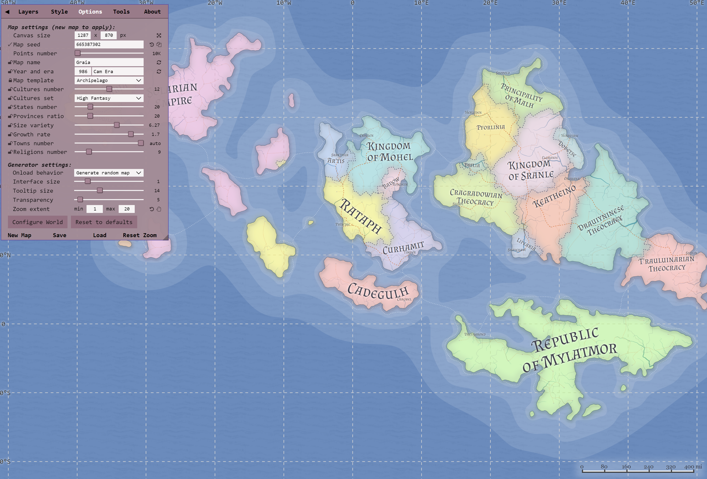
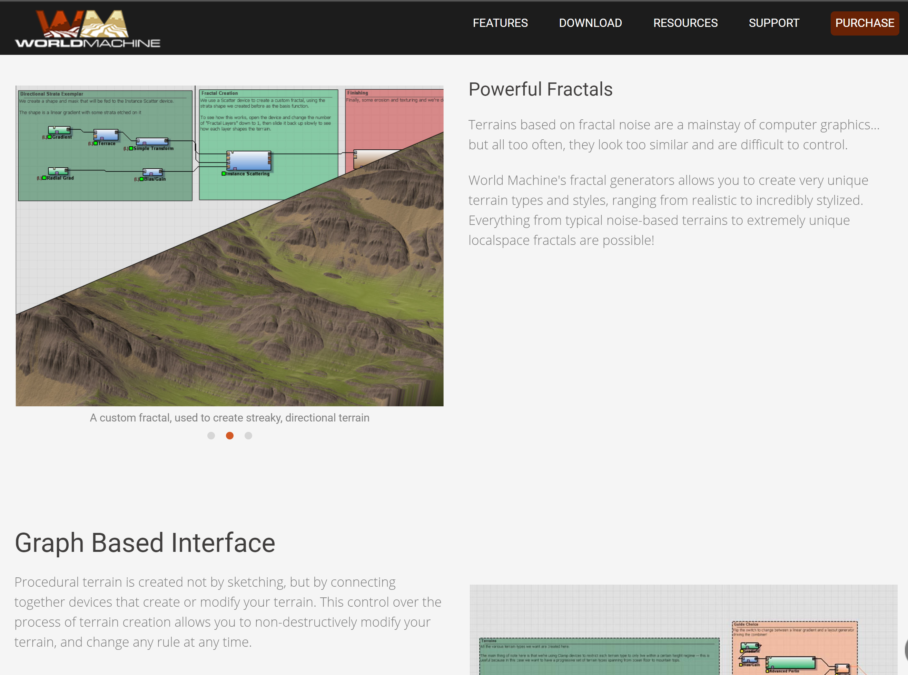
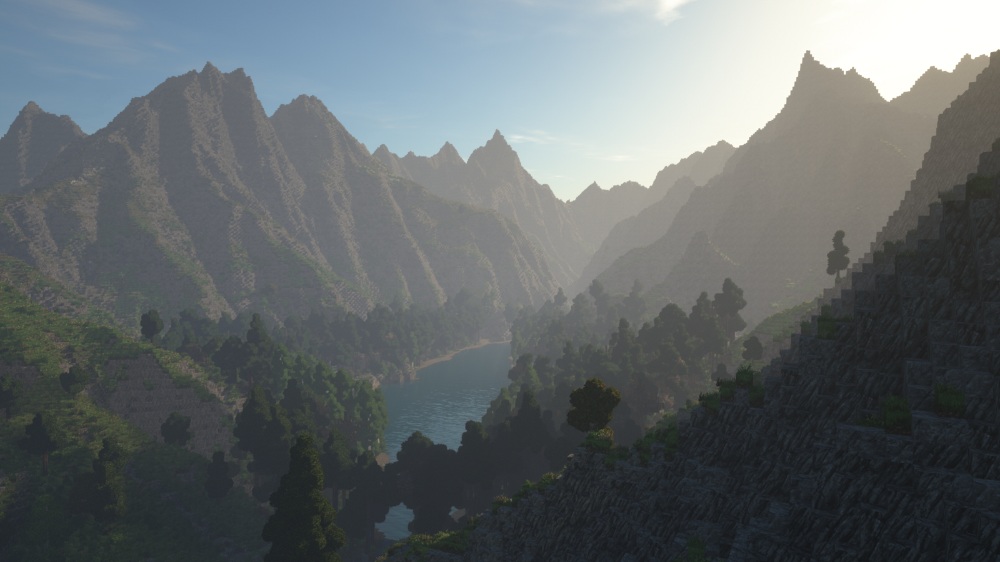

# Generative Art

https://www.reddit.com/r/proceduralgeneration/

https://www.reddit.com/r/generative

https://www.reddit.com/r/PlotterArt/

## Generative World Building

### World generation

| Name & Link                                                  | Purpose                                                      | Screenshot                                                   |
| ------------------------------------------------------------ | ------------------------------------------------------------ | ------------------------------------------------------------ |
| [roberthodgin - meander](http://roberthodgin.com/project/meander) | Generative maps of how rivers meander, not the tool, but at least it's the process |                              |
| [Map Generator](https://matthewtarbutton.itch.io/map-generator) | A tool for building custom maps, envisioned for use in tabletop roleplaying games. |                                |
| [One Page Dungeon](https://watabou.itch.io/one-page-dungeon) |                                                              |                                    |
| [Fantasy City Generator](https://watabou.itch.io/medieval-fantasy-city-generator) | This application generates a random medieval city layout of a requested size. The generation method is rather arbitrary, the goal is to produce a nice looking map, not an accurate model of a city. |                                    |
| [Fantasy Map Generator](https://azgaar.github.io/Fantasy-Map-Generator/) | make a map with tons of customization options including some about the culture and regions |                              |
| [Space Creator](https://github.com/erdavids/Space-Creator)   | Make a lil' solar system                                     |                         |
| [Genbrush](https://mavichist.itch.io/genbrush) $15           |                                                              | <iframe width="347" height="195" src="https://www.youtube.com/embed/oF7b-uTiz74" frameborder="0" allow="accelerometer; autoplay; clipboard-write; encrypted-media; gyroscope; picture-in-picture" allowfullscreen></iframe> |
| [Random Country Generator](https://randomcountrygenerator.com) |                                                              |                                   |
| [World Machine](https://www.world-machine.com/download.php)  | !!!! NOTE THIS IS ONLY FREE FOR NON-COMERCIAL USE !!!        |                                    |
| [World Painter](https://www.worldpainter.net)                | This one is for Minecraft, but still potentially useful      |  SOURCE: https://www.reddit.com/r/ArdaCraft/comments/jaaw0v/a_lake_in_the_ered_luin/ |
| [DataCombs](https://michaelgames.itch.io/datacombs)          | "3D Map editing utility for use with tabletop games like Dungeons & Dragons and Pathfinder" |                            |

### Languages

| Name & Link                                                  | Purpose | Screenshot                 |
| ------------------------------------------------------------ | ------- | -------------------------- |
| [Procedural Runes](https://jakofranko.github.io/procedural-runes/) |         |    |
| [Glyph](https://github.com/nik282000/glyph)                  |         |     |
| [Glyph Generator](https://madequa.itch.io/glyph-generator)   |         |  |

[Huge Playlist on Constructed Languages (YouTube)](https://www.youtube.com/watch?v=97RsfY2ODw0&list=PLuYLhuXt4HrQqnfSceITmv6T_drx1hN84&index=33)

Some more cool examples, but lacking code:

https://www.reddit.com/r/generative/comments/d5284l/pentagonal_glyphs/
https://www.reddit.com/r/generative/comments/d5zeca/generative_glyphs/

## Generative Textures and Geometry

|                                                              |                                                              |                                                              |
| ------------------------------------------------------------ | ------------------------------------------------------------ | ------------------------------------------------------------ |
| [Forsynthia](https://github.com/johnalexandergreene/Forsythia) |                                                              |                        |
| [Noisemaker](https://noisemaker.readthedocs.io/en/latest/#usage) | Noise maker can make a ton of generative art pieces, as you can see at the right, this is a small sampling using a few of the included presets. |   |

## Pixel Sorting

> [Source](https://www.reddit.com/r/pixelsorting/comments/jeor0y/just_messing_around_with_datamoshing_and_pixel/) - [u/Hunter_timeFR](https://www.reddit.com/user/Hunter_timeFR/) on Reddit

[r/pixelsorting (Reddit)](https://www.reddit.com/r/pixelsorting/)

[PixelSorting using Processing (Github)](https://github.com/jeffThompson/PixelSorting)

[python pixelsort, with masks (Github)](https://github.com/satyarth/pixelsort)

[Python again, but with animation support (Github)](https://github.com/rkargon/pixelsorter)

## Generative Eyes

https://www.reddit.com/r/generative/comments/j4uati/iris/
https://www.reddit.com/r/generative/comments/jabwl8/greye/
https://www.reddit.com/r/generative/comments/epja3d/mycelium/

## Livecoding visuals

[TODO]

https://github.com/ojack/hydra

[Thixels by Ramsey Nasser (Github, Linux Only)](https://github.com/nasser/thixels)

[The Force (Github)](https://github.com/shawnlawson/The_Force)

## Creative Coding (Non Live)

[HackadayU Creative Code with Casey Hunt (YouTube)](https://www.youtube.com/playlist?list=PL_tws4AXg7att6rxtRNsGa36fOoRtdKJV)

## Scripting/Generative tools IN other tools

[TODO] blender scripting

[Sorcar for Blender - procedural modeling node-based system](https://aachman98.itch.io/sorcar)

[Krita SeExpr](https://docs.krita.org/en/reference_manual/layers_and_masks/fill_layer_generators/seexpr.html?highlight=seexpr)