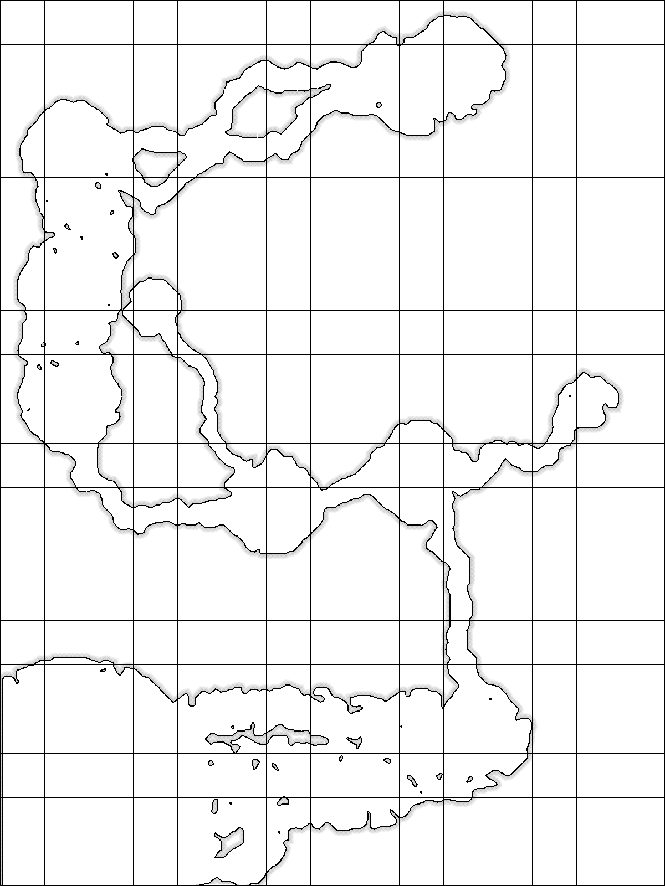
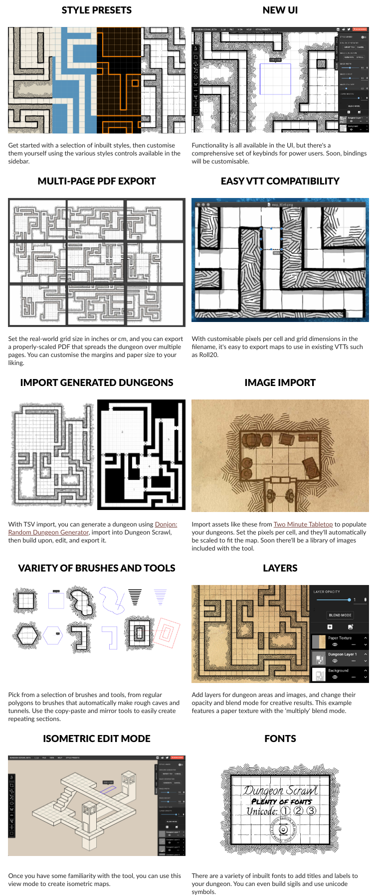
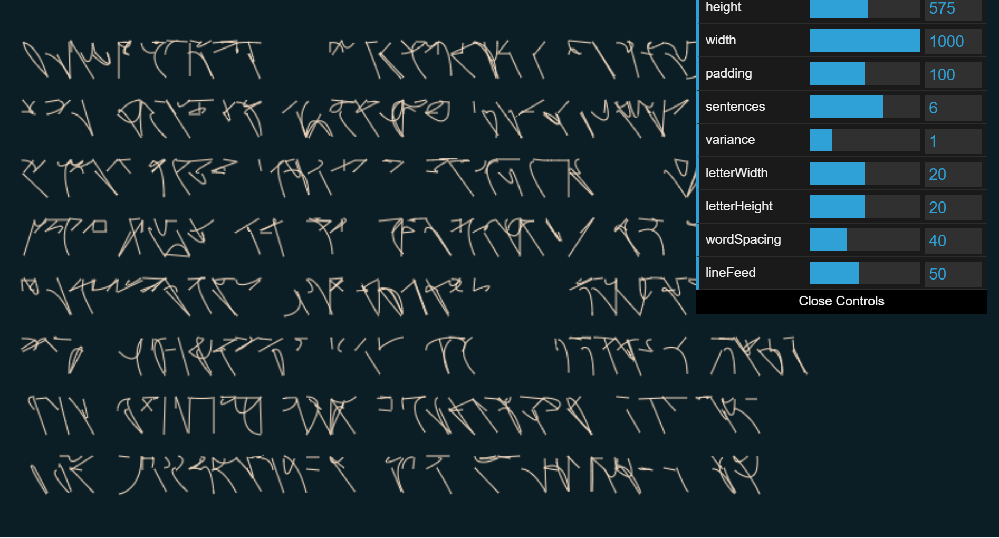

# Generative Art

https://www.reddit.com/r/proceduralgeneration/

https://www.reddit.com/r/generative

https://www.reddit.com/r/PlotterArt/

## Generative World Building

### World generation

| Name & Link                                                  | Purpose                                                      | Screenshot                                                   |
| ------------------------------------------------------------ | ------------------------------------------------------------ | ------------------------------------------------------------ |
| [roberthodgin - meander](http://roberthodgin.com/project/meander) | Generative maps of how rivers meander, not the tool, but at least it's the process |                              |
| [Map Generator](https://matthewtarbutton.itch.io/map-generator) | A tool for building custom maps, envisioned for use in tabletop roleplaying games. |                                |
| [One Page Dungeon](https://watabou.itch.io/one-page-dungeon) |                                                              |                                    |
| [Dungeon Scrawl](https://probabletrain.itch.io/dungeon-scrawl) | https://dungeonscrawl.com/docs/#/                            |                                     |
| [Fantasy City Generator](https://watabou.itch.io/medieval-fantasy-city-generator) | This application generates a random medieval city layout of a requested size. The generation method is rather arbitrary, the goal is to produce a nice looking map, not an accurate model of a city. |                                    |
| [Fantasy Map Generator](https://azgaar.github.io/Fantasy-Map-Generator/) | make a map with tons of customization options including some about the culture and regions |                              |
| [Space Creator](https://github.com/erdavids/Space-Creator)   | Make a lil' solar system                                     |                         |
| [Genbrush](https://mavichist.itch.io/genbrush) $15           |                                                              | <iframe width="347" height="195" src="https://www.youtube.com/embed/oF7b-uTiz74" frameborder="0" allow="accelerometer; autoplay; clipboard-write; encrypted-media; gyroscope; picture-in-picture" allowfullscreen></iframe> |
| [Random Country Generator](https://randomcountrygenerator.com) |                                                              |                                   |
| [World Machine](https://www.world-machine.com/download.php)  | !!!! NOTE THIS IS ONLY FREE FOR NON-COMERCIAL USE !!!        |                                    |
| [World Painter](https://www.worldpainter.net)                | This one is for Minecraft, but still potentially useful      |  SOURCE: https://www.reddit.com/r/ArdaCraft/comments/jaaw0v/a_lake_in_the_ered_luin/ |
| [DataCombs](https://michaelgames.itch.io/datacombs)          | "3D Map editing utility for use with tabletop games like Dungeons & Dragons and Pathfinder" |                            |

### Languages

| Name & Link                                                  | Purpose | Screenshot                 |
| ------------------------------------------------------------ | ------- | -------------------------- |
| [Procedural Runes](https://jakofranko.github.io/procedural-runes/) |         |    |
| [Glyph](https://github.com/nik282000/glyph)                  |         |     |
| [Glyph Generator](https://madequa.itch.io/glyph-generator)   |         |  |

[Huge Playlist on Constructed Languages (YouTube)](https://www.youtube.com/watch?v=97RsfY2ODw0&list=PLuYLhuXt4HrQqnfSceITmv6T_drx1hN84&index=33)

Some more cool examples, but lacking code:

https://www.reddit.com/r/generative/comments/d5284l/pentagonal_glyphs/
https://www.reddit.com/r/generative/comments/d5zeca/generative_glyphs/

## Generative Textures and Geometry

|                                                              |                                                              |                                                              |
| ------------------------------------------------------------ | ------------------------------------------------------------ | ------------------------------------------------------------ |
| [Forsynthia](https://github.com/johnalexandergreene/Forsythia) |                                                              |                        |
| [Noisemaker](https://noisemaker.readthedocs.io/en/latest/#usage) | Noise maker can make a ton of generative art pieces, as you can see at the right, this is a small sampling using a few of the included presets. |   |
| [Noisey-Shapes (Github)](https://github.com/cnfrancis/noisey-shapes) | "Making the computer draw weird shapes using basic trigonometry and different species of randomness(noise)" |  |
| [Superformula SVG](https://jasonwebb.github.io/SuperformulaSVG-for-web/) | [Github repo](https://github.com/jasonwebb/SuperformulaSVG-for-web) |                                |

## Pixel Sorting

> [Source](https://www.reddit.com/r/pixelsorting/comments/jeor0y/just_messing_around_with_datamoshing_and_pixel/) - [u/Hunter_timeFR](https://www.reddit.com/user/Hunter_timeFR/) on Reddit

[r/pixelsorting (Reddit)](https://www.reddit.com/r/pixelsorting/)

[PixelSorting using Processing (Github)](https://github.com/jeffThompson/PixelSorting)

[python pixelsort, with masks (Github)](https://github.com/satyarth/pixelsort)

[Python again, but with animation support (Github)](https://github.com/rkargon/pixelsorter)

[Pixsort for Adobe After Effects ($15)](https://wunkolo.itch.io/pixsort)

## Fractal Art

| Name & Link                                                  | Purpose                               | Screenshot                                                   |
| ------------------------------------------------------------ | ------------------------------------- | ------------------------------------------------------------ |
| [Apophysis](https://sourceforge.net/projects/apophysis/)     | Fractal Flames                        |                                                              |
| [Mandelbulber](https://www.mandelbulber.com)                 |                                       |                                |
| [Mandelbulb3D](https://mb3d.overwhale.com)                   |                                       |                                                              |
| [ifs Fractal Generator](https://sirxemic.github.io/ifs-animator/) |                                       |                                  |
| [Fractorium](http://fractorium.com)                          | A GPU-Accelerated Fractal Flame Edito |                                  |
| [Chaotica](https://www.chaoticafractals.com) (various pricing for resolution/animation) |                                       | I'd love to post a picture from someone here, but it seem the community using this software is very, very picky about copyright and just, I don't want to deal with that. Anyway, it's probably the best looking of the options here honestly, I really recomend looking into it. regardless, here are some good examples ([click me](https://www.deviantart.com/technochroma/art/The-Jupiter-Event-812511507), [or me](https://www.chaoticafractals.com/content/ant-queen)) |

## Generative Eyes

https://www.reddit.com/r/generative/comments/j4uati/iris/
https://www.reddit.com/r/generative/comments/jabwl8/greye/
https://www.reddit.com/r/generative/comments/epja3d/mycelium/

<iframe width="100%" height="450" src="https://www.youtube.com/embed/6avJHaC3C2U" frameborder="0" allow="accelerometer; autoplay; clipboard-write; encrypted-media; gyroscope; picture-in-picture" allowfullscreen></iframe>

## Livecoding visuals

[r/livecoding (Reddit)](https://www.reddit.com/r/livecoding/)

[Toplap.org - a site all about live coding](https://toplap.org)

| Name & Link                                                  | Purpsoe                                                      | Screenshot / Demo                                            |
| ------------------------------------------------------------ | ------------------------------------------------------------ | ------------------------------------------------------------ |
| [Tidal Cycles](https://tidalcycles.org/index.php/Welcome)    |                                                              | <iframe width="50%" height="220" src="https://www.youtube.com/embed/Vomnc9R-7mw" frameborder="0" allow="accelerometer; autoplay; clipboard-write; encrypted-media; gyroscope; picture-in-picture" allowfullscreen></iframe> |
| [Praxislive](https://www.praxislive.org)                     |                                                              |                                                              |
| [Rectitude](https://lbarret.itch.io/rectitude)               |                                                              | <iframe width="640" height="360" src="https://www.youtube.com/embed/pWKpevPKxUQ" frameborder="0" allow="accelerometer; autoplay; clipboard-write; encrypted-media; gyroscope; picture-in-picture" allowfullscreen></iframe> |
| [Mosaic](https://mosaic.d3cod3.org)                          |                                                              | <iframe title="vimeo-player" src="https://player.vimeo.com/video/464702127" width="640" height="360" frameborder="0" allowfullscreen></iframe> |
| [p5-live (Github)](https://github.com/yangsu/p5-live)        | live coding for p5.js - you'll probably want the VS Code Extension |                                                              |
| [hydra (Github)](https://github.com/ojack/hydra)             |                                                              |                                                              |
| [Zerobrane Studio](https://studio.zerobrane.com) and [Moonlet](https://github.com/elihugarret/Moonlet) |                                                              |                                                              |
| [LiveCodeLab](https://livecodelab.net)                       |                                                              |  |
| [Thixels by Ramsey Nasser (Github, Linux Only)](https://github.com/nasser/thixels) |                                                              |                                                              |
| [Gibber.cc](https://gibber.cc)                               |                                                              |                                                              |
| [Ronin (Github)](https://github.com/hundredrabbits/Ronin)    |                                                              | <blockquote class="twitter-tweet">
I was making on a little LISP environment to automate some graphical tasks, like batch resizing pictures, or cropping things(I don&#39;t have photoshop) — But the tool has been repurposed by <a href="https://twitter.com/local_guru?ref_src=twsrc%5Etfw">@local_guru</a> and <a href="https://twitter.com/electret_?ref_src=twsrc%5Etfw">@electret_</a> into a kind of livecoding repl. <a href="https://t.co/xeG38ezltY">https://t.co/xeG38ezltY</a> |
| [The Force (Github)](https://github.com/shawnlawson/The_Force) |                                                              |                                                              |
| [Tooll.io](http://tooll.io/)                                 | node-basde tool for interactive realtime content on the web  |                                                              |
| [Kodelife - Realtime GPU shader editor](https://hexler.net/products/kodelife) |                                                              |  |
| [Cables.gl (beta)](https://cables.gl)                        |                                                              |                                                              |
| [Nimp (Github)](https://github.com/dan335/nimp)              |                                                              |                                                              |
| [vvvv](https://vvvv.org) - Heads up VVVV requires a licence for comercial use that is rather expensive |                                                              |  |
| [TouchDesigner](https://derivative.ca) (Free, but **$600** for Commercial licence) |                                                              |                                                              |

## Creative Coding (Non Live)

[HackadayU Creative Code with Casey Hunt (YouTube)](https://www.youtube.com/playlist?list=PL_tws4AXg7att6rxtRNsGa36fOoRtdKJV)

* [Processing Language](https://processing.org)
  * [Hype Framework](https://www.hypeframework.com)
  * [P5.js](https://p5js.org/) - Processing can run P5.js scripts, you can also live code p5.js with some VSCode extensions as mentioned above

[StructureSynth](http://structuresynth.sourceforge.net/index.php)

[Nodebox](https://www.nodebox.net/node/) (appears to be more for data visulization?)

[Nannou - a creative coding frame work for Rust](https://github.com/nannou-org/nannou)

[ANSIedad](https://github.com/gabochi/ANSIedad)

[Apparatus - a hybrid graphics editor / programming environment for creating interactive diagrams](https://github.com/cdglabs/apparatus)

## Scripting/Generative tools IN other tools

| Name & Link                                                  | Purpose                                           | Screenshot                                                   |
| ------------------------------------------------------------ | ------------------------------------------------- | ------------------------------------------------------------ |
| [Sorcar for Blender](https://aachman98.itch.io/sorcar)       | procedural modeling node-based system for Blender |                                                              |
|                                                              |                                                   |                                                              |
| [Krita SeExpr](https://docs.krita.org/en/reference_manual/layers_and_masks/fill_layer_generators/seexpr.html?highlight=seexpr) |                                                   |  |

## Super resolution, frame interpolation, and other effects

[Drain-App](https://grisk.itch.io/dain-app)

!> Drain-App only runs on computers with Nvidia GPUs

> Dain-App is a free app that let you take any form of media like movies, stop-motion, anime, cartoons, sprites, etc and interpolate new frames, generating a bigger frame-rate from the original file.

[Waifu-2x](http://waifu2x.udp.jp) - "Single-Image Super-Resolution for Anime-Style Art using Deep Convolutional Neural Networks. And it supports photo."

> Think of this like CSI style zoom-and-enhance. It works super well, even on non anime images.

[Neat auto lighting/shading software (Github pages site)](https://lllyasviel.github.io/PaintingLight/)

[Pixatool](https://kronbits.itch.io/pixatool) ($15) - convert 'normal' art into pixel art

[Geon FX](https://nod.itch.io/geon-fx) ($10) - Particle effects generator/editor

## Other tools

### Sound Design

!> There's a LOT more tools listed in the music chapters, but there's some more 'for animation' tools here:

[rfxgen](https://raylibtech.itch.io/rfxgen)

# Some inspiration

[Python + Quantum Research = Art + Saving 1000s hours of CPU time (Reddit)](https://www.reddit.com/r/dataisbeautiful/comments/eaap3p/python_quantum_research_art_saving_1000s_hours_of/)

[Generative Constellations (Reddit)](https://www.reddit.com/r/generative/comments/dynx25/constellations/) 

> Seriously, the two above pieces are some of my absolute favorite pieces. I think about them a lot.

[Grant Custer's Feed](https://feed.grantcuster.com) + [Constraint.systems](https://constraint.systems)