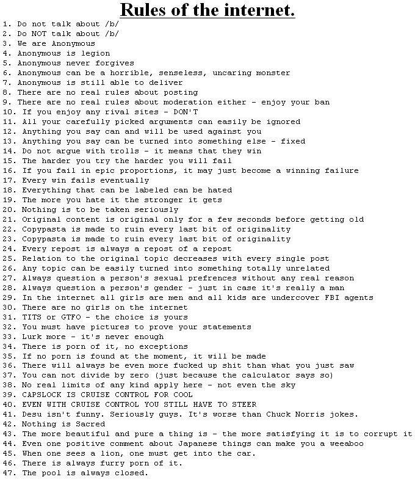

# Chapter 23 - Exploitation

> XKCD: https://xkcd.com/2166/

Often when we think about Exploitation, better known as hacking, we conjure images of a more-punk-than-cyber cyberpunk person clicking away wildly on a keyboard as code flies by, like the [1995 movie, Hackers](https://en.wikipedia.org/wiki/Hackers_(film)), and to some extent this isn't wrong, as one look around the floor at [DefCon](https://www.defcon.org/), will show you. And honestly, that's to by accident. While there are strictly professional security experts, those that work at corporations and banks, a large number do it for the lolz, for fun, and to bring a little fun back into computing. Calling exploitation 'hacking' is almost a misnomer, as hacking encompass a lot more than exploitation, and exploitation a lot more than hacking. For that reason, before we start, I recommend you watch [this video](https://www.youtube.com/watch?v=wjge1bVobN0), on speed running Super Mario 64, this is a prime example of exploitation in a non-harmful manner done for fun.

[TODO]

## Types of exploits

[TODO] - where to put return oriented programming, super old hardware/software - 'the home router',

Otherwise known as hacking, exploitation of software is always alluring, though in reality like many things it is much less glamorous than the news or tv make it out to be. Before I get into it I want to plug 'The Art of Exploitation' by Jon Erickson again, as it truly is a masterpiece that describes exploiting in a way that just makes sense

### Software

Injection - SQL

breaking hashes

Heap/buffer overflow

dangling pointers

code-injection

clock attacks

Race conditions

Path traversal 

format string

pseudo-random

Fuzzing

#### Networking

DoS/DDoS

MitM

XXS

MAC/IP spoofing

sniffing

DNS: https://www.xudongz.com/blog/2017/idn-phishing/

[Wifi Cactus](https://blog.adafruit.com/2017/08/02/wificactus-when-you-need-to-know-about-hackers-wearablewednesday/)

### Hardware

[Intro to Hardware Reversing: Finding a UART and getting a shell (YouTube)](https://www.youtube.com/watch?v=ZmZuKA-Rst0&list=PL5cGwrD7cv8hK-qxPqRB25Dzs0BtLWhXz)

Talk about CPU bugs

Power side channel

Timing attacks

pseudo-random (hardware side)

Hardware trust (HID injection)

replay attacks

radio, rfid, etc

rowhammer, Heartbleed

### Social Engineering

Phishing

spoofing (email, phone)

UTF-8 v ASCII

click jacking

expired certificate

default passwords

honey pots

### Physical security

Lock picking as a last resort

[Law School for Lockpickers [YouTube, DEF CON 28]](https://www.youtube.com/watch?v=HGg9mypLcH0)

data destruction

## Malware

> Section here about not being a dick

Viruses

polymorphic

boot-record

trojan

logic/compression bomb

logic/time bombs

ransomware

adware/spyware

## Tools of the trade

Many tools in common with debugging (gdb - gef, hex editors, logic analzer)

and testing (fuzzing)

decompilers, dissassembly, analysis

Wireshark

Cheatengine

dynamic linking

## Getting some practice

### CTF-Time

### PWNie Island

## Where to learn even more:

Live Overflow, Youtube: https://www.youtube.com/channel/UClcE-kVhqyiHCcjYwcpfj9w/playlists

Phrack : http://www.phrack.org/

Defcon Media Server : https://media.defcon.org/

As mentioned above in [Chapter 17- Compilers and Assemblers](#chapter-17--compilers-and-assemblers) At this point I highly recommend '[The Art of Exploitation](https://nostarch.com/hacking2.htm)' by Jon Erickson

https://microcorruption.com/ , https://ctftime.org/ ,

CTF time,

https://nagarrosecurity.com/blog/interactive-buffer-overflow-exploitation

## Some Hacking Community Fun

https://www.youtube.com/watch?v=Jwpg-AwJ0Jc
https://www.youtube.com/watch?v=UBaVek2oTtc
https://www.youtube.com/watch?v=bouYRMItWnI
https://www.youtube.com/watch?v=RDZnlcnmPUA

https://twitter.com/Foone/status/910217984098017281

[Does register selection matter to performance on x86 CPUs? ](https://readhacker.news/s/4hqd9)

[Leap Day Bugs](https://codeofmatt.com/list-of-2020-leap-day-bugs/)

Never claim something is 'unhackable':
https://techcrunch.com/2019/05/10/eyedisk-encrypted-flash-drive-unhackable/,

[DEF CON 18 - Zoz - Pwned By The Owner: What Happens When You Steal A Hacker's Computer (YouTube)](https://www.youtube.com/watch?v=Jwpg-AwJ0Jc)

[Diabetics Are Hacking Their Own Insulin Pumps (YouTube)](https://www.youtube.com/watch?v=bouYRMItWnI)

[Big List of Naughty Strings (Github)](https://github.com/minimaxir/big-list-of-naughty-strings)

[αcτµαlly pδrταblε εxεcµταblε](https://justine.storage.googleapis.com/ape.html)

## Sacred texts of hacking:

From https://wiki.xxiivv.com/#development:

> The Four Essential Freedoms
> The freedom to run the program as you wish, for any purpose.
> The freedom to study how the program works, and change it.
> The freedom to redistribute copies so you can help others.
> The freedom to distribute copies of your modified versions to others.

The hacker and information freedom community has multiple 'sacred texts' if you will, which I think do a good job of outlining some of the ideologies of the communities. Probably the most famous is the Guerrilla Open Access Manifesto written by Aaron Swartz, an amazing man that, according to Wikipedia "was involved in the development of the web feed format RSS and the Markdown publishing format, the organization Creative Commons, and the website framework web.py, and was a co-founder of the social news site Reddit". Due to his extensive work in online politics his Wikipedia page almost acts like a hub of sorts for relevant information: https://en.wikipedia.org/wiki/Aaron_Swartz. The full text of the Guerrilla Open Access Manifesto is below:

> Information is power. But like all power, there are those who want to keep it for
> themselves. The world's entire scientific and cultural heritage, published over centuries
> in books and journals, is increasingly being digitized and locked up by a handful of
> private corporations. Want to read the papers featuring the most famous results of the
> sciences? You'll need to send enormous amounts to publishers like Reed Elsevier.
>
> There are those struggling to change this. The Open Access Movement has fought
> valiantly to ensure that scientists do not sign their copyrights away but instead ensure
> their work is published on the Internet, under terms that allow anyone to access it. But
> even under the best scenarios, their work will only apply to things published in the future.
> Everything up until now will have been lost.
>
> That is too high a price to pay. Forcing academics to pay money to read the work of their
> colleagues? Scanning entire libraries but only allowing the folks at Google to read them?
> Providing scientific articles to those at elite universities in the First World, but not to
> children in the Global South? It's outrageous and unacceptable.
>
> "I agree," many say, "but what can we do? The companies hold the copyrights, they
> make enormous amounts of money by charging for access, and it's perfectly legal —
> there's nothing we can do to stop them." But there is something we can, something that's
> already being done: we can fight back.
>
> Those with access to these resources — students, librarians, scientists — you have been
> given a privilege. You get to feed at this banquet of knowledge while the rest of the world
> is locked out. But you need not — indeed, morally, you cannot — keep this privilege for
> yourselves. You have a duty to share it with the world. And you have: trading passwords
> with colleagues, filling download requests for friends.
>
> Meanwhile, those who have been locked out are not standing idly by. You have been
> sneaking through holes and climbing over fences, liberating the information locked up by
> publishers and sharing them with your friends.
>
> But all of this action goes on in the dark, hidden underground. It's called stealing or
> piracy, as if sharing a wealth of knowledge were the moral equivalent of plundering a
> ship and murdering its crew. But sharing isn't immoral — it's a moral imperative. Only
> those blinded by greed would refuse to let a friend make a copy.
>
> Large corporations, of course, are blinded by greed. The laws under which they operate
> require it — their shareholders would revolt at anything less. And the politicians they
> have bought off back them, passing laws giving them the exclusive power to decide who
> can make copies.
>
> There is no justice in following unjust laws. It's time to come into the light and, in the
> grand tradition of civil disobedience, declare our opposition to this private theft of public
> culture.
>
> We need to take information, wherever it is stored, make our copies and share them with
> the world. We need to take stuff that's out of copyright and add it to the archive. We need
> to buy secret databases and put them on the Web. We need to download scientific
> journals and upload them to file sharing networks. We need to fight for Guerilla Open
> Access.
>
> With enough of us, around the world, we'll not just send a strong message opposing the
> privatization of knowledge — we'll make it a thing of the past. Will you join us?
>
> Aaron Swartz
>
> July 2008, Eremo, Italy

If you'd like more information on Swartz's infulence you can watch a documentry on him [here](https://www.youtube.com/watch?v=vXr-2hwTk58&list=PL5cGwrD7cv8hK-qxPqRB25Dzs0BtLWhXz&index=367&t=0s)

Another important document is "The Conscience of a Hacker" written by "The Mentor" in '86

> Another one got caught today, It's all over the papers.
> "Teenager Arrested in Computer Crime Scandal", "Hacker arrested
> after Bank Tampering"...
>
> Damn kids. They're all alike.
>
> But did you, in your three-piece psychology and 1950's
> technobrain, ever take a look behind the eyes of a hacker? did
> you ever wonder what made him tick, what forces shaped him, what
> may have molded him?
>
> I am a hacker. Enter my world.
>
> Mine is a world that begins with school... I'm smarter than
> most of the other kids, this crap they teach us bores me...
> Come on...  Ain't Got All Day!!
> Damn underachiever. They're all alike.
>
> I'm in junior high or high school. I've listened to the
> teachers explain for the fifteenth time how to reduce a
> fraction. I understand it. "No Ms. Smith, I didn't show my work.
> I did it in my head..."
>
> Damn kid. Probably copied it. They're all alike.
>
> I made a discovery today. I found a computer. Wait a xecond,
> this is cool. It does what I want it to. if it makes a mistake,
> it's because I screwed it up. Not Because it doesn't like me...
> Or feels threatend by me...
> Or thinks I'm a smart ass...
> Or doesn't like teaching and shouldn't be here...
>
> Damn kid. All he does is play games. They're all alike.
>
> And then it happened... a door opened to a world... rushing
> through the phone line like junk through an addict's veins, an
> electronic impulse is sent out, a refuge from the day-to-day
> incompetencies is sought... a board is found.
>
> "this is it... this is wwhere I belong..."
>
> I know everyone herre... even if I've never met them, never
> talked to them, may never hear from them again... I know you
> all...
>
> Damn kid. tying up the phone line again. They're all alike...
> Come on...  Ain't Got All Day!!
> You bet your ass we're all alike... we've been spoon-fed baby
> food at school when we hungered for steak... the bits of meat
> that you did let slip through were prechewed and tasteless.
> We've been dominated by sadist, or ignored by the apathetic. The
> few that had something to teach us found us willing pupils, but
> those few are like drops of water in the desert.
>
> This is our world now... the world of the electron and the
> switch, the beauty of the baud. We make use of a service already
> existing without paying for what could be dirt-cheap if it
> wasn't run by profiteering gluttons, and you call us criminals.
> we explore... and you call us criminals. We seek after
> knoledge... and you call us criminals. We exist without skin
> color, without nationality, without religous bias... and you
> call us criminals. You build atomic bombs, you wage wars, you
> murder, cheat, and lie to us and try to make us believe it's for
> our own good, yet we're the criminals.
>
> Yes, I am a criminal. My crime is that of curiosity. My crime
> is that of judging people by what they say and think, not what
> they look like. My crime is that of outsmarting you, something
> that you will never forgive me for.
>
> Come on...  Ain't Got All Day!!
>
> I am a hacker, and this is my manifesto. You may stop this
> individual, but you can't stop us all... after all, we're all alike.
>
> +++The Mentor+++
> Racketeers

