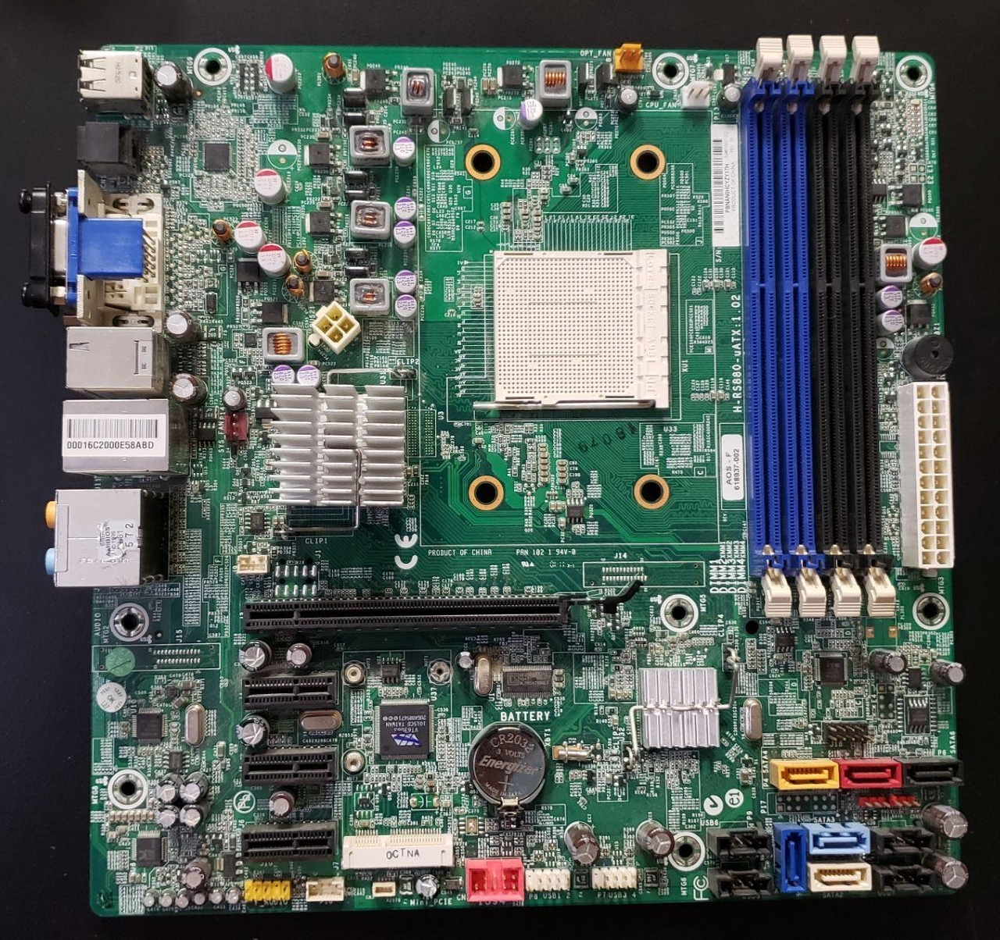
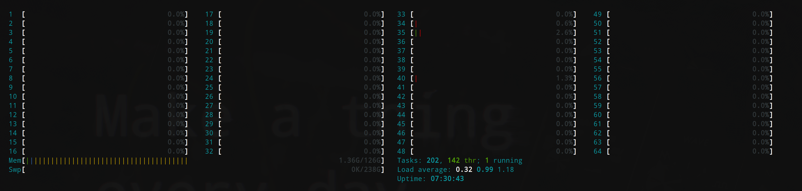
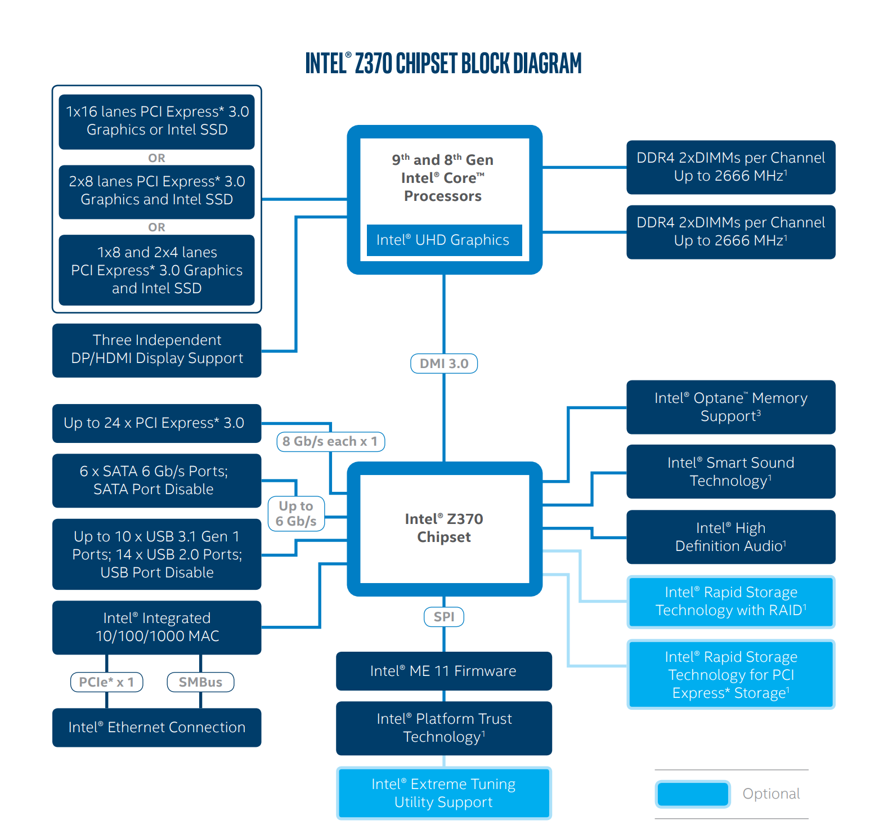

# Chapter 3 - Into the hardware

One of the nifty things about Linux is you don't need to install extra software to check out the deeper parts of your hardware. While on windows you might need a tool like CPU-Z to look at information about the CPU on Linux you can do it out of the box. Let's get started on that then!

## The CPU


These are CPUS or Central Processing Units. They're the beating heart of your computer, doing the day-to-day number crunching. The rectangular one of one of the first CPU's in the lineage leading up to CPU's like the ones used in desktop's today, with further sucessors shown in order from top left to the bottom right. The metal-capped one at the bottom right, while old, is visulally quite representative of a moden desktop CPU, though the CPUs in a laptop or smart phone do look quite differnt still.

One of the nifty things we do pretty easily in linux is get information about our hardware directly. Just as when we were installing Arch and we used `lsblk` to see an overview of the disks on the system, we can use some other tools to find out some other information about the system. Let's start off basic and see what CPU you have. Go ahead and run

```bash
╭─vega@lyrae ~
╰─➤  cat /proc/cpuinfo
```

This is actually just using that same `cat` command we used before. This time we're using it to read the system generated file that tells us about the processor in this system. I'm going to provide the output from my system for reference:

```bash
processor       : 0
vendor_id       : AuthenticAMD
cpu family      : 23
model           : 1
model name      : AMD Ryzen 7 1700 Eight-Core Processor
stepping        : 1
microcode       : 0x8001137
cpu MHz         : 2018.119
cache size      : 512 KB
physical id     : 0
siblings        : 16
core id         : 0
cpu cores       : 8
apicid          : 0
initial apicid  : 0
fpu             : yes
fpu_exception   : yes
cpuid level     : 13
wp              : yes
flags           : fpu vme de pse tsc msr pae mce cx8 apic sep mtrr pge mca cmov pat pse36 clflush mmx fxsr sse sse2 ht syscall nx mmxext fxsr_opt pdpe1gb rdtscp lm constant_tsc rep_good nopl nonstop_tsc cpuid extd_apicid aperfmperf pni pclmulqdq monitor ssse3 fma cx16 sse4_1 sse4_2 movbe popcnt aes xsave avx f16c rdrand lahf_lm cmp_legacy svm extapic cr8_legacy abm sse4a misalignsse 3dnowprefetch osvw skinit wdt tce topoext perfctr_core perfctr_nb bpext perfctr_llc mwaitx cpb hw_pstate sme ssbd sev ibpb vmmcall fsgsbase bmi1 avx2 smep bmi2 rdseed adx smap clflushopt sha_ni xsaveopt xsavec xgetbv1 xsaves clzero irperf xsaveerptr arat npt lbrv svm_lock nrip_save tsc_scale vmcb_clean flushbyasid decodeassists pausefilter pfthreshold avic v_vmsave_vmload vgif overflow_recov succor smca
bugs            : sysret_ss_attrs null_seg spectre_v1 spectre_v2 spec_store_bypass
bogomips        : 7688.44
TLB size        : 2560 4K pages
clflush size    : 64
cache_alignment : 64
address sizes   : 43 bits physical, 48 bits virtual
power management: ts ttp tm hwpstate eff_freq_ro [13] [14]
```

Alright, that's a whole lot of information, let's break it down.

First of all, almost all modern Central Processing Units (CPUs) have multiple cores, and as with most things in computers the're counted from 0, so on a 4 core computer you'll have cores 0, 1, 2, and 3. Multiple cores simply let your computer do things in parallel, running multiple programs or tasks at the same time

Next is the vendor ID, family, model, name, and stepping. My processor is an AMD Ryzen 7 1700. There's a pretty good chance your CPU will be made by Intel, and as such the family, model, name, and what not will reflect that. AMD and Intel are practically the only two laptop and desktop CPU providers, though in the feature we'll work with boards that use CPU's made by other manufactures. Really, most of this doesn't matter. Some CPUs are nicer than others, and if you follow the market or care it's easy to get a sense of a CPU's speed just based on it's name, but let's move on for now.

Next is

```bash
microcode       : 0x8001137
cpu MHz         : 2018.119
cache size      : 512 KB
```

Each of these things is very important, but I'm going to start with cpu MHz as it's probably the easiest to understand, however, to understand this we'll need to get even a bit lower level than this and learn about the electronic component that changed humanity: the transistor.

### Clock Speed


However, to get to that we've gotta go just a bit further down the rabbit hole to the relay. Relays are super simple to understand, they're just a metal switch that is pulled open or closed using another input signal (usually a magnet pulling/pushing the switch closed/open) basically imagine a light switch, where the switch itself is controlled by yet another electrical signal. Relays are slow though, they require a physical metal plate to move to change the connection. Because of this they have limited reliability and worth note they're actually loud. You can hear an audible click of the switch as they change state.

Enter the vacuum tube. Though rarely used today outside of high end audio and old radios, for a period of time the logic inside a computer used these tubes. Essentially theres three important parts of the tube, the Cathode, Plate and Grid. Put very simply the Cathode emits electrons and the Plate collects them. Where it gets interesting is the grid in between. By applying a voltage to the grid a signal can be controlled giving us the same ability to turn something on or off by a third wire as in the relay.

> Worth note but irreverent for digital electronics, tubes and transistors can actually pass only a percentage of the input back out, based proportionally on the input. This actually means that both tubes and transistors can act as an amplifier, using a small input range to control a much larger signal. A single tube or transistor in conjunction with other supporting components can be used to make a functional amplifier.

Though the real break though here was the fact that this was no longer a mechanical system. With relays there was a very slow limit on the rate at which they could respond reliably, but with tubes this increased exponentially. Tubes were still expensive, large, and power hungry though. However, with their advent early computers saw a massive boost in speed with a decrease in cost

Finally, enter the transistor. The physics here isn't that far removed from the vacuum tube, only now instead of a vacuum the electrons are moving though a semiconductor - typically silicon. Again this brought a massive shrink in physical size and increase in that rate at which it could respond. Pictured above are two discrete transistors, however, this is where things get mind blowing:

The Ryzen 1700 CPU in the computer I'm typing this on has 4,800,000,000 transistors in a package that is only 213 mm², and finally, we can refrence the number output by `cat /proc/cpuinfo`

At the moment I got that output the transistors where being turned on and off at a rate of 2018Mhz. or 2Ghz. However, this system can run up to roughly 3.8Ghz. The faster this speed the faster your computer; however, your CPU will also use more power and run hotter. It's for this reason that most systems adjust the speed based on load. Doing simple things like writing this document and as seen with that output my system runs at nearly half speed which is actually the slowest it can run. Because the computer is hardly doing anything right now the majority of that switching is actually just doing nothing but using power running 'no operation instructions' the functional equivalent of just running 0+0 while it it waits for something to do.

The OS itself actually tells the processor what speed it should be running at. In Windows, when you change your power plan to 'high performance' one of the major things it does is not allow the processor to run at a slower speed, and in Linux you can similarly control this using some cpu speed commands. We'll get to that later though.

Finally it's worth note that on some systems, primarily high end desktops, you can actually run your processor outside of factor specifications by increasing the maximum clock rate of the processor. Doing this can lead to system stability issues and obviously leads to a higher power usage and heat output though. This process is known as 'overclocking'  as your taking the internal clock of the processor beyond it's rating. My CPU, a Ryzen 1700, has actually been over clocked in order to get 3.8Ghz at all times on all of the cores.

### Microcode

Modern processors are very, very complicated. So complicated in fact that there is a full very tiny computer in your processor. This computer does multiple things, but the main one we'll talk about is the translation between types of machine code. In order to understand this we'll need to look a basic program written in the language 'C'.

```c
int main() {
  int a;
  int b;
  a = 8;
  b = 16;
  a = a + b;
  return 0;
}
```

This code first makes two integers, a and b, gives them values, then adds them together and stores the result back into a. Finally, the program returns a 0 to the operating system in order to say "I ran without errors".

Unlike python which get's converted to something the computer can understand as it executes C is compiled before hand. This makes it so programs written in C are much, much faster than those written in python, though obviously C code is more difficult to write. Compilation is the process of turning a program into a file full of instructions the computer actually understands. This happens in two steps, first the program is turned into assembly code, for the above code this results in an output that looks like

```c
        push    rbp
        mov     rbp, rsp
        mov     DWORD PTR [rbp-4], 8
        mov     DWORD PTR [rbp-8], 16
        mov     eax, DWORD PTR [rbp-8]
        add     DWORD PTR [rbp-4], eax
        mov     eax, 0
        pop     rbp
        ret
```

As you can see, this is incredibly difficult to read to a 'normal' person, so even though we're not there yet.

This in turn gets turned into binary as can bee seen by this screenshot generated using https://godbolt.org/


See the weird numbers next to each instruction? like 4004b255? That's a base 16 number or hexadecimal usually refered to as 'Hex'. Hex is what is used by most computer guys to represent numbers because computers operate in base 2, or binary- like 01001100, which is very difficult to read and type accurately, however, base 10, the normal numbering system your used to, makes translating between binary and decimal a bit uncomfortable as the common factor is 5, an number that is both odd and in turn not a factor of two, where as 16 is $2^4$ so that means we can easily represent binary like this:

| Binary | Hex | Decimal |
| ------ | --- | ------- |
| 0000   | 0   | 0       |
| 0001   | 1   | 1       |
| 0010   | 2   | 2       |
| 0011   | 3   | 3       |
| 0100   | 4   | 4       |
| 0101   | 5   | 5       |
| 0110   | 6   | 6       |
| 0111   | 6   | 7       |
| 1000   | 8   | 8       |
| 1001   | 9   | 9       |
| 1010   | A   | 10      |
| 1011   | B   | 11      |
| 1100   | C   | 12      |
| 1101   | D   | 13      |
| 1110   | E   | 14      |
| 1111   | F   | 15      |

Okay, so now those 1's and 0's are what your computer actually reads to run instructions. We'll come back to this later, but since we're here I'll drop this [link]( https://www-user.tu-chemnitz.de/~heha/viewchm.php/hs/x86.chm/x86.htm)

Where you can see how these 1's and 0's are arranged to tell the computer what to do. That is super advanced for where we are now though, so let's get back on track- what the hell is micro code already?

Well, it turns out that modern processors are still compatible with some really, really old code. All the way back to the first 8086 processor made by Intel in 1978. It was here that the x86 instruction set - the instructions like 'mov' , 'push', and 'add' above that define the x86 architecture were born. Originally these were 16bit CPUs, that is each instruction only had 16 1's and 0's but soon the i386 came along and used 32bits. Back when 32 bit computers were common this is what this was in reference to. As with all things technology progressed and 64bit cpu's came along. Many attempts were made to make 32bit programs run with backwards comparability at high speeds on these CPU's, though in the end AMD made the method used today, dubbed the x86_64 instruction set. Overtime this instruction set was expanded with various additions. We can actually see the names of these additions that are available on the CPU in the system by looking yet again at the output of `cat /proc/cpuinfo` and looking at the flags section. While not all of these signify instruction set additions, many do. The most common 'famous' if you will is SSE, of which there have been multiple revision, the first version alone adds [70 instructions](https://en.wikipedia.org/wiki/Streaming_SIMD_Extensions), which are used to make math faster

Alright, so finally, enter Mircocode. At some point all of this became a lot to manage and processor designs evolved even further, getting exponentially more complicated and faster with more and more instructions, so they added this little computer which has the primary duty of turning the mess of countless possible instructions into yet even smaller instructions that the heavy duty 'real' processor does. Every once in a while a problem will be found in the way this is done, or a security vulnerability in the hardware itself may be found, and your CPU manufacture will release a microcode update.

That update version is what you see on that line of `cat /proc/cpuinfo`

Now, at the beginning of this guide I said I wouldn't provide useless information, and I'm sure that all looks pretty useless without more context. In general, this is interesting because you can (and will need to) write some assembly code by hand every now and then. Thankfully, its usually not x86 assembly which is very, very difficult to write but instead assembly on much smaller, micro controllers (basically really tiny computers), where that assembly is necessary because the system is so limited.

### Cache

Okay, next up is cache. Cache, just like in the real world, is a small place to store things. Most people like to think the majority of what a computer does is raw number crunching, doing hard math, but the truth is more often than not it's just moving data around. This follows a path from slowest and cheapest storage up to the fastest but most expensive. Typically this order looks a bit like

Hard Drive -> Solid State Drive -> Ram -> Cache -> Registers , where the price for storage on a hard drive can be under \$0.10Gb, Ram upwards of \$10Gb, and Cache and registers, which are storage baked directly onto the CPU, cost much, much, more to implement.  It's of note that these not only are digitally faster with each jump, but also usually physically close. A hard drive can be 10's of feet of wire from the CPU while the RAM can be a few inches at best, and the cache and registers are physically in the CPU dye. Most of the data above the HDD/SSD level is actually just smaller subsets of each previous pool. In fact, on modern CPU's there are actually usually 3 levels of cache, each with a progressively smaller size but increase in proximity to the executed instruction.

Put simply, just as with adding more Random Access Memory (RAM) to your system, having more cache means more information can be within arm's reach of the CPU to do work on at any moment.

Let's take a look. install the `hwloc` package using yay and then run `lstopo` and you should get an output that looks a bit like this


The stuff on the right are connections around the system, you can ignore those for now, but see the various cache layers, designated by L3, L2, L1d and L1i, and you can see how each core has it's own cache. Finally, you can see that each core has two processing units? Hey, wait, what's that all about?

Hyper threading, or SMT, or whatever the new term is for it, is a way of adding paths for doing things to keep every part of the CPU active. We'll go into this more later, but for now, suffice it to say it's a way of getting just a bit more performance out of a system.

### Interrupts

While not listed in the /proc/cpuinfo output , it's still relevant to bring up CPU interrupts, which are, fittingly, listed in /proc/interupts


> Output of `cat /proc/interupts` on my system


> Output of information for the first 3 cores on my system displayed graphically using Netdata

CPU interrupts are a bit confusing because the term interrupt can refer to the action itself, the code that executes, or the general concept. In general a CPU interrupt is when something needs to poke the CPU to tell it to interrupt what it's doing. This can be when physical pin in the CPU gets a signal, a timer going off, or a program dividing by 0. We'll cover this more in depth later, but from the hardware perspective what's relevant is the CPU is generally so fast compared to other actions that the rest of the system mostly just triggers an interrupt to let the CPU know that a task the CPU asked to be done has completed. The most common example is requesting data from disk (Hard drive or SSD) takes so long, even at just a few milliseconds, that the CPU can get millions of things done while it waits for the request to be fulfilled. So rather than waste that time having the CPU poke the device asking "Are you done yet? Are you done yet?" the disk (or the controller it's hooked up to, like the chipset) issues an interrupt to the CPU to let it know a task has completed. USB works in a similar way, though the really old keyboards with the circular connector (PS2) actually did interrupt the CPU directly on each key press.

We'll come back and explore this more later, but if you're really interested you can read ahead by going over these links and reading these man pages: [Oreilly on Interupts](https://www.oreilly.com/library/view/understanding-the-linux/0596005652/ch04s06.html), [Oreilly cont.](https://www.oreilly.com/library/view/understanding-the-linux/0596005652/ch04s02.html), `man trap`,  `man syscall`, 

### Power

the CPU is one of the most power hungry parts of your computer, and as such it does some interesting things to try to keep it's power usage lower. Namely, it'll turn it's clock speed to do less operations per second as previously mentioned, but theres other things like entering sleep and hibernation states the processor is also capable of. The main thing you might want to concern yourself with from a performance to power consumption stand point is how aggressive this clock speed changing is. You can go as extreme as to tell the system to never let the processor get to full speed or to say 'only run at max speed all the time'. The latter is actually quite useful as often it can take quite a few clock cycles after a heavy load is started for the processor to come up to speed, but if it's always running full steam ahead this is a non issue. This entire topic is particularly relevent to laptops, and on Arch you may want to install a program to manage some of this for you or set sane defaults to save battery. I've had good luck using the `tlp` package. the `cpupower` package is helpful for looking at how arch handles cpu scaling and it lets you directly set these min and max frequencies or pick the scaling governor to handle how aggressive the switching is.https://wiki.archlinux.org/index.php/CPU_frequency_scaling#cpupower

I very strongly recommend looking into this on any system though, as by default some CPUs will run at the minimum frequency only.


We'll talk about delivering power to the CPU in a bit, when we talk about the Voltage Regulation Module (VRM) on the Motherboard.

### Physically, what and where is this thing?

The CPU is on a square or rectangular board that is usually covered by a large heat sink used to keep it cool under load. It connects to the motherboard via hundreds of small, gold plated pins to send and receive signals (which well will discuss in depth later) from all around the system. Even though most modern CPUs are x86_64, generation to generation and cross manufacturer there are changes in the number of pins and the way they are arranged, meaning getting a new processor that's not from the same generation usually won't work. Furthermore, most laptops have soldered on processors that can not be upgraded to begin with.

### A note on x86, vendors, and CPU politics

[TODO]

china trying to make their own silicon, apple to own CPU, etc.

https://www.agner.org/forum/viewtopic.php?f=1&t=6

## RAM


 This is RAM or Random Access Memory. The above two sticks are the normal sized used in desktop PCs, this form factor is called a DIM while the bottom two are from laptops and are called SO-DIMS, the placement of the notch is an indicator of the generation of RAM, with neraly all modern ram being a consecutive generation of the DDR standard. At the time of writing (Q2,2019) DDR4 is common in new, medium to high end devices, with many DDR3 devices still being used. Of note many more compact devices solder the ram chips directly to the board, meaning there is no form factor to consider.

Just like the CPU, RAM has a speed at which it operates as well, Typically it's listed in MHz still, but speeds range from ~1.8Ghz to ~3.8Ghz at the time of writing, dependent DDR3 or 4. While DDR4 has faster clock speeds, it does typically have a higher overall latency, meaning theres a longer delay between when when data is requested to when it's delivered, albeit at a much higher total throughput. This is a massive topic in of itself, yet is also pretty niche as outside of some pretty specialized applications RAM speed and latency has a relatively minor impact, though faster is typically better.

okay, let's move on to ram in Linux.

While support for this will vary depending on your motherboard, you should be able to see information about your ram by running `sudo dmidecode --type 17`

The output will probably repeat multiple times, printing once for each physical stick of ram in your system. I actually have 4 sticks, but I'll just be showing one:


You should note that many of the things mentioned above can be seen here, though I do want to look at some things here.

First, size. This is an 8Gb or 8192Mb stick of ram. Obviously the more ram the better, but you may find strange ram configurations where there's a mix of ram sizes in a system. This can be bad for performance though, because of memory channels.

Most modern systems use 2 or 3 memory channels, to simplify a bit, it makes it so two sticks of ram can have their speed be used in parallel. Think about it like a parking lot, if you have a total of 4 parking lots you could, theoretically, hook them all up in a straight line with one entrance/exit shared among them. This would be pretty stupid though, as it would severely bottleneck traffic going though. Instead you may want to add a separate entrance and exit for each, but that quickly becomes expensive. Instead, most systems use a mix of the two, connecting a pair of sticks together, allowing for added capacity, but allowing for multiple pairs to be inserted independently. A lot of people don't fully fill all the available memory slots on their motherboard though, so instead of having 4 lots with 2 entrances you should be able to have 2 and 2, unless you mistakingly put the sticks in wrong, leaving one 'entrance' closed entirely while the other now has a ton of capacity. On my motherboard these 'lots' are labeled A1, A2, B1, and B2. Looking above you can see the stick we're looking at here is the A1 lot. It's because of this that you should ideally have a multiple of as many sticks of ram as you do memory channels. For example, if you have a two channel motherboard and CPU then you want either 2, 4, or 8 sticks of ram. Most motherboards top out at 4 sticks though, with 2 channel and 2 sticks being the most common configuration.

Next, I want to look at the line that says 'Type Detail: Synchronous Unbuffered (Unregistered)' this is referencing another type of ram, which is buffered and error correcting (ECC) memory. This type of ram is almost strictly used in servers and is special because there's actually an extra physical memory die on the card. If you look above you'll notice each stick has sets of 8 black memory dies. ECC memory actually has 9 dies. The reason there are normally 8 dies is simple- there's 8 bits in a byte. Servers don't work on some magic 9-bit in a byte system, instead, this extra bit per byte is used to ensure the data hasn't been corrupted. The math behind this can get complicated and weird, but for now let's just go with it. Buffered memory is basically just adding an extra 'buffer' between the read/write and again, it's a server thing.

Finally I want to point out the voltage. Much like a CPU the voltage a Ram module runs at is important, and needs to be kept very stable. However, it may need bumped up if the RAM is running at a particularly high speed or if it's set higher than factory (overclocked).

Some RAM actually includes a special memory profile, often called XMPP, which can be applied in the BIOS/UEFI settings to make sure you're getting the absolute best performance out of you RAM before manual overclocking. This may actually overclock your CPU a bit as well as a bit of a side effect.

There's a program on your system called `free` which can be used to see how much RAM you have, how much is in use, etc. Let's run free with the -h flag so we can see the amounts with nice units.

```bash
╭─vega@lyrae ~
╰─➤  free -h
              total        used        free      shared  buff/cache   available
Mem:           31Gi       4.5Gi        23Gi       488Mi       3.3Gi        26Gi
```

You can see I have 32Gb of RAM total (it get's truncated to 31 because it's actually like 31.99, units are weird), with ony 4.5Gb used. Most people complain about Chorme eating all their RAM but the truth is unused RAM is wasted RAM. The OS will manage RAM for you, and if you run out start using swap (that partition we made eariler).

Let's take a deeper dive, reading the man page for free with `man free` we can see it uses information from /proc/meminfo, so lets look at that file ourselves using `cat /proc/meminfo`.

One of the most interesting things to point out here is the concept of Dirty memory.

'Dirty' memory is the amount of information that has been modified in memory, but that has not been saved back onto the permanent storage (SSD/HDD). If you were to suddenly lose power this information would be lost.

Pagefaults and misses are also important. Because these topics are a bit hard to summarize I'm going to recommend you read [the Wikipedia page on Pagefaults](https://en.wikipedia.org/wiki/Page_fault) and on [Cache Misses](https://en.wikipedia.org/wiki/CPU_cache#Cache_miss). It's okay if you don't understand everything you're reading. Hopefully as you read more later and gain more experience the terms you didn't know will 'click' and you'll understand. 

Going back to when cache was mentioned though, RAM's primary job is to hold bulk information that's in use a bit closer to the CPU. For example if you load a large image file it'll first get copied to ram and then be processed though cache in chunks, this is because there just simply isn't enough cache on the CPU to hold a large image.

### Memory issues and Memtest86:

### Rowhammer


## The Motherboard



This is an older motherboard, but still new enough to have modern parts. Let's start by looking at the the most obvious physical features and move to smaller things from there.

The most obvious thing to point out is the size of the motherboard. This is a mATX motherboard, which is considered the normal size for most systems. Most gaming or DIY computers will use full size ATX motherboards, which look very similar but are a bit longer vertically, allowing for more expansion slots - those horizonal black bars - among other features. Other formfactors include ITX, a smaller form factor with only a single expansion slot, eATX (extended ATX) which is rarely used now, and SSI and EEB which are both server motheboard sizes.

The large, white square is the CPU socket. This is an older board made for an AM3+ processor. The AM3+ processor line, as well as most consumer processors from AMD use a PGA or Pin Grid Array socket. these CPUs have many pins on the bottom which fall into these holes to make contact. Before the CPU is inserted the metal leaver arm, seen at the bottom of the socket if you look carefully, is raised and the CPU should smoothly plop right in, after which the arm can be lowered. Modern Intel CPUs follow a similar-ish mechanism, only instead of having a bunch of pins that go into holes the 'pins' are actually tiny springy pieces of metal on the motherboard which make contact with pads on the CPU, that socket looks a bit like this, albeit this is an old one:


([img source](https://commons.wikimedia.org/wiki/File:CPU_Socket_775_T.jpg))

If you're looking at a server or high end workstation you may actually run into a single motherboard with multiple CPU sockets. These are becoming less common with time, but even though there are multiple CPUs the system still operates as one larger system. For example, I have access to a system with 4, 8 core, 16 thread cpu's to give for a total of of 64 threads. Giving this beautiful sight:

Clearly, a server with that much horsepower will use a lot of electricity though, and there is some overhead for the system when getting information from one physical CPU to another.

Above and left of the CPU on you'll see a bunch of copper coils in little boxes and some small metal cylinders, as well as a cluster of these with a large, 4-hole plug a bit further left, directly above the big aluminum heat sink. This all makes up the VRM or Voltage Regulation Module. The connector there is where the CPU power plug from the PC power supply would be plugged in. The power needs to be carefully controlled, filtered, and adjusted based on the needs of the CPU, that's what all of this is for. Generally the beefier and faster a CPU, the larger the VRM. The VRM also needs to dissipate a good amount of heat on higher end systems so many nicer motherboards will cover this up with a large heatsink.

Moving on from the CPU you'll see 4 vertical slots next to socket, these are where the RAM sticks are inserted. You'll notice they're color coded as to indicate which slots share the communication channel, so in this case you'd want to put the first memory stick in the blue slot closest to the socket, followed by the black slot closest to the socket, then repeat.

While we're looking at this side of the board- next to the RAM slots you'll see two things of note. First, that black circular thing is actually a little buzzer. A lot of even modern systems have these on board to buzz error codes out in morse code if something goes wrong. Below that is a large, 20 or 24 pin connector (most modern systems use the 24pin varient) which is where the power supply is plugged in to provide power to the motherboard (with the exception of the CPU) as well.

On the other side of the CPU and down a little you'll see a sizable metal heatsink. This is covering the chipset. We'll come back to what the chipset does in a bit. This motherboard is actually a bit weird, on most motherboards the chipset is found almost directly below the RAM, but in general look for a large heatsink and it's probably under that.

Below the chipset here are 4 expansion slots, all of which use the PCI-e standard in this case. We'll come back to these in a bit.

In the bottom right of the motherboard there are 6 SATA connectors, here each is a different color (for no apparent reason?). These are for connecting storage like hard drives.

Vertically in line but closer to the center of the board you'll also spot a coin cell battery. This is so the system can keep time with use of an on board Real Time Clock (RTC) even when fully powered down and disconnected from wall power.

Along the bottom you'll see various connectors with pins sticking out, these are mostly for front panel connections- where the USB, audio, power button, etc. from the front of your case connect.

Finally, along the top of the back left edge you'll see the metal tops of the main 'rear i/o' for the computer. These are all the main connections for your system. The bulk of the system's USB ports, networking, and audio ports will be found here.

So, how do we get any information from the motherboard? Well, in case it wasn't already obvious, the motherboard isn't really one thing. It's more a common interconnect point and routing system than anything; however, it does have some of it's own responsibilities. To start small let's look at one small, but exceedingly import role of the motherboard: fan and temperature control.

To see what your fans are doing on Linux you'll need to grab the package `lm_sensors` with yay, then you can run run `sudo sensors-decect` and mash enter until it's done. After this you should be able to run `sensors` and see an output similar to this one:


Of note, depending on your system, there's a small chance nothing will be detected at all or that some information will be wrong. Even in my case this is true as my CPU fan is reporting 0 RPM. Actually entering your motherboard's UEFI or BIOS settings may expose more information, but we'll talk about that more later.

Alright, so that's coll and all, but what else can you do?

Alright, let's move on to seeing the system buses, namely, the pci bus.

The pci bus is where most of the system's add in cards, controllers, and the like connect. Here's a shortened version of the ouput of `lspci` from my system

```bash
00:00.0 Host bridge: Advanced Micro Devices, Inc. [AMD] Family 17h (Models 00h-0fh) Root Complex
00:00.2 IOMMU: Advanced Micro Devices, Inc. [AMD] Family 17h (Models 00h-0fh) I/O Memory Management Unit
00:01.0 Host bridge: Advanced Micro Devices, Inc. [AMD] Family 17h (Models 00h-1fh) PCIe Dummy Host Bridge
00:01.1 PCI bridge: Advanced Micro Devices, Inc. [AMD] Family 17h (Models 00h-0fh) PCIe GPP Bridge
 ...
00:08.1 PCI bridge: Advanced Micro Devices, Inc. [AMD] Family 17h (Models 00h-0fh) Internal PCIe GPP Bridge 0 to Bus B
00:14.0 SMBus: Advanced Micro Devices, Inc. [AMD] FCH SMBus Controller (rev 59)
00:14.3 ISA bridge: Advanced Micro Devices, Inc. [AMD] FCH LPC Bridge (rev 51)
00:18.0 Host bridge: Advanced Micro Devices, Inc. [AMD] Family 17h (Models 00h-0fh) Data Fabric: Device 18h; Function 0
 ...
00:18.7 Host bridge: Advanced Micro Devices, Inc. [AMD] Family 17h (Models 00h-0fh) Data Fabric: Device 18h; Function 7
01:00.0 Non-Volatile memory controller: Phison Electronics Corporation E12 NVMe Controller (rev 01)
02:00.0 USB controller: Advanced Micro Devices, Inc. [AMD] X370 Series Chipset USB 3.1 xHCI Controller (rev 02)
02:00.1 SATA controller: Advanced Micro Devices, Inc. [AMD] X370 Series Chipset SATA Controller (rev 02)
02:00.2 PCI bridge: Advanced Micro Devices, Inc. [AMD] X370 Series Chipset PCIe Upstream Port (rev 02)
03:00.0 PCI bridge: Advanced Micro Devices, Inc. [AMD] 300 Series Chipset PCIe Port (rev 02)
 ...
03:07.0 PCI bridge: Advanced Micro Devices, Inc. [AMD] 300 Series Chipset PCIe Port (rev 02)
07:00.0 USB controller: ASMedia Technology Inc. ASM1143 USB 3.1 Host Controller
08:00.0 Ethernet controller: Intel Corporation I211 Gigabit Network Connection (rev 03)
0a:00.0 PCI bridge: Advanced Micro Devices, Inc. [AMD] Device 1470 (rev c3)
0b:00.0 PCI bridge: Advanced Micro Devices, Inc. [AMD] Device 1471
0c:00.0 VGA compatible controller: Advanced Micro Devices, Inc. [AMD/ATI] Vega 10 XL/XT [Radeon RX Vega 56/64] (rev c3)
0c:00.1 Audio device: Advanced Micro Devices, Inc. [AMD/ATI] Vega 10 HDMI Audio [Radeon Vega 56/64]
0d:00.0 VGA compatible controller: NVIDIA Corporation GP106 [GeForce GTX 1060 6GB] (rev a1)
0d:00.1 Audio device: NVIDIA Corporation GP106 High Definition Audio Controller (rev a1)
0e:00.0 Non-Essential Instrumentation [1300]: Advanced Micro Devices, Inc. [AMD] Zeppelin/Raven/Raven2 PCIe Dummy Function
0e:00.2 Encryption controller: Advanced Micro Devices, Inc. [AMD] Family 17h (Models 00h-0fh) Platform Security Processor
0e:00.3 USB controller: Advanced Micro Devices, Inc. [AMD] Family 17h (Models 00h-0fh) USB 3.0 Host Controller
0f:00.0 Non-Essential Instrumentation [1300]: Advanced Micro Devices, Inc. [AMD] Zeppelin/Renoir PCIe Dummy Function
0f:00.2 SATA controller: Advanced Micro Devices, Inc. [AMD] FCH SATA Controller [AHCI mode] (rev 51)
0f:00.3 Audio device: Advanced Micro Devices, Inc. [AMD] Family 17h (Models 00h-0fh) HD Audio Controller
```

Alright, clearly there's a lot going on here, and on first glance it doesn't even look all that useful. But let's look deeper. From this output we can see some interesting things. Starting from the top you'll see there's a lot of internal AMD things that are just handling routing, really these probably don't matter. the first interesting things to look at is `01:00.0 Non-Volatile memory controller: Phison Electronics Corporation E12 NVMe Controller (rev 01)` which is telling me that my super speedy NVMe solid state drive is at the address 01:00.0 on the pci bus and despite being made by a consumer brand (I think mine's a Silicon Power? though I have another that's made by Samsung) the actual controller on the device is made by Phison, a reputable brand for NVMe controllers.

next thing of note is

```bash
02:00.0 USB controller: Advanced Micro Devices, Inc. [AMD] X370 Series Chipset USB 3.1 xHCI Controller (rev 02)
02:00.1 SATA controller: Advanced Micro Devices, Inc. [AMD] X370 Series Chipset SATA Controller (rev 02)
```

You can see here that I have a separate controller for my USB 3.1 ports and that it's sharing pci lanes with my sata controller. In theory, this means If I'm working one or both of these really hard, the other may be slower.

next is:

```bash
07:00.0 USB controller: ASMedia Technology Inc. ASM1143 USB 3.1 Host Controller
08:00.0 Ethernet controller: Intel Corporation I211 Gigabit Network Connection (rev 03)
```

What's interesting here is I have another 3.1 controller, on an entirely different set of lanes. Really, this is a fault of USB that it's not very clear, this is actually a USB 3.1 gen 2 controller, so each port has a top speed of 10gb/s, compared to the 5gb/s of the other controller.

You'll also see that my network interface is being handled by an Intel network controller, despite this system having an AMD CPU.

moving on:

```bash
0c:00.0 VGA compatible controller: Advanced Micro Devices, Inc. [AMD/ATI] Vega 10 XL/XT [Radeon RX Vega 56/64] (rev c3)
0c:00.1 Audio device: Advanced Micro Devices, Inc. [AMD/ATI] Vega 10 HDMI Audio [Radeon Vega 56/64]
0d:00.0 VGA compatible controller: NVIDIA Corporation GP106 [GeForce GTX 1060 6GB] (rev a1)
0d:00.1 Audio device: NVIDIA Corporation GP106 High Definition Audio Controller (rev a1)
```

Here you'll see some devices can actually use multiple IDs for one physical device. both of the 0c:00.x 'devices' are actually for the 'Vega56' graphics card (Often called GPU for graphics processing unit) made by AMD Radeon, while the 0d:00.x devices are for the GTX1060 card made by Nvida that I have in this system as well. Of note, having both of these in one system is exceedingly uncommon, and my use case is strange; however, It is common to see systems which have a gpu integrated into the CPU (which will still appear in this list) and have a separate larger GPU in the system as well.

If you continue down this list you'll see there's yet another USB controller and a audio controller among other things.

What's cool is this information relates back to something we saw earlier when looking at the CPU:


See all those PCI ids on the right side, those directly correlate with a lot of the above.

Finally, if you want a lot more information you can run `sudo lspci -v` to see even more info about anything, for example, here's the output about my GTX1060 GPU:

```bash
0d:00.0 VGA compatible controller: NVIDIA Corporation GP106 [GeForce GTX 1060 6GB] (rev a1) (prog-if 00 [VGA controller])
    Subsystem: Micro-Star International Co., Ltd. [MSI] GP106 [GeForce GTX 1060 6GB]
    Flags: bus master, fast devsel, latency 0, IRQ 78
    Memory at f6000000 (32-bit, non-prefetchable) [size=16M]
    Memory at c0000000 (64-bit, prefetchable) [size=256M]
    Memory at d0000000 (64-bit, prefetchable) [size=32M]
    I/O ports at c000 [size=128]
    Expansion ROM at f7000000 [disabled] [size=512K]
    Capabilities: [60] Power Management version 3
    Capabilities: [68] MSI: Enable+ Count=1/1 Maskable- 64bit+
    Capabilities: [78] Express Legacy Endpoint, MSI 00
    Capabilities: [100] Virtual Channel
    Capabilities: [250] Latency Tolerance Reporting
    Capabilities: [128] Power Budgeting <?>
    Capabilities: [420] Advanced Error Reporting
    Capabilities: [600] Vendor Specific Information: ID=0001 Rev=1 Len=024 <?>
    Capabilities: [900] Secondary PCI Express <?>
    Kernel driver in use: nouveau
    Kernel modules: nouveau
```

The most notable thing here is actually at the end:

```bash
Kernel driver in use: nouveau
Kernel modules: nouveau
```

tells us I'm using the nouveau driver and kernel modules instead of one of the alternatives on the Nvida card in my system If I wanted to I could switch this over to the proprietary Nvidia driver to get a pretty nice speed boost in some applications.

> I'm not really worried about this because I'm mostly just using the Vega56 card. The nvidia card is there strictly for CUDA support in some workloads.

Much like lspci, there's also `lsusb`, which as you can imagine, tells us information about the USB devices on the system. I have a LOT of usb devices on this system so I'll just paste in a snippet:

```bash
Bus 002 Device 001: ID 1d6b:0003 Linux Foundation 3.0 root hub
Bus 001 Device 003: ID 0c45:6340 Microdia Camera
Bus 001 Device 008: ID 28de:1142 Valve Software Wireless Steam Controller
Bus 001 Device 006: ID 258a:0013
Bus 001 Device 005: ID 05e3:0745 Genesys Logic, Inc. Logilink CR0012
```

You'll see here that USB hubs, input devices, webcams, etc. all show up. Anything that's hooked up through USB should appear here. The device with ID 258a:0013 isn't really telling us anything though. What we do know is the first part is the USB Vendor ID. This is an ID that vendors of USB devices have to purchase to uniquely id their products.

upon looking this id up online, it appears it's used for a generic USB keyboard.

For completeness I'll mention, the first part of the id, the x's in xxxx:yyyy is the vendor id, while the y's are the product id.

Finally, I'd like to mention `dimdecode`. according to the manual page:

> dmidecode is a tool for dumping a computer's DMI (some say SMBIOS) table contents in a human-readable format. This table contains a description of the system's hardwarecomponents, as well as other useful pieces of information such as serial numbers and BIOS revision. Thanks to this table, you can retrieve this information without having to probe for the actual hardware. While this is a good point in terms of report speed and safeness, this also makes the presented information possibly unreliable.

we've already used this to get information about the system ram, but other things can be read as well. For example, going back to the pci slots from above running `sudo dmidecode --type 9` will tell you what physical slots correspond to what bus address among other information, for a full list of available types simply look at the dmidecode man page with `man dmidecode`.

### Chipset

The chipset is a chip usually located in the bottom right 1/4 of a motherboard underneath a heatsink. The chipset coordinates the data flow between the processor and most of everything else- excluding the few direct-CPU attached things like the Graphics card. Older systems had both a Northbridge and and a SouthBridge as two separate chips, but everything modern has just the single chip, as the Northbridge, which had memory the memory controller, isn't necessary on modern systems where the memory controller has been integrated into the CPU itself.

For the most part, the chipset on a motherboard will match a certain CPU socket, that is each generation of CPU will have it's own chipset and socket; however, this is not always the case as sometimes one chipset may support multiple CPU generations or a CPU generation will work with multiple chipsets. This is the case with AMD's ryzen line where a first generation Ryzen CPU such as the Ryzen 1700 will work in a motherboard with an x370, x470, or x570 chipset, and a third generation Ryzen CPU such as the Ryzen 3700 will work in any motherboard with one of those as well, albeit running a generation mis-match may result in degraded performance or missing features (such as lacking PCIe 4.0).

Finally, it's notable that the chipset typically acts as a PCIe lane 'splitter' of sorts, turning (usually) 4 lanes into may more so that more devices may be attached. This can be particularly important when many high bandwidth devices are attached though, as even though these lanes are split, there's still only that original 4 lanes of bandwidth to go around.



> [Source](https://www.intel.com/dam/www/public/us/en/documents/product-briefs/z370-chipset-product-brief.pdf)


> [Source](https://en.wikichip.org/wiki/amd/microarchitectures/zen)

### Expansion slots


> Two PCI-e 1x expansion cards, one for USB 3.0 and one for audio. Of note, most motherboards have both functions built in.

Most modern expansion cards connect though the PCI Express or PCIe bus. This standard, much like DDR, has gone though multiple generations of bandwidth doubling. Currently consumer devices offer up to PCIe 3.0 but devices with both 4.0 and 5.0 should be on the market shortly.

PCIe cards are used for just about anything you could imagine, form adding a more powerful graphics card, more usb ports, a higher end sound card, to some more esoteric things like specific task accelerators (encryption, compression) or even a software defined radio.

No matter what the device is you have to keep in mind its physical and electrical requirements. That is, do you have a slot long enough to accommodate the card and can you provide power to it.

This may seem odd, but unlike most connections (think USB or Ethernet) which may support varying speeds (usb2 vs 3) but are still physically the same size, the more bandwith hungry a PCIe device, the larger the physical connection. The largest available is a 16x connection, while the smallest is a 1x. The most commonly used lane arrangements are 1x, 4x 8x, and 16x. The motherboard shown above has one 16x connector and three 1x connectors. If you have a card that is electrically wired for 4x it will definitly work in any slot physically designed for 4x or greater, and it will still work in a 1x slot of that slot is open ended- this means the 'back' of the slot is open, allowing the card's connector to go past the actual physical connection. Similarly, many 16x physical slots only have 8x actually wired. If you use a card which elecrically needs more connections it will almost certainly still work, but may have degraded performance. Similarly, if you have a card which expects a PCIe gen 3 16x connection but the best you have available is a PCIe gen 2 connection, it will run at half speed. To be extra clear:

PCIe 1 @ 16x == PCIe 2 @ 8x == PCIe 3 @ 4x

Similarly, putting a card which only supports PCIe Gen 2 into a Gen 3 slot will not suddenly make the card faster, even if it was to compensate, that is, if the card is made for PCIe Gen 2 @ 16x and you put it in a PCIe Gen 3 @ 8x slot, it will still run at half speed because it's the lowest gen number of the card or the slot that determines how many lanes are actually needed.

Unfortunately, PCIe lanes, that is if you add together all the available 16x's and 8x's etc. on a given CPU are usually pretty limited. If the only extra card you plan on adding is a graphics card, you'll be fine, but if you intend to add a graphics card, sound card, network card, etc. all at once you may find that you've either run out of physical slots or that a card is running with less than ideal bandwidth as a 16x slot may 'give up' 8 of it's lanes becoming an 8x slot so that another card can function at all.

Of note, the number of physical lanes and slots the mother board has probably greatly exceeds the number of lanes actually going to the CPU, so even if it appears you have plenty of room to add cards you may end up accidentally starving one for bandwidth.

Finally, from a power perspective most motherboards will supply up to 75 watts to a card through the motherboard, but power hungry cards like the Nvidia and AMD graphics cards in my system may require external power connections. Also, some server boards cap PCIe power delivery to only 25 watts without an external power supply, so just be careful with compatibility.

There are some other standards other than PCIe worth mentioning though.

Older standards such as PCI, AGP, and ISA were all used before the widespread adoption of PCIe and while their availability is declining, PCI cards are still often for sale, you need to be very careful to only get PCIe cards and not PCI cards if your system doesn't support them.

Both AGP and ISA have been phased out a long time ago, but very old cards may poke up now and then. If you're into vintage computers you may want to look the standards up to learn more.


> Top: a 16x pci-e graphics card and a 1x pcie networking card
> 
> Bottom: an ISA networking card and an AGP graphics card, not pictured is the PCI connector

### ROM/BIOS/UEFI

Motherboards have to coordinate the communication of all the peripherals on the system and their own internal buses, furthermore, they have to have some sort of minimal configuration settings for setting things like which drive to boot off of or what speed the CPU or RAM should run at. These configuration settings are stored in some ROM or 'Read Only Memory', which is an independent chip on the motherboard. This configuration is read by the Binary Input Output System (BIOS) or the Unified Extensible Firmware Interface (UEFI). UEFI is essentially just the newer replacement for BIOS, and usually includes a compatibility mode for BIOS based hardware. When you first turn on the system you can typically mash either the delete or F12 key to enter this configuration page. It's typically from this interface that you'd select your boot device, change your CPU or RAM clock speed, and set the system time. On that note, the system also likely has a battery on board which power's the on-board real time clock, which allows the system to maintain the time even when disconnected from power. On some systems the ROM is actually volatile meaning if this battery dies and the system is disconnected from power you may loose the BIOS/UEFI settings.

Of note, you may need to update the UEFI or BIOS of a system which is sometimes done via a special admin command within windows but more commonly done by downloading a file to flash drive, putting the drive in a specific usb port, and loading the update file. When this is done it's common to lose all UEFI/BIOS settings as well, as it overwrites the ROM.

Finally, it should be noted that it's pretty easy to make your system not boot or boot-loop if you break things here. So, be careful. If you set your fan speeds slower to make the system quieter then everything overheats and dies, well, ヽ（´ー｀）┌

Because this varies per motherboard there's no universal way to describe how it looks or works. Some boards will support a lot more configuration than others, with really the only nearly definite options you'll find at the time of writing being a switch to enable virtualization extensions (for running virtual machines) and a switch to turn of Secure Boot, which you likely had to do to install Arch to begin with.

Further reading [How To Geek: What Is UEFI, and How Is It Different from BIOS?](https://www.howtogeek.com/56958/htg-explains-how-uefi-will-replace-the-bios/) 

### VRM

The VRM or 'Voltage Regulation Module' serves a simple but important task of ensuring that the CPU (or processor in question) receives a constant voltage or voltage that makes sense for it's current clock speed.

Essentially the VRM may contain multiple stages of current and voltage regulation modules. The more of these stages the more stable the voltage and the more current can be delivered. For most cases, this can be left alone, but it's incredibly important when over clocking, as to overclock a CPU or GPU it's usually necessary to increase the voltage, which is typically done from within the BIOS/UEFI or from a configuration utility inside the OS in the case of the GPU.

You can typically tell how strong a particular VRM is by counting the number of 'chokes' on the board.

[TODO, add pictures of chokes]

## Graphics Card (or integrated graphics)


> A wide array of graphics cards spanning multiple generations. The majority pictured are made by Nvidia

Most 'beefier' systems have a graphics card, but (almost) every computer that can output a video signal has dedicated graphics processing of some sort. For many lower end or low power systems (especially laptops) this graphics processing unit, or GPU, is built into the CPU and uses the systems same ram for video. For larger systems there's typically a larger graphics card (often the graphics card is called a GPU as shorthand; however, the GPU is technically just the processor on the board), which is a separate device hooked up though an expansion connection (like PCIe). Typically these cards differ from their integrated into the CPU counterparts in that they're much, much faster and drink much more power. In general the GPU is required because while CPUs are great at very fast consecutive operations like taking '1+1=a, a+1=b, b+1=c' the GPU is really good at parallel operations like '1+1=a, 2+2=b, a+b=c', where both of the first two operations can be done at the same time by different processing units before being manipulated together in the third operation. In reality, this is because the modern GPU really only treats pushing color data to the screen as a secondary operation, instead it's main purpose is to do complex matrix and vector math which is what goes into drawing polygons in a 3D scene, and these matrix operations are massively parallel. So while a CPU has  at the high end a dozen cores, a GPU may have multiple thousand. These cores are much more limited in what they can do of coarse, and typically run at a lower clock speed than the CPU, but for their purpose they absolutely shred though large data. This has given rise to GpGPU Computing, or General Purpose Graphics Processing Unit Computing, where in the GPU is used for things other than graphics, like accelerating data base searchers or training AI models.

As a brief note, historically graphics cards served primarily to actually draw to the screen, with some only having a fixed number of characters they could draw for rendering a text interface and others having a quite limited color palette that dictated how final images would look.

Today, there are three primary manufactures of GPUs: Nvidia, AMD, and Intel.

The largest player in the space, Nvidia, makes cards targeted primarily to gamers in their GTX and RTX lineup, and has cards meant for professional/compute tasks in their Tesla and Quadro lines. While the two lines are very similar technically they vary mostly in drivers and compute bit depth, with the professional cards providing the ability to do higher resolution floating point calculations easier. This is primarily done for market segmentation though- to prevent professional from buying the much cheaper (albeit still far to expensive) 'gaming' cards. All of Nvidia's cards support CUDA, a programming framework that makes it easier to take advantage of Nvidia's cards for GpGPU purposes.

AMD is currently offering little competition to Nvidia in the high end; however, their more midrange cards have found great success as they perform plenty well for the majority of games and compute work loads at what is often a fraction of the cost. Of note, AMD cards do not support CUDA, though they do support a variety of open standards that serve the same purpose. This is still an issue though, as many programs that can take advantage of GpGPU acceleration depend on CUDA and therefor require an Nvidia card. Nvidia has frequently been quite hostile to the open source community and their drivers significantly lag behind in quality and performance compared to AMD's for Linux.

Also of note, AMD makes many 'APU's or Accelerated Processing Units, which is just branding for their take on graphics integrated into the CPU. However, AMD's integrated graphics, at least at the moment, far out do Intel's offerings. Intel, at the moment, only offers integrated graphics that are less than stellar performers. Despite this, laptops with Intel Integrated Graphics are very common due to their low power usage. Intel's Integrated Graphics have very good drive support though, both on Linux and Windows.

As of the time of writing, Intel is starting to send prototype graphics cards to vendors in a bid to break out of the integrated graphics only space.

Moving into the actual hardware itself let's look at three graphics units, starting with Intel Integrated.

Both Intel and Amd offer integrated graphics of various capability that usually pair reasonably well with the CPU they share the die with. Below is an image of the inner workings of a ryzen cpu with integrated graphics, showing the actual CPU cores (I believe this is a 4 core eight thread system?) in CCX0, the memory controller, and the very large Vega series GPU on the right. This looks to be a Vega11 GPU as you can count the 11 stacks of Compute Units in the GPU section. Of note, if you get a CPU with integrated graphics and don't actually use it because you're getting a separate, more powerful card , then you're effectively paying for a large amount of hardware you're not using. As you can see below, if the GPU was not there, there would be a lot more room to add more CPU cores or other features to the CPU to make it more powerful. Unfortunately, due to market segmentation even if the actual cost to add these extra cores would be the same or less as the iGPU's cost, a CPU of the equivalent size would likely be much more expensive.

Finally, it should be noted the iGPUs share system memory for graphics memory, which is actually one of their most limiting factors- as system memory (RAM) is optimized for a different kind of access pattern, it is not nearly as fast as GDDR or HMB2, both of which are memory technologies that have been optimized for use with graphics devices. 

.png)

> [Source](https://en.wikichip.org/wiki/amd/microarchitectures/zen)

Moving on to graphics cards, Looking above at the stacks of graphics cards above, you'll probably notice that a graphics card is basically just a full separate motherboard and processor on a card. Really, this is pretty accurate, as there is a separate compute device (the GPU), ram (GDDR or HBM), and io (fan control, etc.) on the board. Of course, the Graphics card can't really be used as a full separate computer, but thinking about it as such isn't entirely wrong either. In fact, graphics cards really harken back to much older systems where it was common to add a math co-processor chip along side the CPU to make some mathematical operations faster.

### Hardware Accelerated Decode

[TODO]

https://utcc.utoronto.ca/~cks/space/blog/web/Firefox80VideoAccelConfusion

## Storage


> Pictured here are 3 hard drives, 2 of which are 'full size' at 3.5" and the the other a 'laptop drive' at 2.5", the left most hard drive has been opened up, which has certainly ruined it as dust has gotten in. Below the smaller Hard drive is an NVMe ssd, a micro sd card, and a flash drive. All of which are examples of solid state storage

Permanent storage is rapidly evolving, but the old guard: hard drives and tape storage aren't going anywhere either. But why use one over the other? How do you interact with them in Linux?

[TODO] mention hdd, ssd, sata, nvme, usb-storage, sd, scsi, u.2, m.2, tape, floppy, zip

hdparm

### HDDs

Hard disk drives or 'HDDs' are sometimes called "spinning rust" because unlike other modern storage devices they're fundamentally mechanical.

Looking at the delidded hard drive you'll see they're pretty simple in their basic construction: a magnetized needle(s) move across (a) platter(s) and flip bits accordingly. These platters typically spin at 5400 or 7200 RPM, with the faster meaning data can be read and written faster as well. Hard drives generally are not used for speed though, as compared to other alternatives they're extraordinary slow. Instead, they run at 'good enough' speeds for most things- like storing video, music, etc. while being much less expensive than solid state options and with a proven reliability and without suffering from data loss when left without power for long periods of time. That said, just like any storage medium, over time data can be corrupted, so backups are still a must.

When a Hard drive is powered off, the head will typically 'park' off the platter (this is part of why the delidded plater above died, as it parked incorrectly) and transportation should be pretty safe, however, when running and spinning quickly they're pretty fragile, and this is why so many older laptops have dead drives: the gyroscopic effects of spinning something that fast make it resistant to a change in orientation, causing things to scrape, scratch, or otherwise go wrong. Thankfully most 2.5" hard drives have been hardened against this now; however, it's still a good idea to store and run hard drives with as much protection from vibration and shock as possible. In fact, yelling at a hard drive [has been shown](https://www.youtube.com/watch?v=tDacjrSCeq4) to hurt performance.

At the end of the day, for bulk media storage that you still want to be able to access quickly or for backups, hard drives are still one of the best options.

Most hard drives connect though either SATA or SAS, with almost all consumer drives being SATA, and enterprise drives using a mix. SAS has some extra features and depending on the drive may be capable of writing an reading at the same time, a nifty trick SATA drives can't do without alternating between the two rapidly.

For bulk storage servers you can get insane capacities, and building one yourself isn't all that hard. Here's mine:

> A modified powervault MD1000 with a hard drive poking out and the computer - being used an archive server - it connects to. It currently is only housing three, 3Tb SAS hard drives.

For working with hard drives in Linux you're best friend is `hdparm` lets use it to look at some disks. First we need to pick a disk to look at, running `lsblk` you should be able to see all the disks on your system, and I'll be looking at my main data drive which is a 3.7Tb drive on /dev/sdg

The first thing we should do is get an idea about the disk usage, to do that I'll go to the mount point of the disk on my system ( it's mounted at /run/media/vega/raid despite the fact it's no longer in a raid array, we'll come back to this)

so first I'll run `df -h` , that `-h` on most Linux commands means to make the output human readable, printing things in terms of Gigabytes or Terabytes etc instead of just a raw byte count.

```bash
Filesystem      Size  Used Avail Use% Mounted on
/dev/sdg2       3.7T  2.3T 1.5T  62%  /run/media/vega/raid
```

Alright, so I already have the disk 62% used, let's give that a closer look by firing up `ncdu` at the mount point. This will take a little while to scan, the more files the longer it will take. After spending a few minutes to analyze the disk I'm greeted with this:


From this you should be able to plainly see that the majority of the hard drive is taken up by Archived files, Music, Games, Videos, and Pictures. Pretty Mundane, but I could easily dive into the Archives and see why they're so big and save myself some space

None of this is really all that interesting though, so what about speed? How fast or slow is the hard drive? Now is where hdparm comes in. Reading the man page you'll find the the `-T` and `-t` flags both perform disk read bench marks, one cached reads, the other raw, so let's run `sudo hdparm -Tt /dev/sdg`

This gives:

```bash
/dev/sdg:
 Timing cached reads:   22946 MB in  2.00 seconds = 11492.36 MB/sec
 Timing buffered disk reads: 556 MB in  3.01 seconds = 184.91 MB/sec
```

You should immediately notice that cached reads are absolutely insanely high compared to buffered, in reality it's because it was using RAM for cache, and RAM really is that fast. The reads of bulk data on the other hand? A little under 200MB/sec is actually quite fast for a hard drive. Anything between 1-200 is normal. You'll soon see that compared to SSDs though, this is kind of disappointing.

But, moving on, another few interesting flags available in hdparm are `-g` which displays the "geometry" of the drive: cylinders, heads, sectors, etc., `-H` for tempature.
This begs the obvious question: what are cylinders, heads, and sectors
[TODO]

Another thing of note is S.M.A.R.T tests, while not exclusive to hard drives, they're particularly useful for them as most hard drives give a lot of warning signs before failing out right. In
order to get in-depth S.M.A.R.T info on your drive, you'll likely need to run a test first, after which you can view the results. To do this on Linux you can run

```bash
yay -S smartmontools
sudo smartctl -i path/to/disk
```

Finally, a quick note about Western Digital Green drives: Linux eats them. Thankfully you can use hdparm to fix this. From the man page:

> -J
> Get/set the Western Digital (WD) Green Drive's "idle3" timeout value.  This timeout controls how often the drive parks its heads and enters a low power  consumption  state.
> The  factory  default is eight (8) seconds, which is a very poor choice for use with Linux.  Leaving it at the default will result in hundreds of thousands of head load/un‐
> load cycles in a very short period of time.  The drive mechanism is only rated for 300,000 to 1,000,000 cycles, so leaving it at the default could result in premature failure
> not to mention the performance impact of the drive often having to wake-up before doing routine I/O.
> WD  supply a WDIDLE3.EXE DOS utility for tweaking this setting, and you should use that program instead of hdparm if at all possible.  The reverse-engineered implementation
> in hdparm is not as complete as the original official program, even though it does seem to work on at a least a few drives.  A full power cycle is required for  any  change
> in setting to take effect, regardless of which program is used to tweak things.
> A  setting  of  30 seconds is recommended for Linux use.  Permitted values are from 8 to 12 seconds, and from 30 to 300 seconds in 30-second increments.  Specify a value of
> zero (0) to disable the WD idle3 timer completely (NOT RECOMMENDED!).

[Shouting in the Datacenter (YouTube)](https://www.youtube.com/watch?v=tDacjrSCeq4&list=PL5cGwrD7cv8hK-qxPqRB25Dzs0BtLWhXz)

[Western Digital is trying to redefine the word “RPM” (arstechnica)](https://arstechnica.com/gadgets/2020/09/western-digital-is-trying-to-redefine-the-word-rpm/)

### SSD

Solid state drives, like HDDs, come in many capacites, speeds, and form factors; however, SSDs come in many, many more than HDDs. The primary two of note at the moment are SATA SSDs and NVMe SSDs. Sata SSDs are typically the same size and shape (though sometimes a bit thinner) as the normal 2.5" laptop hard drive; however, some other standards are used such as mSATA and m.2. Unfortunately, the m.2 spec is slightly confusing, with some drives being SATA based and some being NVMe based, and the m.2 slot itself supporting any mix (just SATA, just NVMe, or both), so when getting a drive you need to be careful that your motherboard's m.2 slot and the drive are compatible.

The main reason you'd want to use NVMe is because it's much, much faster. NVMe drives are often many times faster than their SATA equivilents, and as of the time of writing, only slightly more expensive, albeit not supported on all systems.

All SSDs regradless of type consist of 3 main parts: The Controller, the NAND, and some RAM. (okay, technically not all SSDs have ram, but that's sorta misleading)

[TODO]
Optane, NVMe, Sata, technically all flash, Ram disks, different controllers, MLC, TLC, etc.

[Recovering File Systems from NAND Flash (YouTube, Defcon 28)](https://www.youtube.com/watch?v=C6munjMprzU)

### Cloud Storage (Some one else's drives)

This is opinioned guide, so now that's about to show: Dont do it. All cloud storage is is someone else's disks. If you want to use it as a backup sure, but I don't see why- it's much less expensive to just backup the reallly important stuff to a hosted server continually and periodically (weekly, monthly, whatever) backup to some external disks that you keep somewhere else. Not to mention the privacy concerns. Like, really? You want to put allllll your family pictures under the all seeing eyes of Google or Microsoft. Nah. I'll pass.

### Portable

Most fixed disk enclosures suck, albeit they can be less expensive. I'd recommend getting a portable multi-drive enclosure that runs over whatever the fastest connection you have is (Thunderbolt, USB 3.1, etc.). You can even get usb->nvme adapters, albeit they have a nasty amount of bandwidth limiting.

Most off-the-shelf flash drives have ass cooling and will over-heat them selves to death when you use them for things like installing operating systems regularly, so I recommend just getting a bulk pack of cheap, low capacity ones to toss when they finally kick the bucket and a few nice USB->SATA or USB->NVME adapter for  your main portable storage needs. Failing that, you can always use your phone if you've got a nice high capacity SD card in it or plenty of spare internal storage. The problem with that is MTP or 'Media Transfer Protocol' is a buggy, slow mess, and there's no other clean way to transfer things from a phone. So ¯\\_(ツ)_/¯

<blockquote class="twitter-tweet"><p lang="ro" dir="ltr">Recuperación de datos de µSD nivel: F*cking Master of the Universe. <a href="https://t.co/B9egCrW4WJ">pic.twitter.com/B9egCrW4WJ</a></p>&mdash; ChuxMan Skywalker (@MrChuxMan) <a href="https://twitter.com/MrChuxMan/status/1288054419985248257?ref_src=twsrc%5Etfw">July 28, 2020</a></blockquote> <script async src="https://platform.twitter.com/widgets.js" charset="utf-8"></script>


### The Past

Floopy, Zip Disks, and Tape? Really? Yes. And yes, they're still used, so you should probably know at least a little about them.

[TODO]

Floppy, Zip, tape

### RAID and Disk Pools

[TODO]

Zfs, hardware raid, software raid, emulated hardware (bios), etc.

## Network Interfaces


Pictured here are three Network Interface cards or a NIC. The three on the left are for WiFi (though some of this form factor may include bluetooth as well) while the one on the right has an ethernet port for wired access. Most computer's will not have a separate card for the wired interface though, as most motherboard's have a wired network interface built in.

NICs also include the wireless chipset used for connecting to a cell tower and really any radio communication device in general.

Older NICs include those used for Dial-Up connections and some obscure wireless methods that predate WiFi.

### Ethernet

[TODO] rj45, ethernet over infiniband, speed bases

### WiFi

[TODO]

Channels 12, 13, 14. 2.4 v 5, wifi 6, weird authentication, etc

### High Bandwidth

[TODO], infiniband, DMA, 10GbE+, Multigig

At the end of the day, nothing is faster than a truck filled with drives.

### The Future

[TODO]

wifi6, 10gbe rj45 and beyond, cellular, sdr

### The Past

[TODO]

coax network, infrared, sneakernet

## Power Supply

The Power Supply Unit or PSU does what you think. It takes power from the wall and turns it into power for the computer. This isn't the chapter on voltage and current, so I'll spare some of the details, but effectively you want a power supply that can deliver plenty of power and that has clean power. A given power supply usually has a rating like '500w' for 500 watts, but this is usually a bad indicator, as they could be refering to multiple things- you see a desktop power supply usually outputs multiple voltages (-12, +12, +5, +3.3) and each one of those lines will have a different maximum power output. Typically, the one that's most relevant is the +12 rail, as both the GPU and CPU will likely run on that and they're what draws the most power. So, you can actually check just this rail by taking the voltage (+12V) times the max current (amperage) on that line (let's use 20A) to see the max power (so 12*20=240 watts)

Also note that the power supply itself may be of varrying quality, with the voltage 'ripple' and the efficiency being important as well. Voltage ripple occurs when the supposed-to-be 12V line instead outputs a signal that's varying a little, so let's say you measure the +12V line and it reads 12.2V now, then a minute later reads 11.8V, that's quite a bit of ripple when you expect a constant +12V. Generally you can trust the power supply is decent about this though so long as the power supply is also pretty efficient. Telling efficiency is easy too, as there's a nifty specification that most PC PSU's have called "80 plus" and it's rated by a metal-value system, so an 80+ bronze power supply is already (typically) much better than one without the rating, and an 80+ Gold is even better, going on up to Platinum.

Most PC PSU's are in the ATX format, the same specification used to size motherboards, and the majority of desktops use a standard ATX power supply, though smaller systems may opt for one of the smaller standards such as SFX. Servers typically have their own power supplies which look a bit strange as they're basically the shape of an elongated brick, but they're like that so they can be easily swapped in and out. Often server power supplies are redundant so a new one could be put in while the system is still on in many cases.

Main takeaway here, if some one is talking about an ATX PSU they're talking about the power supply in a desktop. Often they're (less than safely...) used in other applications as they're cheap and often easy to find used or salvaged from old systems.

[TODO] add pictures

## Cooling

Blower, air flow vs static pressure, fan size liquid, heat pipes, pwm vs DC control

## Peripherals

### USB

[TODO] all the annoyences of USB standards

[USB3: why it's a bit harder than USB2](https://lab.ktemkin.com/post/why-is-usb3-harder/)

### Keyboards

HID or Human Interface Device, is the standard over which most mice, keyboards, and game controllers talk to the computer. Unfortunately, it's also a pretty lame standard. You can't just input arbitrary Unicode or send fancy data back to the keyboard to control fancy RGB lights, because of this it's common to need extra drivers per device

[TODO]

5pin din, PS2, USB


# Chapter 3.1 - How to know what to buy

[TODO - possibly move]


# Chapter 3.2 - Legacy Hardware

[TODO]

Parallel, Serial, Tape, CD, gameport

# Chapter 3.3 - Architectures

From the README.md file at https://github.com/radareorg/radare2

> ## Architectures
>
> i386, x86-64, ARM, MIPS, PowerPC, SPARC, RISC-V, SH, m68k, m680x, AVR, XAP, System Z, XCore, CR16, HPPA, ARC, Blackfin, Z80, H8/300, V810, V850, CRIS, XAP, PIC, LM32, 8051, 6502, i4004, i8080, Propeller, Tricore, CHIP-8, LH5801, T8200, GameBoy, SNES, SPC700, MSP430, Xtensa, NIOS II, Java, Dalvik, WebAssembly, MSIL, EBC, TMS320 (c54x, c55x, c55+, c66), Hexagon, Brainfuck, Malbolge, whitespace, DCPU16, LANAI, MCORE, mcs96, RSP, SuperH-4, VAX.

Which is only further complicated by:

> ## File Formats
>
> ELF, Mach-O, Fatmach-O, PE, PE+, MZ, COFF, OMF, TE, XBE, BIOS/UEFI, Dyldcache, DEX, ART, CGC, Java class, Android boot image, Plan9 executable, ZIMG, MBN/SBL bootloader, ELF coredump, MDMP (Windows minidump), WASM (WebAssembly binary), Commodore VICE emulator, QNX, Game Boy (Advance), Nintendo DS ROMs and Nintendo 3DS FIRMs, various filesystems.

and

> ## Operating Systems
>
> Windows (since XP), GNU/Linux, GNU/Darwin, GNU/Hurd, Apple's {Mac,i,iPad,watch}OS, [Dragonfly|Net|Free|Open]BSD, Android, QNX, Solaris, Haiku, FirefoxOS.

plus, the above lists are by no means exhaustive. Clearly there's no shortage of CPU architectures (virtual or physical) that can be present on a system which can be running any of a number of operating systems which may use a variety of ways of actually storing the executable instructions, so, let's take a look at what all of this actually means. First, let's start with the different architectures you're likely to run into and what makes them different:

[TODO]

For more information on embedded architectures and in-depth comparisons look at Chapter 14.1. For info on Virtual machines (for hosting Linux or for languages like Java) look to Chapters 8 and 17

[TODO] note on hackintoshes

