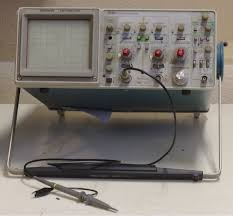

# Chapter 5 - Intro to Angry Pixies

[A simple guide to electronic components (YouTube)](https://www.youtube.com/watch?v=6Maq5IyHSuc&list=PL5cGwrD7cv8hK-qxPqRB25Dzs0BtLWhXz)

## The Tools of the Trade

Building, fixing, and analyzing circuitry requires the use of a few tools and appliences. While there are many more than those listed here, these are the most important ones and should be all you need for most even very advanced applications.

### The Multimeter

<iframe width="100%" height="500" src="https://www.youtube.com/embed/CBah3vz5b-U?list=PLAROrg3NQn7cyu01HpOv5BWo217XWBZu0" frameborder="0" allow="accelerometer; autoplay; clipboard-write; encrypted-media; gyroscope; picture-in-picture" allowfullscreen></iframe>

!> note, the above video uses U=IR instead of V=IR like 'normal'. You'd think that engieers could just get along and pick consistent symbols, but, nope. The 'normal' V (voltage) = I (current) * R (Resistance) is often E=IR

[TODO] textual description of all multimeter functions

## Resistance and the OHM meter

resistors do one thing- resist current. Using the ohm meter function of your multimeter you can find out the amount of this resistance measured in ohms (ohms are represented with a capital omega, Ω) using an ohm meter is simple, just poke and prod with at least one component in between the leads. If there's nothing in between - that is the leads are touching one another- there will be no resistance, if there's no way for a DC voltage to get from one point to the other, that will be infinite or 'overload' resistance

## Voltage, Ground, and the Volt Meter

Voltage can be thought of as the 'pressure' in a hose. However, this pressure is relative to another point, the point we usually take reference to is called 'ground', though this doesn't have to be the case- you can measure the voltage across a single resistor or other component too. Just remember measuring the voltage with both probes at point or along the same wire doesn't make sense because a volt meter only tells you the voltage difference between two points. This would be like seeing the pressure difference in hose between two nearby points, obviously the pressure of one point minus the other will be 0.

In general there are two primary ways you will work with voltage- AC or DC, these stand for Alternating Current and Direct Current. DC is simply a constant voltage level output. AC on the other hand is any time varying signal, usually periodic (repeating) and most commonly a sine, though many other waves are used like square, triangle, saw, and any mixture of these, including the same signal with a DC offset.

Your multimeter will likely have two different settings for measuring voltage, one for DC and one for AC. Of note, *most* multimeters are not true RMS (Root Mean Square) meters, meaning the reading of AC voltage is not accurate unless it's a clean, no DC offset sine wave. RMS is a topic we'll be covering later, but to wet your apatite, this from wikipedia may help:

https://en.wikipedia.org/wiki/Root_mean_square

Of note, from a mathematical perspective all time varrying signals can be represented as an infinite number of sine waves added together, this is actually used to do practical computation in many things.

https://en.wikipedia.org/wiki/Fourier_series#Examples

## Current and the Ammeter

If current is the pressure in the hose, then current is how much water actually flows. This analogy holds up too, because if we use a resistor to kink the hose and the flow is restircted the current will go down. If you were to stick a wire directly into the wall outlet all the current the wall can give will try to flow though, but it can be restricted. To measure the current though a circuit we can't just probe between two points as before though. Instead the probes need to form the exclusive path that part of the circuit can flow through.

In practice this means the wire you want to measure current through would need to be cut and the ammeter's probes hooked up at either end, making the meter part of the circuit.

Current, just like voltage, can varry, and in AC circuits usually does. This leads to some more interesting caseses like power factor, but we'll get to that later.

#### Continuity Tester

The contiuity tester does exactly what it's name implies, it makes sure two points are connected electrically. If you have a piece of metal and put both probes on it it should beep, but if you put the probes on rubber, they clearly will not be. The continutiy tester isn't really much different from the ohm meter in operation, and many will actually dispaly the resistance if there is any. The main use is that it beeps when the resistance is low enough to be confident two points are electrically connected.

#### [TODO] day to day use, why you want one

## OHM's Law

\+ with power wheel

### The Lab Power Supply

Power Supply Units or 'PSU's are useful because unlike your phone charger which puts out a singular voltage of 5 volts (ignoring fast charging) they can have their output voltage varried usually between 1 and 35-ish volts. Furthermore, they provide current limiting, useful when you're unsure of how much current your circuit might sink or need it for safety.

[TODO] add picture, mention ATX psu, current safety

### The Frequnecy or Waveform Generator

Frequency generators can be used to output a signal that is alternating, unlike the DC signal of the Lab PSU.  Usually they'll support a range of wave shapes, frequencies, amplitudes, and DC offsets. Many support far more than this, though the applications for the more advanced modes are few. If you're just starting out you can (with precausions) actually just use the audio output of your computer or buy an inexpensive one for under \$20, unlike the expensive example below:

https://en.wikipedia.org/wiki/Arbitrary_waveform_generator

### The Oscilloscope

The osciliscope (or OScope or simply Scope) allows you to see an AC signal and how it varies over time as a plot of Voltage on the Y axis and time on the X, Most OScopes will allow you to look at multiple signals at once, with one overlaid on the other. Furthermore, most support X-Y mode, where the plot is actually the voltage of one input as the X axis and the voltage of another as the Y, moving a dot and it's trail around the screen. In fact, this is how the first computer monitors worked:

Modern OScopes look much different than their phosphorescent green ancestors though:

However, a decent 'Digital Storage Oscilloscope' or DSO like the one above run a minimum of \$300 at the time of writing, so many hobbyist opt for older scopes like this one:

or a cheap, low resolution, low speed one from Ebay. For most uses, both of these will be perfectly fine. For just starting out though I'd recommend a logic analyzer (I'll talk about that next) and oscilloscope combo tool, like the **LHT00SU1** which can be found on Ebay pretty easily. Be aware they can fry your USB port or worse though.

But what are these actually used for day to day, and why would you want one? [TODO]

[Quake on an oscilloscope (YouTube)](https://www.youtube.com/watch?v=GIdiHh6mW58&list=PL5cGwrD7cv8hK-qxPqRB25Dzs0BtLWhXz)

### The Logic Analyzer

Logic Analyzers... analyze logic. Who knew? But what does that mean? Well, in reality they are *somewhat* similar to an oscilloscope in that they show a voltage over time, the difference is they only show either on or off over time based on the set TTL (Transistor–transistor logic) voltage. This lets you eavesdrop on the digital communication going on over a wire. Here's an example output:

In this particular encoding, the longer high bumps represent a 1 and the short high bumps a 0, so you're looking at the binary that was sent over a wire. It's actually pretty rare that a wire sends raw high for a 1 and low for 0 so other schemes, like the one above, are used. For most schemes the software can actually be used to decode the received data into raw binary or if it was human readable characters even that.

Using a logic analyzer is pretty simple, most today are connected to your computer over USB and then use software like Pulseview as shown above, then you just select the sample rate (how many times per second to check the wire, here 1MHz) and the number of samples to collect and hit start. You may want to setup a trigger too (speaking of, it's worthwhile to look up how triggering works on an OScope [TODO]) Most logic analyzers support 8 or more simultaneous data streams, though in the picture above I'm only using one.

[TODO] explain when a logic analyzer is actually used, and look at a quick example decode

## Software Simulation

[TODO]

Circuit Simulator

Simulide

VCV Rack?

[TODO- following title needs split up, possibly new chapter?]

## OHM's law, Nodal & Mesh Analysis, Superposition, Thevanins

[TODO]

## Resistors

[TODO]

potentiometer read from aduino full range (center tap or max resitor)

## Capacitors

[TODO]

[True, Reactive, Apparent & Deformed Power](https://www.youtube.com/watch?v=cxXmWZDwNEs&list=PL5cGwrD7cv8hK-qxPqRB25Dzs0BtLWhXz)

[Why electrolytic capacitors are actually kinda shitty 💩 (YouTube)](https://www.youtube.com/watch?v=WytU5uj78-4&list=PL5cGwrD7cv8hK-qxPqRB25Dzs0BtLWhXz)

[Ideal Capacitor's aren't real](https://en.wikipedia.org/wiki/Two_capacitor_paradox)

## Inductors

[TODO]

[RGB LED, Inductively Powered, Frequency Controlled (YouTube)](https://www.youtube.com/watch?v=3DeOPN1Cl1Y&list=PL5cGwrD7cv8hK-qxPqRB25Dzs0BtLWhXz)

Motors

## Transformers, Variacs

[TODO]

## Buttons, Switches, and Knobs

[TODO] SPST DPST etc.  Pots V encoders, encoders with buttons, slider pots. (inc motorized) etc.

## Relays

[TODO] solid state vs old school

## Filters

[TODO]

Passive V Active

## Decibels

[TODO]

How to read logorithmic first

[log-scales demo in uPlot (github)](https://leeoniya.github.io/uPlot/demos/log-scales.html)

## Further Reading

[TODO]

https://learn.sparkfun.com/tutorials/voltage-current-resistance-and-ohms-law/voltage

https://en.wikipedia.org/wiki/Transmission_line