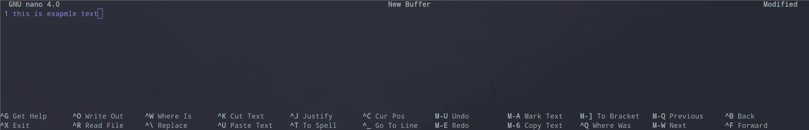
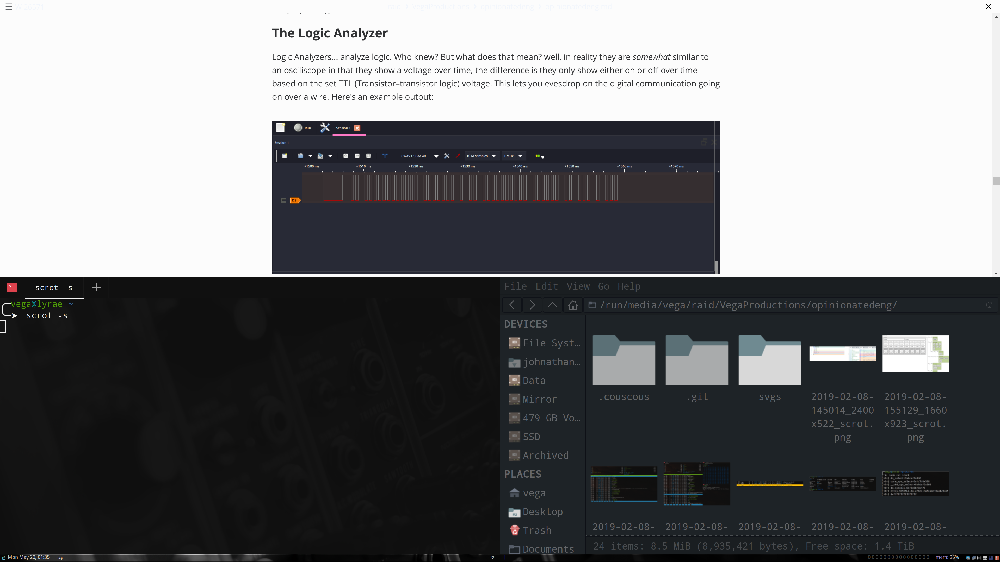
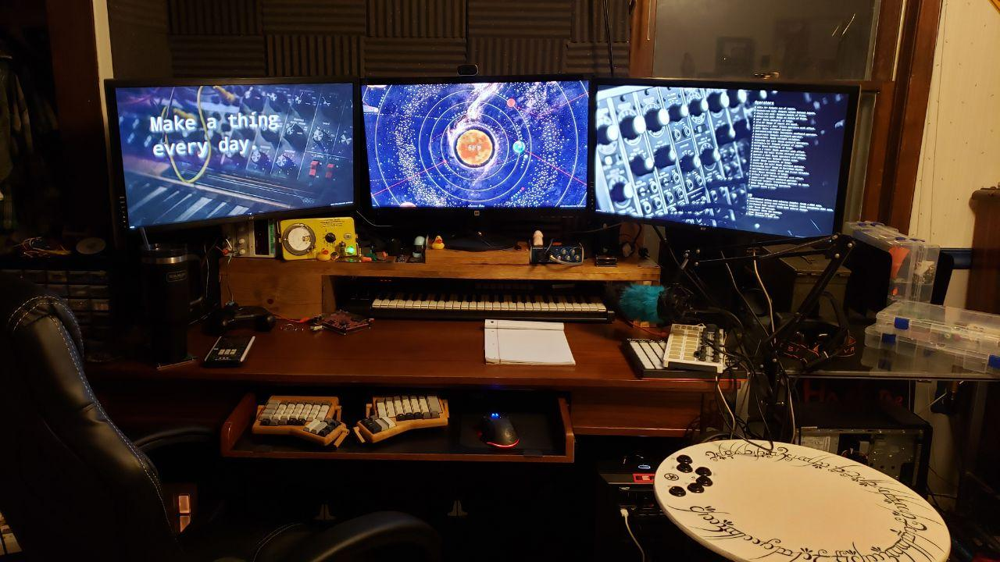
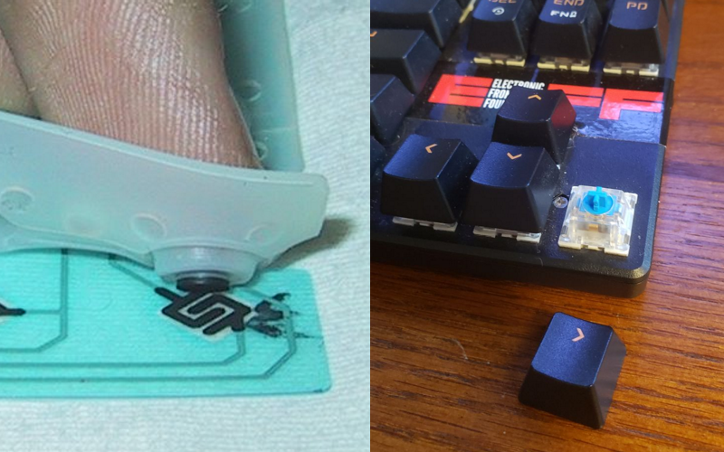
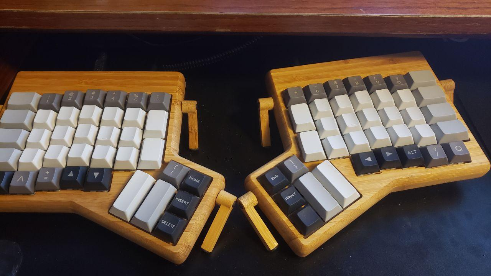

# Chapter 6 - Let's work on how we work

## The Terminal

In the world of programming, embedded development, and electrical debugging you will inevitably need to understand how to use a terminal/command line at some point. While the text only interface can look intimidating, it has some clear advantages, namely it's significantly faster to use the cli or 'command line interface' version of many tools. Because of the nature of this book you will be using the terminal frequently, so for convince sake information on using it effectively has been moved to Appendix A, though I highly recommend you read though it now.

I highly recommend getting autojump setup early as it makes navigating around the terminal much faster, furthermore, bat makes reading code though cat not suck and tldr will save you time when you forget how to use tar, set these up early if nothing eles.

## Heads up,

With that out of the way, I want to preface this chapter with a big warning: Getting used to everything we're about to do will be a pretty big leap. There's a good chance you've never used a computer that works like we're going to be setting up, but it's what I and many of my friends use daily and for good reason. This is probably where more opinions are going to show than anywhere else. You've been warned.

[TODO] pacman -Qi , pacman -R

## Code editors

People get defensive about the way they work, and frequently try to claim theres is the best way. I personally see value in multiple of them, but also understand how setting down with just one and getting very fast with it may have it's appeal. I have three recommendations for code editors, as silly as that may seem.

The first two are terminal based `nano` and `vim`,

nano, is the most simplistic of all the editors I'll list here. It's stupid simple to use and for quick just opening a text file and changing one line, probably the fastest. It clearly prints it's instructions at the bottom of the terminal:



where ^ is the ctrl key, and M the alt key. However, you'll quickly find nano rather limiting, so onto vim!

Vim, with Spacevim (spacevim.org) ontop is a very powerful tool.


Vim can do everything you could ever dream of, and probably a bit more, and with spacevim ontop, it's a powerhouse. Unfortunately, vim is regularly the butt end of a joke becaue of how nutoriously difficult it is to get the hang of. For that reason I'm going to link a mini tutorial here: https://www.openvim.com/, and link https://spacevim.org/documentation

Graphically I recommend Visual Studio Code with Platform IO, Bracket Pair Colorizer 2, and GitLens

This gives you a pretty kick butt editor on bar with most full Integrated Development Environments or IDEs. I recommend you try out IDEs, especially if for some unholy reason you want to write in Java, but otherwise this will do fine.


## The Desktop Envrioment

This is the biggest change, I'm going to recommend switching from KDE, which we installed when we setup arch, to i3. i3 is a tiling window manager, this means it looks something like this:



This is with 3 windows open: Marktext (the program I'm writing this in), a file manager, and an terminal I used to launch the program (scrot) to take the screenshot. What's cool about i3 is how it will always use space as efficiently as possible by tiling the windows, and you can navigate between the windows (or multiple monitors) entirely by keyboard (mouse still works obviously) and open multiple virtual workspaces. When programming and using a computer for advanced things it's not uncommon to have a dozen windows open and having things organized like this can be a life saver.

i3, when first installed, is very, very minimal, it will greet you with a plain black bar and clicking with either mouse button anywhere will do nothing. You should, however, be able to open a terminal by using your modkey (probably the windows or alt key) and enter.

i3 actually comes in a bunch of separate parts, the most important of which are the window manager itself, the status bar, and the task runner.

The window manager is the thing that actually manages the windows, this is the part most people are referring to when talking about i3 (assuming they're not talking about an i3 Intel CPU) and is sometimes refereed to as i3wm. A very popular 'fork' of i3 is `i3-gaps` which is available in the community repository.

On top of the raw window manager you'll probably want a status bar of some kind. While the default i3bar which is included with the i3-gaps package is fine when paired with `i3status`, it does leave a bit to be desired. Many other options are available. I personally use `polybar` though I have friends that have used `lemonbar`  or`i3blocks`.

Finally you'll want a runner/application launcher. While i3-demu is included, I find it rather annoying to use, and much prefer `rofi` -- this is much better explained here than I can briefly: https://github.com/davatorium/rofi

To further make i3 reasonable to use you'll want a few more things:

`compton` is a composite manager. This is used to allow application to have some transparency, prevent screen tearing, and do slight effects, like but a shadow behind windows.

`lxappearance-gtk3` can be used to set the theme used by various graphical applications. I use [Sweet](https://www.gnome-look.org/p/1253385/) but there are nearly endless options

For setting the wallpaper (which you probably wont see much) you can use `nitrogen` or `feh`

if you have multiple monitors before setting the wallpaper though you'll probably want to arrange your monitors correctly, for this you can use `xrandr` , read the man page for more information. You can add the command you use to set up your displays to your i3 config file to apply them at each reboot

if you have a high resolution monitor and things are small, you may want to look here: https://wiki.archlinux.org/index.php/HiDPI , the best thing from this is to add

```bash
QT_QPA_PLATFORMTHEME=qt5ct
QT_AUTO_SCREEN_SCALE_FACTOR=1
GDK_SCALE=2
ELM_SCALE=1.5
```

to your /etc/enviroment file.

You'll be needing quite a few different utilities beyond this. for a terminal I highly  recomend `kitty`,  `rxvt-unicode`, or `Alacritty`.

For fonts you'll certainly have your own tastes, but I really like Droid Sans Mono, which is in `ttf-droid`, but `ttf-hack` and `otf-fira-code` are pretty cool too. I also recommend installing `noto-fonts`, `noto-fonts-extra`, and `ttf-font-awesome`. The noto packages will provide coverage for weird characters and font awesome is basically icons saved as a font, and many open source projects use it.

If you're looking for more ways to make your setup the best it can be or config files you can steal from check out  [r/unixporn](https://www.reddit.com/r/unixporn).

## The Physical Enviroment & Hardware



Working on a laptop with a mushy membrane keyboard is totally fine for some people, but when you're deep into some complicated work having the best possible setup can save a lot of time, frustration, and mental overhead.

Furthermore, the work environment can change how long you can work for and how productive your work time really is. Be it for comfort or productivity, there are many reasons to take care in making sure you're setup is right for you.

If you are on a laptop some of the following is still applicable, but consider how any of what I'm about to mention may be adapted to your own setup.

**Displays**

The way you use your monitor is more important the monitor itself. Don't get me wrong, if you have an 11", 4:3 aspect ratio monitor running though VGA there's a limited amount you can do, but there's still some things.

First and foremost is positioning. I've helped many a office worker complaining about neck and back pain simply by raising their monitor closer to eye level. Ideally you want your eyes to naturally rest right on the on the top 3rd line of your screen, about the level where the left-most knob is on the wallpaper on my right-most monitor in the picture above.

Unfortunately, there is no magic rule for how far away your monitor should be from your face, as this highly depends on your vision, monitor's resolution, and size

> on this note, you'll often hear monitors described by their dots per inch, this is a measure of the number of pixels in a square inch on the screen, the higher this is the finer the details, but the smaller any given element on screen will be. Apple's Retina displays for example have a high DPI rating, which is a large part of the reason they look so good

I personally have my three, 4k (that's 3840x2160, or 4 times the resolution of 1080p) monitors positioned approximately 30 inches from my eyes.

Before moving forward though, I think it would make sense to talk about some of this display terminology, if you're already cool with this just skip this massive quote block

> Aspect ratio is the ratio is the ratio of the width to the height of the screen, most modern screens are 16:9, or have 16 units of width for every 9 units of height. Most older displays, often now called square screens, are actually 4:3. Many people actually still prefer this for the extra vertical room it affords at a given size, and some laptops are actually moving back to a more 'square' aspect ratio. On the other hand more exotic ultra-wide displays are also coming out

> Sizing of displays is a bit odd. A 27" 16:9 display, is not the same size as a 27" 4:3 display as displays are measured diagonally.

> Resolution of a display refers to the number of pixels, HD technically starts at 720p, or 720 pixels across, though this is generally rather low by modern standards, with acceptable usually considered 1080p, which is technically 1920x1080. You may also see 1080i, this is a strange concept, not actually related to resolution, and we'll come back to it in a moment

> The interface on your display matters greatly as well, the most common at the are HDMI, Display Port, DVI, and VGA
> 
> VGA is the worst option here, as it's an analog signal. This means the signal can do strange things, getting corrupted between your computer and the monitor. Typically this is a blue, screw in connection with many pins
> 
> DVI is still pretty common and looks like an even larger VGA connection, with a typically white, screw in connector. This signal is normally digital, though there is a varient of DVI that can be adapted into VGA. Of note, DVI can also be adapted to HDMI though you will not have audio, as DVI does not carry sound
> 
> HDMI, probably the most well known connector, has multiple revisions, the revision determines many things such as the maximum resolution, refresh rate, and weather or not more obscure things such as HDR are supported. HDMI is usually considered the best of these three options
> 
> Taking the crown however, is Display Port (DP). Like HDMI display port does have multiple revisions which do differentiate similar things; however, Display Port will generally support high resolutions and more features at any given point. Assuming you're running a bog-standard 60hz 1080p display however, you'll find no difference between DVI, HDMI, and DP - unless you need sound.

> Next, you'll want to note the refresh rate of your monitor. This is how many times per second your monitor refreshes the screen. Typically monitors run at 60hz and TVs at 30 or 60. Because unlike a TV you're causing things on screen to change though, 30hz is generally considered bad and can even cause motion sickness. While 60hz may be standard, going for something even higher, with many displays offering well above 120hz, is something you may want to consider, especially if you plan on gaming.
> 
> Newer displays may support Freesync or Gsync, and both of these technologies require a supported graphics card in the system as well. These allow the display and computer to adaptively change the refresh rate so the monitor and computer both send and display frames in sync, which can make even a low refresh rate 'feel' much higher. This is a feature typically marketed to gamers and only supported in video games, but this has been changing. Gsync monitors genearlly have a much better implementation of the technology but it requires an Nvidia graphics card. As of the time of writing both Freesync and GSync are supported on linux, but quite rough around the edges.

> related to refresh rate is latency. In general this can actually mean two things, one is how long it takes for an image sent to the screen to actually be displayed. The lower this time the better, with good screens being sub 10 millisecond. Unfortunately, there's no standard among the industry to measure this and many get it wrong.
> 
> Also with latency theres grey to grey times, this is a measure of how long it takes a pixel to go from one shade to another. The lower this is the less motion blur the screen will exhibit

> The color depth of the display determines how precisely a color may be displayed. The higher this is the better, but almost all modern displays will be the same, and unless you're an artist or creative professional you're unlikely to notice a difference
> 
> On the other hand, you are likely to notice the color gamut or what range of colors the display is actually capable of displaying.
> 
> For example, two displays may both be capable of displaying 255 levels of red, but if one display's range is only from a dingy red to a dark-ish red, while the other is from a brilliant red to a deep dark red, there's a massive difference in color availability. If this is important to you, notably as a creative professionally in photo or video, you may want to read more at https://en.wikipedia.org/wiki/Gamut

> The next obvious thing to mention is dynamic range, or how deep the blacks are and how vivid the whites are. Again, this is simple, the higher the better. Many display types (LCD, TN-Panel) will have similar specifications in all these areas, but particularly here. OLED is probably the best when it comes to dynamic range as it can display true black by actually turning the source of the light off, but unfortunately these are quite susceptible to burn in and image persistence.
>
> Actually, display technology overall (OLED, LCD, TN, CRT, etc.) will have more of an impact than anything else. But, this is also getting really into the weeds, and I don't want to recomend one technology over the other since depending on many other factors on each display theres no clear winner.
>
> There are some newer displays which feature HDR or High Dynamic Range, which allows the panel to selective change the brightness in an area of the screen, giving much better dynamic range in supported applications than a normal display

> burn in and image persistence are both negative effects on many displays where a pixel either permanently or temporarily resists change in color. This can lead to being able to read previously displayed bright white text on a now black image for example. More commonly you'll find TVs which have a particular station's logo 'burnt in' to one corner of the screen, persisting even after changing channels

> Brightness is obvious, how bright or dim is the display. The big thing to note here is weather the brightness is PWM or DC controlled. Displays with PWM controlled brightness are much more common, however, it's a bit of a cheat. Instead of actually changing the intensity of the back light directly, they're simply strobing the light on and off to fast for the eye to see. This can cause eye strain over time though, and generally DC control, which actually does change the brightness directly is preferred. If you have a PWM display and don't mind it at full brightness, this should help with eyes strain, as there is no longer a strobe effect as the display's backlight is just constantly on.

> Finally, if fonts look bad on a screen, it may be due to Sub-pixel rendering. Basically, while most screens pixels go R-G-B in order, not all do. To make text look sharper, most font renders will try to abuse this sub-pixel order to get sharper-than-pixel fonts.

clearly there's a lot to be considered here. A no compromise monitor can cost thousands of dollars, but nice 4k 27" monitors like mine can be found for <250 on sale, and I love them. Just figure out what you need and what would be the most beneficial for you and work from there

---

One of the great things about i3 is how powerful it can be with multiple displays, though even if you're not using i3 having a 'multi head' setup can be a god send for productivity. Even if your monitors don't match it's worth it. If you have the budget to get two matching monitors, great, if not just getting a cheapo used monitor from a thrift store will be a massive improvement. I think 2 is the magic number for most people. 3 monitors take up a lot of room and unless you do some very multi-tasked things you won't see much benefit that using something like i3's workspaces wouldn't provide anyways.

Another thing to mention is red-light filters. While I dont personally use one many people find that reducing the amount of blue light coming from their displays significant helps with eyestrain. If this interests you give `redshift` a shot. I use it every now and then if I have a headache.

**Keyboard**

Probably the most important thing you can do for your workspace is getting a nice keyboard. If you're rocking a rubber dome or membrane keyboard, moving to a mechanical keyboard will make a massive difference.



([source](https://commons.wikimedia.org/wiki/File:Keyboard_Construction_Button_Press.JPG))

The membrane/rubber dome keyboard on the left doesn't give much physical feedback to your fingers when you press a key, compared to the mechanical key switch on the right. A decent mechanical keyboard can be found on amazon for <50 USD, though as with anything in life the more you spend the better the product. One thing to keep in mind is the color of the switch used. Above you can see that keyboard has blue switches, blue switches have a noticeable 'bump', that is the switch has a spot of higher resistance before it actually botmoms out, and the key actually presses at this point, furthermore, blue keys are clicky - they are loud and some people find this annoying. Finally, they're also pretty light, not taking too much force to push down. Generally, blues are considered the 'gold standard' among typist, but games on the other hand may prefer a brown, red, or black switch.

|           | Linear | Bump  | Bump + Click |
| --------- | ------ | ----- | ------------ |
| **Light** | Red    | Brown | Blue         |
| **Heavy** | Black  | Clear | Green        |

> these are the common colors and how they feel for Cherry MX switches. Most other mechancial switches are 'clones' of MX switches- though sometimes these clones are actually superiour-
> but these clones don't always follow this chart

really it's all a matter of preference, I'm actually using a switch not listed here on my keyboard, but generally finding what you like among the above first is a good place to start. If I'm not using my main keyboard I generally use Blues. If you'd like to try some out before pulling the trigger on a full keyboard you can find switch test boards for sale online.

Furthermore, there are other types of switches like IBM's old Model M line which use a buckling spring, which are quite stiff and have a very unique, heavy feeling. If you don't want to use a 20 year old keyboard Unicomp makes clones that are quite nice.

You should also consider they layout of your keyboard. Some people absolutely need a number pad while others are happy to omit it and have the shorted hand travel to their mouse. Even still others want an extravagant number of keys or a weird split keyboard like mine:

> This is a custom built ErgoDone keyboard, The Ergodox-ez can be purchased for ~300 USD, or you can build one like mine for a bit under 200

Beyond the physical layout you may also consider the keymap or software layout. Not only does my keyboard look weird, but the keys aren't arranged as you'd expect either. Instead of typing in QWERTY, I actually use Dvorak. That layout looks a like this on a normal keyboard: 

though obviously anything is possible. A lot of programmers like to disable their Caps key for example and put something more useful there, or you may just want to move around a letter or two. Using a standard layout like Dovark is a bit easier though as I can easily load my keymap pretty quickly on any computer. Plain old Qwerty is fine, but I personally like my 'weird' keymap.

If you're shelling out big bucks on a nice keyboard anyway, you may also want to get a keyboard which supports QMK, a completely open source firmware which gives you total control of your keyboard, allowing you do to cool things like type greek letters ( Ω , α, β) or type parentheses by tapping the shift keys. I find that particularly helpful as my keyboard doesn't actually have enough keys to do have every key nicely available (note how I don't have a function row) for more info check out https://docs.qmk.fm/#/ . You can actually buy an adapter to use a normal keyboard with QMK, but it's a bit hack-y and I really recommend just saving up to get a full keyboard made for it.

Back to ergonomics, you'll want to make sure your keyboard is a t a comfortable height for you and that you can type in a way that isn't putting your wrists at any weird angles

Finally, one of the nice things about i3 is the ability to navigate everything entirely from the keyboard as well as bind as much as you want to as many keys as you'd like. Want a key combo to launch a file manager? easy. Want a key to navigate to open up a terminal and immediately run a command- no problem. Set things up as you like and enjoy being able to use your system at break neck speed while everyone else drags things around slowly.

**Mouse and other input**

Speaking of dragging things around slowly: The mouse

**Sound**

Noise isolation both electrical and physical, headphone types (over, on, in), amplifiers, dacs, ASIO/ sound hardware, connection types

**The Desk and Chair**


**Lighting**


**Air Quality**

[This Is Your Brain On Stale Air (YouTube)](https://www.youtube.com/watch?v=1Nh_vxpycEA&list=FLFMnqfaTa1se1LfbCB3peJQ)


## Various Programs:

**Markdown**

[TODO]

Marktext, Typora, colabrative editing, Github markup, etc

**Taskwarrior & Timewarrior**

[TODO]

Taskweb

**File Explorers & Storage Managment**

[TODO]

Ranger, THunar, Nautilius, Baobab, Gparted

if you use Nautilius, you may want to run

```bash
dconf write /org/gnome/nautilus/preferences/always-use-location-entry true
```

so that the file paths are displayed in full

**Media (Music, Video, PDF,)**

[TODO]

**Office & Creative Software**

[TODO]

Libreoffice

Krita

Audacity

DAW? QJackCTL?

OBS

KiCad

darktable

Evince

Feh, nomacs

Wine

Boxes- vm

**Package managment**

[TODO]

Pamac, Steam, AppImg, itch.io, dpkg, snap.

maintaining an aur package, pacman conf stuff

**Web and network protocols**

[TODO]

Vivaldi, Firefox, Syncthing, Beaker, IPFS, IRC - irssi, Telegram, Etherape, Wireshark, gufw,

**Shell Scripts**

[TODO]
