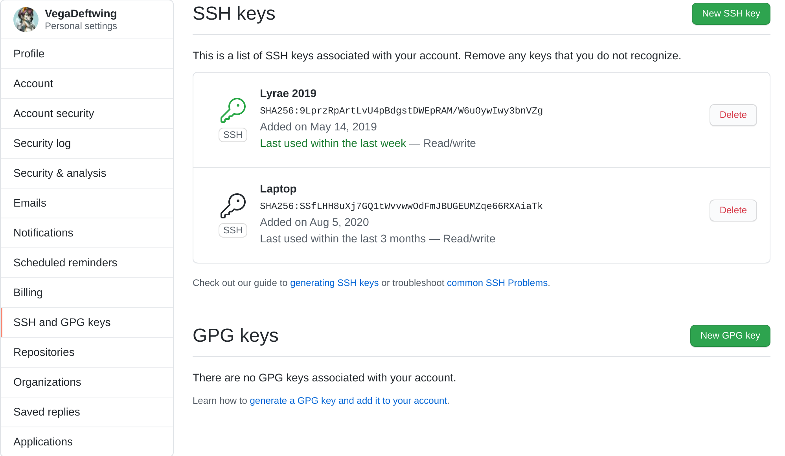
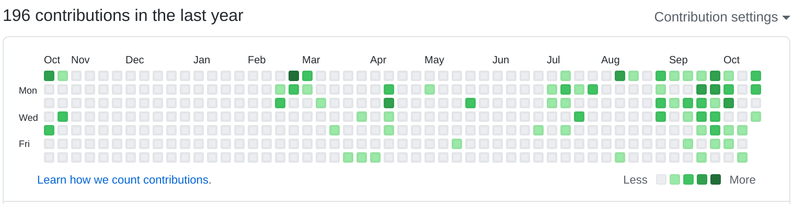
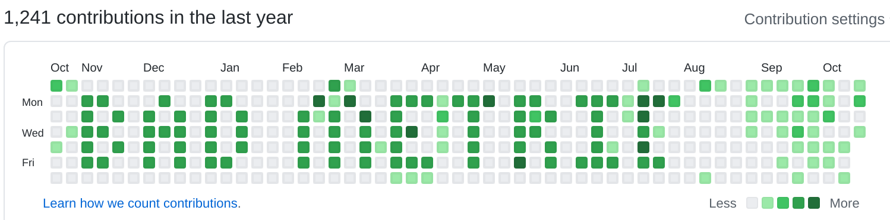

# Chapter 6½ - Git.

[./missing-semester - Version Control](https://missing.csail.mit.edu/2020/version-control/)

!> The above link does a better job of covering the vast majority of what I'd say than I could hope to put here. Just check it out.

[Bit, an alternative git cli (Github)](https://github.com/chriswalz/bit)

[learngitbranching.js.org](https://learngitbranching.js.org) (more than just branching)

[μGit- DIY Git in python](https://www.leshenko.net/p/ugit/)

[TODO] Show how to setup SSH keys for Git

[SSH keys article on the (Arch Wiki)](https://wiki.archlinux.org/index.php/SSH_keys)

`ssh-keygen` 

After you have a key generated, you'll need to add the public key to github,



you may need to change existing repo to use a git based origin rather than an https one:

```bash
╭─vega@lyrae ~/git/local/openg3  ‹master› 
╰─➤  git remote -v
origin	https://github.com/opinionatedguide/opinionatedguide.github.io (fetch)
origin	https://github.com/opinionatedguide/opinionatedguide.github.io (push)
╭─vega@lyrae ~/git/local/openg3  ‹master› 
╰─➤  git remote set-url origin git@github.com:opinionatedguide/opinionatedguide.github.io.git
╭─vega@lyrae ~/git/local/openg3  ‹master› 
╰─➤  git remote -v
origin	git@github.com:opinionatedguide/opinionatedguide.github.io.git (fetch)
origin	git@github.com:opinionatedguide/opinionatedguide.github.io.git (push)
```

[TODO] show graphical git tools

[TODO] comparison of Bit, Git, GithubCLI

[TODO] .gitignores

[TODO] show `git log --all --graph --decorate --oneline` and adding it to the gitconfig

[TODO] Git on not-github, diy hosting

https://dhwthompson.com/2019/my-favourite-git-commit

## Notes on GitHub and competition

[Stop using number of git commits as any metric (u/Sajjon on Reddit)](https://www.reddit.com/r/CryptoCurrency/comments/cub9c2/stop_using_number_of_git_commits_as_any_metric/)

[](https://github.com/ryo-ma/github-profile-trophy)

> generated using https://github.com/ryo-ma/github-profile-trophy, the above are the stats on my github profile





> ahh, much better. Made using https://github.com/gelstudios/gitfiti, inspired by someone else that wrote the same thing, but I can't find the original.

