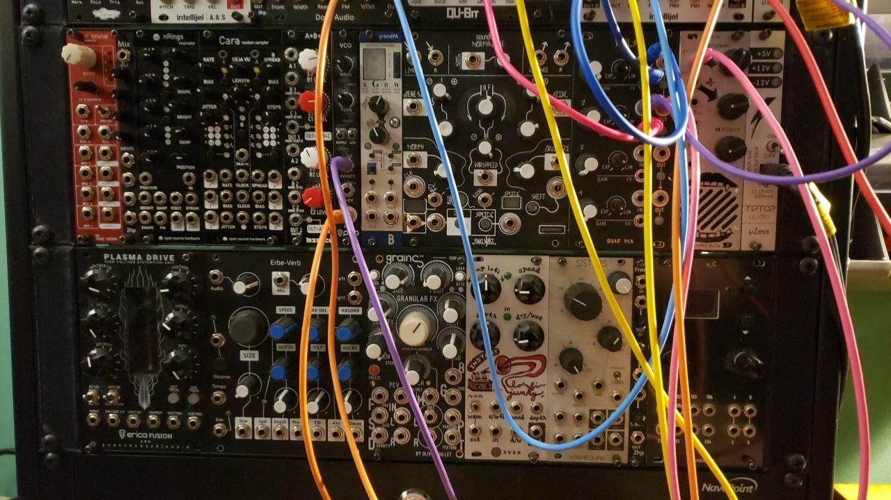
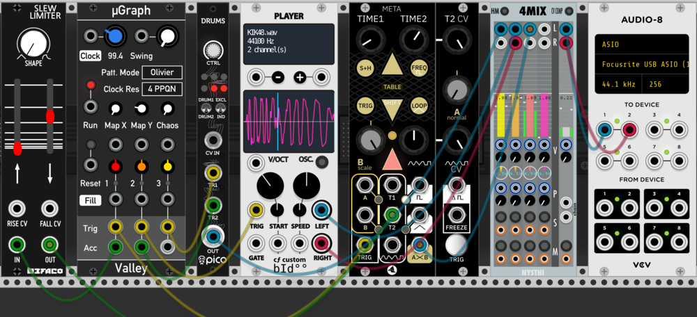

# Getting Started

Here's the part where I'm supposed to explain how to read music or something boring like that. Really though, that's not why you're here. So let me start by giving you a bit of motivation. In a bit I'll be going though how to use VCV Rack, a free (with paid addons, but those aren't necessary) program for making music. But as we go though each bit is going to look so -basic- that it's hard to see the bigger picture. So, here's that bigger picture: This track was made entirely with VCV rack:

<iframe style="border: 0; width: 100%; height: 42px;" src="https://bandcamp.com/EmbeddedPlayer/album=3503666064/size=small/bgcol=ffffff/linkcol=0687f5/track=3864536185/transparent=true/" seamless><a href="http://vegadeftwing.bandcamp.com/album-2">Content by Vega Deftwing</a></iframe>

Alright, with motivation out of the way, let's make some noise! To do that though we're gonna need just a few things:
Go download VCV Rack from https://vcvrack.com/ and depending on your OS you'll need some sound drivers, MAC guys, sorry, no idea. On Windows you'll want to use ASIO, if you don't know what that is just go grab http://www.asio4all.org/ and use that, on Linux you'll want to use Jack https://wiki.archlinux.org/index.php/JACK_Audio_Connection_Kit. On Linux you may need to use a tool like Catia to actually connect the jack devices together (VCV to System Out)

Go ahead and fire up VCV and a template patch should have opened up that looks some thing like this:

Windows guys, set your sound device to ASIO and fiddle around until you have sound working, Linux people RTFM, Mac people ヽ( ´¬`)ノ.
That default patch should respond to input when you mash keys so you can test your sound settings (assuming the MIDI-CV module is set to QWERTY keyboard as in the above screenshot and an audio device has been selected)

Final note on that, sound cards and their drivers/software (asio/jack/etc.) have a few important settings you should know about. First, is the 'buffer size'. Frankly, this isn't all the important to understand from a technical perspective but the gist is the lower the buffer size the lower the latency, and higher the higher the latency (latency is how long it takes for sound to come out after you hit a key and is bad); however, the lower the buffer size the more likely you are to have audio under runs, this makes your sound do this weird robotty sound like it was recorded on an Atari2600, make nasty beeps, or cut out entirely. The size you can set your buffer to will vary depending on the hardware you have in your computer, but generally I can get away with 128 and I'll bump it up to 256 when working on large projects if I notice the above issues. You may need to try up to 512 or 1024 though.

Alright, that pita outa the way, lets *actually* make some noise.

The reason we're starting in VCV rack is it exposes a lot of the raw ideas and fundamentals of how music works behind the scenes, raw frequencies and modulation open to see. In that default patch there we start with a MIDI (Musical Instrument Digital Interface) input which outputs a 'voltage' from the V/oct (Volt per Octave) output, which is fed into an VCO's (Voltage Controlled Oscillator) V/oct input.

Wait. Big words. Stapphh.

Alright. I'll backup So VCV rack actually emulates real hardware systems called modular synthesizers. VCV emulates the Eurorack standard of modular synths in particular. Skipping some finer details for a moment, the standard defines one nice thing, and that's the idea of 1 Volt per Octave note control. (If you don't know anything about electronics that's fine, but it might help here) In a real eurorack system the voltage running though the wires can range from -10 to +10Volts. Any wire can really be patched into any hole to get surprising results and all the signals are technically interchangeable, but generally in eurorack there are two categories of signals CV or 'Control Voltage' and 'Audio Rate' signals. The most common form of CV is this V/oct signal, where each volt represents a one octave change. A stable 0v (the same as no input) signal is 'Middle C' or C4 where 'C' is the note and '4' is the octave number. This is only 'generally' the case, but just stick with it for now. When you strike a key on your keyboard VCV is interpreting that keypress as a MIDI event, and converting that MIDI signal to a virtual CV signal. So, if you happen to press the C note on the 4th octave, you'll get... 0v, no change, but if you were to hit the C note one octave higher (C5) the note should be noticeably higher pitch and the output from the V/oct port would be 1V. In fact because of how our music system works, an octave is exactly a doubling in frequency so while 'C4' is 261.63Hz 'C5' is 523.25Hz). If you hit a C#5 note though the output voltage will be  1.08333V because there are 12 notes per octave (A, A#, B, C, C#, D, D#, E, F, F#, G, G#) and 1/12 is .08333 which is added to the 1V from being up one octave from from middle C (C4)

> This is Stinkbomb's hardware Eurorack. Real Eurorack hardware is incredibly expensive!

Alright. Fuck that's complicated. So, to boil that into a digestible chunk, you press a higher key, a higher voltage comes out, lower key, lower voltage. Keys above C4 will output a positive voltage, keys below a negative voltage.

So we hit a key, voltage comes from V/oct on the MIDI->CV interface and goes to the Voltage Controlled Oscillator, which, as it's name suggests uses these voltages to control how it oscillates (moves). The V/oct input directly manipulates the frequency, but there's also this big honking frequency knob just begging to be twisted. That knob can be used to make it so 0V corresponds to a different note. For example, if we right click the frequency knob to enter a value directly, and enter '440' Hz that would make 0V into an 'A4' note (A is a common reference pitch, as it's just multiples of 110Hz so it's easy to remember) Now each key will just be 'transposed' that is they'll all be shifted over a few notes.

You can also turn this knob to something out of tune to get things completely out of the classical scale. The fine knob below does the same thing, but gives you fine control (obviously)

Alright, we'll come back to the VCO later, but let's follow the signal path a bit further. The VCO has a wire coming from the Saw wave output into a VCF or 'Voltage Controlled Filter'.

Filters are a huge part of making good sounding music as often you'll have a good sound but it'll have too much low or high end and you just want to cut it out. This filter actually has 2 outputs, one for a 'High Pass Filter' (HPF) and one for a 'Low Pass Filter' (LPF) as the names imply, a HPF lets high frequencies though and cuts the low end and a LPF cuts the high end but lets the low though. LPFs are generally used more as usually it's more desirable to cut the harsh highs out of a sound than the humming, thumping lows. This is exactly what has been done in the default patch here. The final basic (filters get really complicated) thing you should know about a filter is how they have have a cut-off frequency. That is the point at which the filter starts cutting the sound. This is adjustable, so say with a Low Pass Filter we could set the frequency really low and only let though the lowest frequency sounds or set in nice and open to just cut out the really hissy stuff. We'll talk about more complex stuff like resonance in a bit.

The need for this may seem a bit weird at first, as if we're playing a note at exactly one frequency, say A at 220Hz, then why would we need to filter out anything? Well, most oscillators and real instruments alike will actually have multiple 'harmonics', that is it will play an A at 220, 440, 880, and so on with decreasing amplitude or even on other frequencies entirely that still have a musical influence on the signal. On the 'VCO-1' Oscillator loaded into the default patch here you can lessen these harmonics by switching the ANLG (Analog) and DIGI (Digital) switch on the right. This is because this oscillator can emulate either an 'ideal' digital oscillator which outputs a clean, sharp signal with less harmonics or an analog signal oscillator which includes a subtle amount of pitch drift and some smoothing of the output wave- of note, usually the analog characteristics, while technically flaws, are desirable.

> The top VCO is outputting an 'analog' emulating signal while the bottom is in digital mode. Look at how the Triangle output shape on the analog mode is smoothed out compared to the digital mode's sharp edges

You'll also notice there's a third wire running into the filter though- into an input labeled 'freq'. This input modulates the filter's cut off frequency. You wont visually see the knob change but you will hear the filter's cut off change based on the signal applied to this input but only if the 'Freq CV' knob is turned up. The 'Freq CV' knob is what's known as an attenuverter (a portamento of 'Attenuator' and 'Inverter'). This knob, when facing dead center says 'let nothing though' while all the way right lets the full signal (from the freq input) though, and all the way left lets the full signal though but inverts it first. Leaning right but not all the way will 'Attenuate' or weaken the signal first. I think you get the idea.

So say we put the big 'FREQ' knob dead center, and give the 'FREQ' input jack wire carrying a very slow sine wave that goes between 0 and 10V, and set the 'FREQ CV' knob all the way right: This will bring the cut off higher and higher from it's starting position, and then bring it back to the starting level. If we instead turn the 'FREQ CV' knob all the way left, it'll bring the cut off frequency lower before turning back around and coming to it's starting position. Putting it at a slight lean right will still do the same as we started with, but will have less of an impact, making the sound much less 'jumpy' and tame. Really, that's what attenuverter's are for, taming an input signal.

Here, I'm showing modulating the filter frequency manually as well as showing what resonance is- it boots the signal right at the cut off frequency

Here, the input to the cut off frequency is modulated with an 'LFO' or Low Frequency Oscillator, which much like the VCO outputs a simple signal, but in this case the signal is low frequency, usually below human hearing range:

Alright, that's fine and all, but the cable going input to the 'FREQ' control on the VCF is coming from something called an 'ADSR'

So the adventure continues. 'ADSR' stands for 'Attack, Decay, Sustain, Release' and it does exactly that. But before we understand the output of an ADSR we have to look at it's input- 'Gate' and 'Retrig'

'Gates', in modular, are simply a positive (sometimes needing to be 5V or higher) signals that represent that something is happening. Usually, that a key is being held. And that's exactly what's going on here. When you hold a key the 'Gate' output of  the MIDI->CV module is active. When you release it, the output goes off. You can see this by looking at the green indicator light where the gate output is on the MIDI->CV module when you hold or release a key. 'Retrig' is similar, though it only outputs a short pulse every time you press a key. This is handy because you may press a second key while already holding one key, meaning the gate output should stay on, but the retrig output will have sent a pulse each time you pressed a key (once when you pressed the key your holding, another time when you press a different key while still holding the original key).

So, back to the 'ADSR' an ADSR generates a signal that looks like this:

That is, voltage will follow this shape over time. The 'Attack' knob sets how long it takes to reach the peak point, the Decay knob set's how long it will take to reach the sustain level, the sustain knob set's at what level the sustain should be held at, and the release knob set's how long the note should take to fade out from the sustain level after the key is released. Take note, the sustain knob controls a level, while the other three control time:

Alright, so when the ADSR get's a gate signal it'll go though the Attack and Decay stages and wait at the Sustain level until the Gate is released or a Retrig signal is sent telling the ADSR to repeat the Attack and Decay stages.

So, this output signal is fed to two places, the first is the frequency knob we saw before. This will result in the frequency cutoff going high then coming down to a reasonable level, then cutting down to just low frequencies as a note is released. The other place the signal goes is into the mixer:

The mixer in this demo patch is super simple. It has 4 inputs, with one output. The sliders let you set the level of each input, and the 'CV' input of each slider let's you externally control the slider. Because the ADSR is fed into this input and the ADSR output is at 0V unless you hit a key the mixer actually mutes the signal until a key is pressed and then lets it play, fading out over the release period. The mixer also has one big volume knob ontop to set the master output volume of all 4 channels combined. Essentially the volume follows this shape of the ADSR signal over time. In times like this, the ADSR signal is called the 'envelope' for the sound. Really, the mixer is just a combination of multiple of a simpler component though, the VCA or Voltage Controlled Amplifier. This name is a bit misleading though, as really VCAs are usually used to bring a sounds volume down, like an attenuator. To show the simplest case I'll hook up a LFO to control a VCA's level, in turn changing the level of the signal passing though:

Also, above you'll see I used a 3rd party oscillator instead of the VCO-1 you've seen so far. Pictured is 'Basal' from the 'Vult-Free' collection of modules available on the VCV library page.

Finally, the output of just the first channel of the mixer is fed into the scope so that when you press a key you can see the signal your generating. To understand this it's easiest to just drag the cable coming out of the VCO's 'SAW' output to the VCO's 'Sine' Output. Now when you press a key instead of seeing a saw wave you should see a sine wave.

Finally, I want to mention that at least by default this setup is 'Monophonic' (Mono = One , Phonic = Voice) meaning that even if you hit 2 keys at once you'll only hear the note from the last key you pressed. We'll explore Polyphonic (Many Voice) and Paraphonic (Para = beside, or side by side) systems later.

---

Now that we have that mess out of the way let's talk shop and drop back into our rack. This time Let's start with a mostly clean slate. Make sure you can still get sound out, then remove every module except the Audio module. Alrighty, now we can get to business.

Let's make a simple generative track, to start with we'll need some drums. Here's what we'll be setting up:

So first, let's break each module down by function. The uGraph module (2nd on left) is a generative trigger sequencer, it generates drum rhythms for us. It has it's own built in clock, but an external clock signal can be provided (turn the clock knob left until it says *Ext.* then provide a clock input that's multiplied by the rate specified in the clock res box, in this case it wants 4ppqn or peaks per quarter note, so, if you want to a 120 bpm drum line, you'll want to send a clock signal that's multiplied by 4. Some modules will sync on 1ppqn or 24ppqn, etc. So, just be aware that you may need to multiply your clock signal some times.) though here we'll use the internal clock. This module sends out 6 triggers, where the three 'accent' (Acc) triggers are a strict subset of the main trigger outputs, that is there will only be an output on Acc when there is an output on Trig, but not always. uGraph will generate the three trigger sequences such that the left most trigger output 'fires' the least often and the right most the most often. This works well for setting up a common drum machine with kick, snare, and hat sounds so that the hats are frequent, the snare less so, and the kick a steady beat, but not overpowering. Of course, this isn't how you have to use it, and you can always add more trigger output patterns in VCV simply by sending two uGraph modules the same clock. Again, for now one module is fine. Finally, it's notable that this pattern will repeat, but a new pattern can be selected with the Map X and Map Y knobs.

Alright, so uGraph is generating the drum triggers, think of it like the human swinging the drum sticks, but with only uGraph in there's nothing to hit. so let's add the basics. Grab a small Nysthi Mixers as pictures 2nd to last above and hook it up to an audio module as well. Then, grab the Erica PicoDrums module and place it in. Now, hook up two of the trigger outputs to the picoDrum's TR1 and TR2 trigger inputs, take the PicoDrums output to the mixer. After turning down the mixer module's master out a bit to make sure you don't play too loud of a sound, hit 'run' on the uGraph module. Currently, both of the drum sounds on the PicoDrum are set to the same sample, so you'll want to move the big 'ctrl' knob at the top to select a different sample on drum1, then switch to drum2 with the switch, and pick a good sample for drum two as well. You should now have a good drum pattern started!

The problem with the PicoDrum module is that it has some baked in drum sounds that can't be changed (well, okay, the real eurorack version they can be, which actually makes it a good value, but I digress) but the sounds are still samples, that is they're just audio files being trigged to be played back. So, why not use something where we can pick our own sample?

You'll need some drum samples to get started, so just to get you started here's a decent sample pack: https://soundpacks.com/free-sound-packs/nyc-drum-kit/

Download, extract, etc. that folder and in VCV place the 'Player' module as pictured above. Right click the module, select 'Load Sample', and use one of the sounds in the folders. You should now be able to trigger the player module and get sound out of it the same as the PicoDrum module. You can mess with some of the controls to get a feel for what you can do with the player Module. If you're having fun with that, you may want to look at the 'Simpliciter' module from Nysthi for an even more advanced sampler (also check the "samples" section below).

All of this is cool and all, but we're just playing back and manipulating sound files so far, so, let's look at the next type of drum: synthesized drum. Synth drums can be made to sound very close to real drums (this is generally called physical modeling, you'll hear the term a lot more for string synth sounds though) but can give sounds that no real drum would be capable of either. In the patch above I have 'Meta' from starling generating a low bass drum sound, but you can generally tweak synth drums into whatever sound you want, albeit some module will be better at different sounds, for example Vult's 'Trummor' modules excel at kick and bass drums. You can also make synth drums from basically anything just by thinking about the sound a drum makes. Generally, a drum is just a sound with a really sharp attack and a pitch that changes at it releases, so, this, while not the best, is a decent drum sound:

anyway, so now the last relevant part of the above patch worth understanding is the slew is just making it so we get a nice envelope generated by the Acc output, that slew is changing the pitch decay time on the synth drum (Meta) so that on accent outputs the low drum lasts a bit longer and has a slightly different sound. Just look at the signal on a scope in VCV if you don't fully get it.