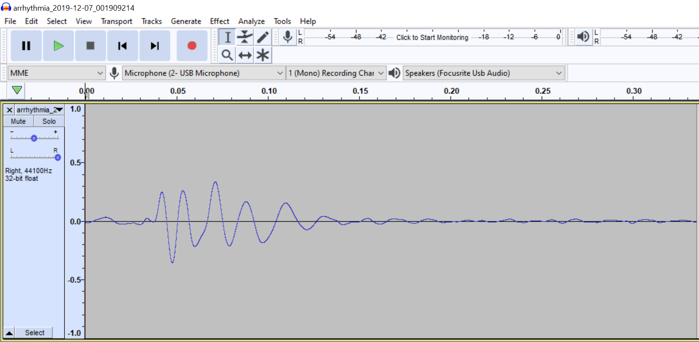
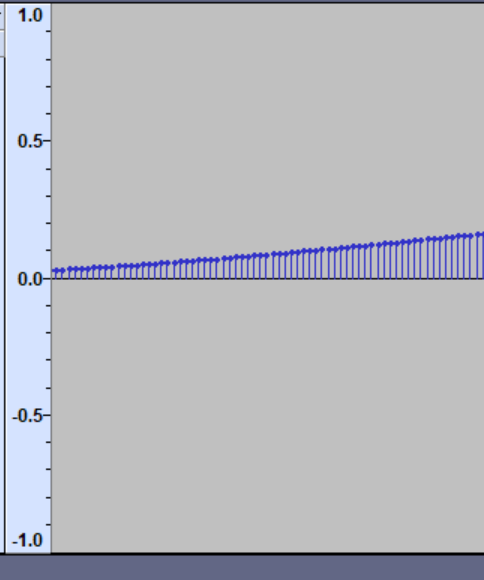

# Methods of making noise

## Samples

> a snippet of a .wav file open in audacity

A sample is exactly as the name implies- a 'sample' of audio. Sample is a pretty broad term though, so usually some more terms are applied to help categorize them. The easiest to explain is what is usually meant by sample: a small audio file that contains one sound, like one drum hit or one piano key press. These can either be samples made or collected for the sole purpose of use in later music (like hitting record, playing one drum hit, then stopping, to create a small drum sample) or a sample lifted (with often dubious legality) from another recording. It's worth noting that fair use is really not something you can rely on here, but it's also pretty common. #notlegaladvice

The next kind of sample worth looking at is a loop. These are longer and are usually, well, loopable. If you play them on repeat they typically sound continuous. Often these will be of drums or guitar. The term 'loop' is often used broadly for audio snippets of this length though, so not all loops loop. Usually when using a loop it's best to do some mangling, swapping some beats or putting on destructive effects to transform it in some way. This prevents your audio from just sounding like layered tracks from another artist mashed together and is a good way to put creativity into what you make.  

Another term you might hear are stems. Stems are just separate recordings of each part of a song - say the vocals as one audio file and the drums as another, these would make up the stems. 

> Zoomed in view of the snipped, showing the individual points in the sample

Samples are also, sort of ironically, made of samples. But these words mean two different things in that sentence. The sample of sound is made up digitally of a bunch of different points in a wave, usually captured ~44 thousand times a second- whatever the sampling rate is (commonly 44.1, 48, or 96 <a class="ptr">(1)</a>). This is what gives us the image above, where the originally pretty smooth looking wave, when zoomed in, we can see is made of these discrete points. This is particularly relevant to making music for multiple reasons: 

* When change the speed/pitch by a non integer value, we have to 'interpolate' extra points into this.
* When we slow down or make a sample lower pitch there's only so much data to use, at really low pitches the wave will start to sound sort of low-fi
* When chopping a sample to start playback at any point, we want to chop at a 0-crossing to avoid a sharp transition (which equates to high pitch sound)

<ol hidden id="footnotes">
    <li>The Nyquist-Shannon Sampling Therom <a href="https://en.wikipedia.org/wiki/Nyquist–Shannon_sampling_theorem">(Wikipedia)</a> , put very basically, just says your sampling rate needs to be twice as high as the highest frequency in your source to be reproduced exactly. Because human hearing ranges roughly from 20 to 20khz, sampling at 40khz or above should be sufficient. Unfortunately, there's more too it than that, especially as generating waves in a virtual synth can benefit in sound quality for various reason from 'oversampling' - running above 44.1 or 48khz. Unfortunately, the higher the sampling rate the more work the computer has to do.
    </li>
</ol>

> Bitwig Studio's Sampler. Here pitch tracking is enabled, making it so the sample can be played sped up or slowed down to pitch chromatically along the keyboard. Bitwig's Sampler is pretty similar to many other samplers in other DAWs like Ableton Live or modules like Simpliciter In VCV rack

Here, we're looking at the sampler device in in Bitwig Studio, though most of this should be similar in other software. Starting with the obvious, the sample wave form in the middle. Here I have loaded a sample ([TODO, new picture, .wav]) which has multiple drum sound in it, but I've zoomed in on one sample and placed these yellow flags to denote the start an end points. Bitwig's sampler, like many others, will try to snap these points to aforementioned zero crossings.  You'll also see next to the file name that the keyboard icon is blue and says 100% and next to that the root is set to C3. This means that if I play the C3 key on my keyboard it will play the sample as is, but if I play a different key it will slow playback down or speed playback up to match the pitch to the key I'm playing. The root being C3 is because, say I hit and recorded the A4 key on my piano- it's nice to be able to correct for the pitch of the sample in the keyboard tracking.

Still in the same section of the window but at the bottom now you'll see two icons for the flags with '[TODO]' time between them and after them, these are the times in the sample where the start and end flags are placed. Left of that you'll also see an arrow with an R over it, that's the button to tell it you want to play the sample in reverse.

[TODO, a lot to go here]

> 'Simpliciter' module in VCV rack, a sampler with transient detection, Sound On Sound (SOS) looping, and variable speed (pitch) playback

start, stop, fade, pitch shift, (ableton simpler)Live Input

quantization, tracking

## Wavetables

## FM Synthesis

> [Source (Likely originally from the Yahmaha DX7 Manual)](https://scsynth.org/t/coding-fm-synthesis-algorithms/1381)

Frequency Modulation or FM, is just the simply when you let the output of one oscillator modulate the frequency of another oscillator. Usually this is done in simple ratios and, ideals, uses linear, through zero modulation.

First, Let's start with linear vs exponential FM. It's worth noting that most pitch tracking is exponential since our music system itself is inherently exponential (each octave is a doubling, that is the frequency between C5 and C4 is twice the frequency between C3 and C4). This causes a problem though, if we modulate with exponential FM, say with a sine wave that is +/- 1V (2Vpp) and we start with an A4 at 440hz, then we'll swing up to 880hz and down to 220hz. Fine right? Not so much. If this modulation is meant to simply give us a more harmonically interesting A as we mix in different octaves that won't be the effect, as now we're (to oversimplify) at 880hz half the time and 220hz half the time, and if we average those $\frac{880+220}{2}$ then we don't still get the original A 440hz but rather we get 550Hz, so, we've detuned. Linear FM won't be able to follow the V/Oct standard (though some may use the Hz/V standard) but will keep you in tune as you modulate. This, however, begins to pose a more interesting problem. Imagine you want to modulate a 100hz signal by +/- 200hz. Clearly, that would mean going as high as 300hz, but what happens when we get past the first half of that negative signal and hit 0hz? Well, this is where having a Though Zero FM (TZFM) capability comes in handy, as this issue is solved sonically by actually inverting the phase of the signal when crossing the 0Hz point. While this may seem an odd solution, it does produce sounds that line up with what our ears expect.

Exponential FM and V/Oct, assuming the same scaling, are the same thing though so sometimes you can actually view it more as a second V/Oct input. For example, you could use the Exp FM input to specify the note, and then the normal V/Oct input to change the octave. Of note however, this may not always work as the Exp FM input may be AC coupled, meaning that DC values, like note data, will not be able to get through and instead you'll just hear a "ping" as the pitch is modulated at the cutoff of the AC coupling filter, in these cases the Exp FM input will have a minimum frequency that the input signal can oscillate at to perform properly. 

When talking about Linear FM, I mentioned that simple ratios are best. This isn't entirely true, but they will produce the least complicated harmonics. For example taking

[Todo, Why simple ratios]

[Todo, Algorithms]

## Granular Synthesis

textures