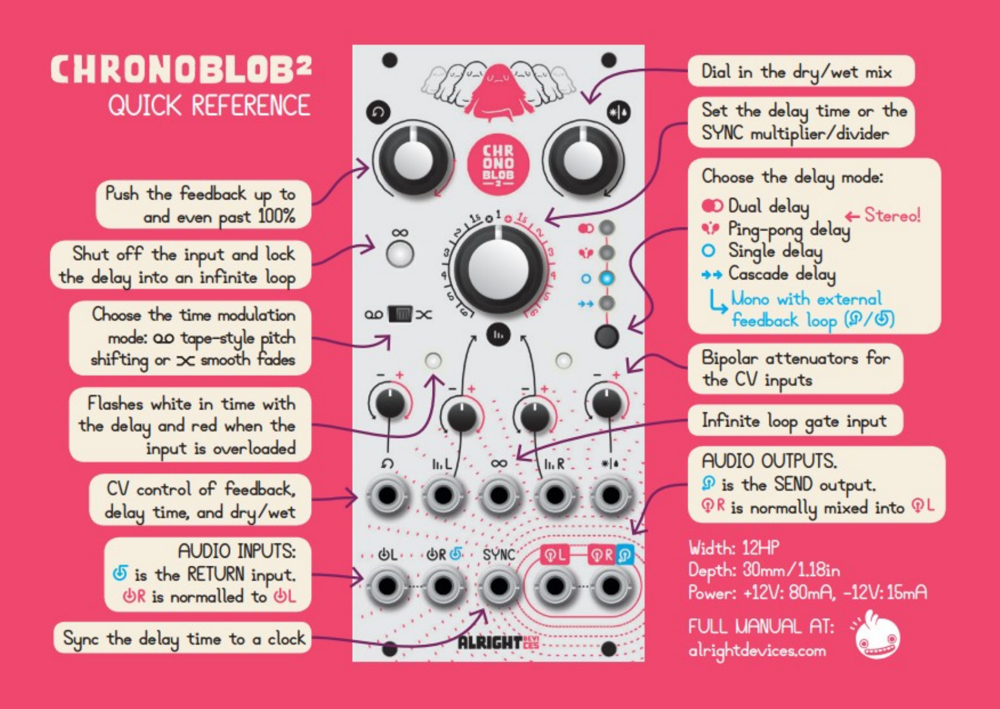
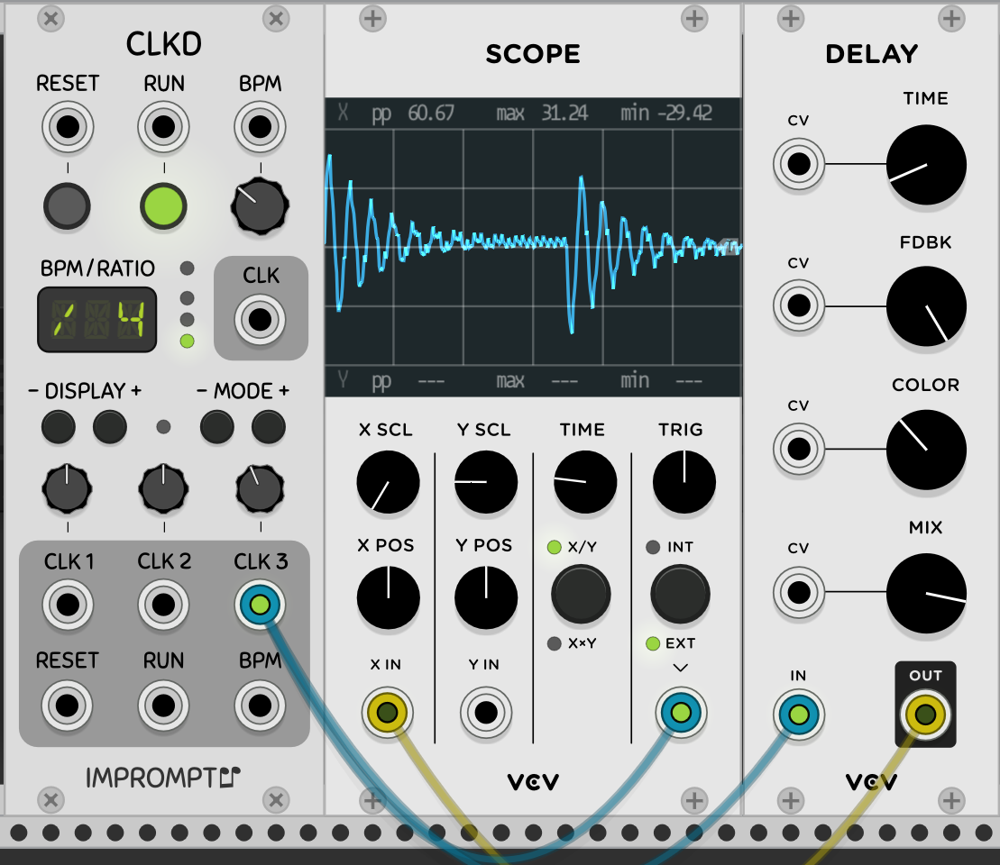
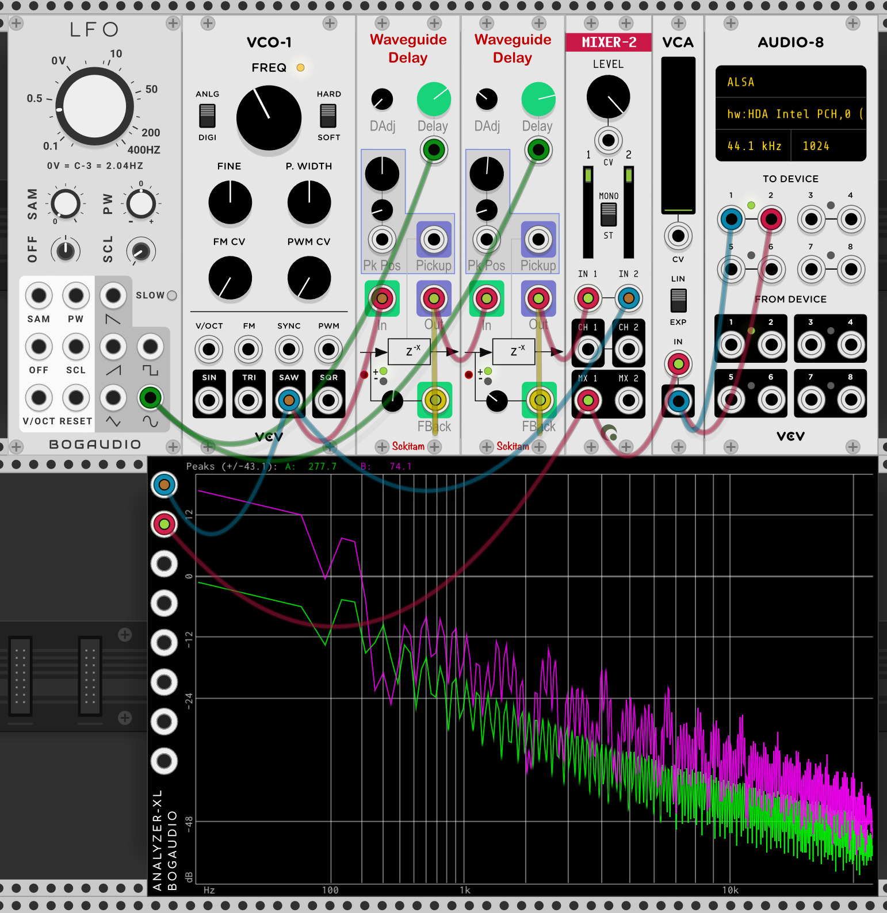
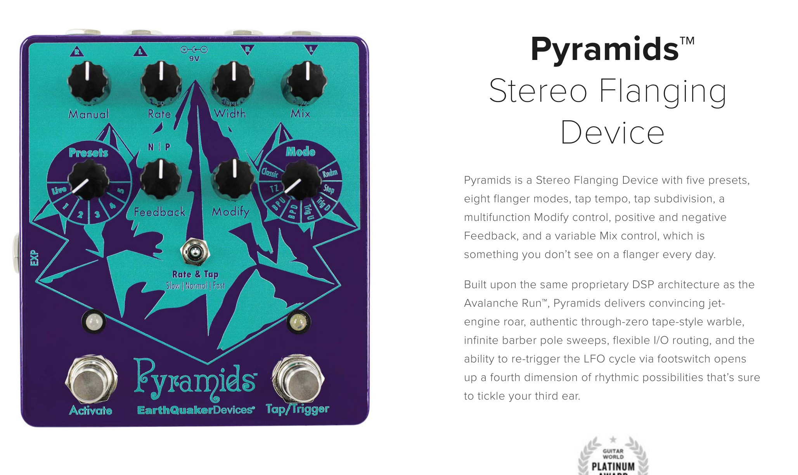

# Audio Effects

## Tremolo

This is probably the easiest to understand audio effect. Put simply, fade the volume in and out automatically, usually pretty fast and with a bias so that the volume never completely cuts. It can also refer to a playing style where the same note is struck rapidly, leading to a similar effect. In VCV this can be done as simply as hooking up an LFO to a VCA's CV input like we did here, but turning up the frequency of the LFO-2 module (note, that here there is no bias so the volume does actually cut out):

## Vibrato

Vibrato as an effect requires pitch shifting, which I suppose actually makes it akin to FM synthesis as described above, regardless, it's as simple as applying a, typically subtle, pitch 'wobble' into the sound. On a guitar this may be done with a pedal but more simply just by bending the string back and forth with the fingers.

## Delay

Delay is basically echo. Take a sound in, and repeat it it it. Normally the main controls on a delay are 'Time', which controls how long of a delay there is before each repeat, 'Feedback' which controls how much the level is reduced each time the delay repeats (and in turn, how many audible repetitions there are), and 'Dry/Wet' which controls how the signal is blended, entirely dry will have no delay, entirely wet may even miss the initial sound adding a weird latency before you hear what you're playing. Some delays have additional controls, obviously I can't cover every possible delay, but I'll try to cover most:

Some delays instead of letting you set a delay time or 'tap' a delay tempo in actually synchronize to a clock signal input which lets the delayed repetitions always be in time with the rest of the song.

Stereo delays many have additional controls as well, most commonly offering a different delay time for the left and right channels. often a 'Ping Pong' mode will also be available where the left and right speaker alternate for the echo'd sound- 'ping' and 'ponging' out each side until the sound cuts out.

Some delays may also allow for unity or higher feedback, which will cause the delay to be infinite or, if above unity, infinitely grow in volume until it's just a distorted clipping mess. This can actually be a lot of fun to play with.

> Quick Reference Card for the Chronblob^2 from Alright Devices, http://docs.alrightdevices.com/chronoblob2-manual.pdf 

Some delays let you also insert other things into the feedback path. This means you could do things such as having each repetition be progressively more filtered, cutting out more and more high end each time or putting a delay in the delay. (yo dawg, I heard you like delay?).

Some digital delays and most analog delays (especially bucket brigade delays[^BBD]) can produce interesting sounds if you change the delay time while audio is going through the buffer, resulting in a sort of pitch shift *whip* sound as the delay catches up or slows down.

[^BBD]: Bucket Brigade Delay is essentially a bunch of capacitors acting as the 'buckets' that are figuratively passed down the chain, moving from one bucket to the next each clock cycle, of course, this clock rate can be changed while it's running. The number of stages in a BBD determines how long of a delay you can get without having a massive determent to quality.

While not strictly something to do with delay, it's also worth noting that by making delay time very short and having gain near unity, sending a brief trigger (impulse) can make a sound that sounds like a string being plucked. This is called [Karplus-Strong Synthesis](https://en.wikipedia.org/wiki/Karplus–Strong_string_synthesis).

> Karplus-Strong Synthesis in VCV rack

Finally, it's worth noting that there are a few interesting features some delays may have, such as letting the delay buffer be frozen to infinitely repeat what was playing at the time (unity gain, ignore input), reverse'd delay - having the initial sound play forward but each repeat play in reverse, pitch shifted delay- having each delay affected by a pitch shift, often done with octave up/down. Often, this pitch shifting is done via Granular Synthesis, as mentioned above. Using granular synthesis does allow for some other interesting options though, such as [Unfiltered Audio's Sandman Pro VST](https://www.unfilteredaudio.com/collections/plug-ins/products/sandman-pro).

> Screenshot of [Eventide's Quadravox VST](https://www.eventideaudio.com/products/effects/diatonic-pitch-shift/quadravox), with pitch shifted delays

## Loopers

Loopers are most commonly seen in hardware and can be seen as a sort of mix between samplers and delays. Essentially you just tap in when you start playing, play what you want, then tap out, then, the loop of whatever you played will play back to you. There may be additional settings, such as a half speed effect.

## Filters (LP, HP, BP, Notch)

https://www.perfectcircuit.com/signal/learning-synthesis-filters

### Low Pass Filters

Low Pass filters do what you think, they let the low frequencies pass and cut out the high frequencies. As with most filters, this will typically not be a sharp cutoff but instead be a gradual fading of the higher frequencies. Despite this, there is still a point called the cut off frequency, which is defined as the point where the signal is cut by 3db (what this means is discussed below). It's also pretty common for Low pass filters to have some resonance, where the frequency right at the cut off has a bit of a bump, as can be seen in this gif:

#### Slew Limiting

#### Effect on Square Waves

#### Low Shelf Filters

### High Pass Filters

High pass filters act pretty much the same as low pass filters, except they do they cut the lows and pass the highs. High pass filters are ironically often actually used to give a bump in the bass using the resonant peak.

### Band Pass Filters

There's two kinds of bandpass filters, one, is a Lowpass and Highpass filter in series, where there's only a band left that can pass giving two potential resonant peaks, and then theres band pass filters which are more 'true' band pass filters that have a resonant peak in the middle.(need to confirm this)

### Notch Filters

Again, as the name implies, notch filters create a notch in the sound. Often used to correct for an issue in the sound, such as removing a 60hz hum. In Notch filters the resonance control actually changes how steep the notch is, so low resonance (Low Q) will cause the notch to be wider as the slope isn't very steep, but a high resonance (Q) will let you really pick out a specific frequency.

### Comb Filters

### All-Pass Filters (Phaser)

### Types of Filters

#### State Variable (Steiner-Parker)

#### Transistor Ladder

#### Diode Ladder

#### Sallen-Key

#### Operational Transconductance Amplifiers (OTA Filters)

CEM3320

#### Chebbychev

#### SEM

#### Wasp

#### Formant Filters

#### Polivoks

### Slope, Pole-Zero plots, dB

different analog models

### Filter Resonance (Q)

#### Pinging Filters

#### Self Oscilation

### AutoWah

## Equalizers

### Parametric

### Fixed Filter Banks

## Phaser

## Flanger

Flanger works by taking a **very** short delay* which slowly modulated delay time and mixing this back with the original signal. This will result in some phase cancellation effects and give a similar sound to a phaser. The delay time modulation rate and depth, and delay feedback are the most commonly exposed controls. Flanger is probably most commonly used as an effect on guitar.

*note, that delay, in this context, means an actual time delay, just a buffer that makes sound take longer to get through if that makes sense. Of course, with feedback and mixing the original this will have the same effect as a delay in the 'echo' sense.

> Flanger sort of makes a comb filter sound too, as you can see in the Spectrum Analyzer on the bottom.

> The '[Pyramids](https://www.earthquakerdevices.com/pyramids)' Flanger pedal from Earthquaker Devices.
> 

## Chorus

## Reverb

plate, room, spring, gated, erbe verb video, convolutional, delay line + allpass, hearing comb filters

## Distortion

[How Distortion Works in Music (Ben Sheron's Blog)](https://benmosheron.gitlab.io/blog/2020/04/26/distortion.html)

### Clipping (Soft & Hard)

### Waveshaping

### Wavefolding

#### Parallel V Serial Wavefolding

### Drive, and Tubes

### Bitcrushing & Comparators

[Todo, fabfilter distortion video]

## Stereo Effects

### Panning

### Widening

## Noise Gating

## Limiting

## Compression

<audio
    controls
    src="{static}/audio/Compression.mp3">
        Your browser does not support the
        <code>audio</code> element.
</audio>
Compression can mean multiple things when talking about music and sometimes this makes talking about it sometimes confusing. Usually, when talking about compression the meaning is for compression that changes the *dynamics* of the audio, making loud sounds quieter and quiet sounds louder sort of ~squishing~ the sound. The other, unrealetd, definiton of compression is data compression, for example .mp3 vs .wav. We'll go into that later.

Usually compression has a few basic attributes that are relevent:

The 'Threshold' is what level the compressor has to be over to do anything at all. 'Attack' is the time it takes for the signal to be affected. All compressors will have some minimum attack time if they're happening live (there are some compressors with 'Lookahead' that solve this problem) which lets the transients (sharp changes) of louder sounds, like the start of a drum hit, get through to some extent, but more attack will let more of the drum transient through. Tune to taste, release is similar idea, but controls how the compressor behaves as it falls below the treshold, letting the compressor fade out with a given time instead of having a sharp cut. Compressors can be used to make drums really stand out, give guitars a longer sustained sound, or just glue the mix together better.

[Todo, add fabfilter guy video] 

[Todo, Dynamic range compression, Parallel Compression, different analog models (ie Fets)]

reverb, delay, pan, tremello, overdrive, distortion

## Vocoders

## Glitch, Granular, and Pitch