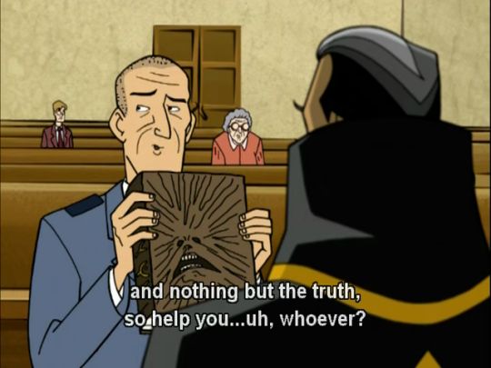

# Religion

The engineering community is strangely divided, the 'old guard' is actually relatively conservative and professional, but as time has moved forward it's quite the opposite. Unsurprisingly, this correlates with religion as well. The main way this plays into politics is a general hard stance for the separation of church and state. This is in part due to a past of religiously motivated legislation negatively impacting copyright law, but also just generally an understood ideal that is beneficial to democracy. Furthermore, it would probably be worth your time to look into basics of most world religions, as engineering is increasingly a global field where you will have no choice but to work with people from diverse backgrounds across the globe.

[TODO] Taxing it