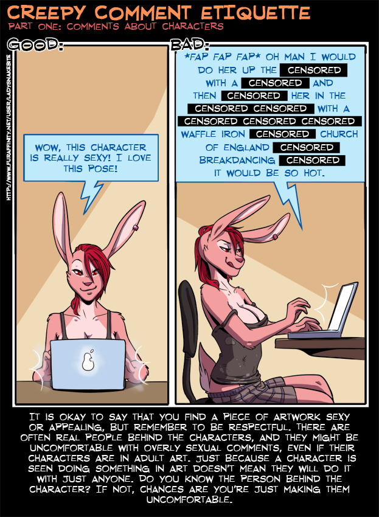

# Sex

In an ideal world human kind would be driven forward by more than the initiate desire to reproduce and bone. Then again, if it weren't for that we wouldn't have evolved to this point where we're capable of reflecting on that irony, in the first place.

## Consent

Coersion by econominc and social pressure, unwanted arousal

## Sex Work and Porn

## Pro-Choice Vs Pro-Life

> I am so tired of this abortion debate and hearing people treat it like a political issue instead of a deeply-personal, medical decision that men and women have to decide under horrible, tragic, heart-breaking circumstances. My husband and my son have long assumed that I'm pro-choice. I've never corrected them, but I'm not exactly. My mother, co-workers and some of my friends have assumed I'm pro-life. I'm actually not pro-life either. I am simply pro-reasonable.
>
> I'm a child custody attorney, who is now also seeing the tragedy of the Juvenile Court system on a regular basis too. I'm seeing what happens to the kids the parents don't want, and yes, there are many who are not wanted by either parent. I represent men and women who are forced to pay child support and do not get to see their children, or rarely see their children. I was also a young girl faced with an unexpected pregnancy more then once, and carrying a baby that I couldn't financially support.
>
> So, here are a few of the societal/legal facts leading to abortion, and preventing all these babies from going to adoptive families: All methods of birth control have failure rates. Teenagers, and especially those raised in conservative households, do not have easy access to birth control. Expecting teenagers not to have sex is not practical. The State can make either or both parents pay child support even if they don't have custody or parenting time with their children. Parenting time/custody are not legally connected to a parent's obligation to pay child support. You can't just agree to give up your parental rights to get out of paying child support. The only way to do that is with an adoption or step-parent adoption. Nebraska's Safehaven law only protects the parents from criminal prosecution for neglect and abandonment, not from paying child support. Both parents have to agree to an adoption. There is a birth father registry list in Nebraska that allows fathers to register to claim a baby born to the woman whose name he provides (and if he does this a woman giving up her baby for adoption could find herself paying him child support). State aid isn't as easy to come by as most people think and most of us would not want to live on it. Rape, incest, and pregnancy in girls under fifteen still happen. Babies die in utero, and sometimes must be removed from the womb. Sometimes a mother cannot carry a baby to term without endangering her life.
>
> If you really, truly want to reduce the abortion rates, then here's what it's going to take: First, end the abstinence-only sex ed in schools. Give teenagers real facts. Make birth control free and readily available to EVERYONE. Allow both parents (and either parent) to give up their legal rights AND avoid paying child support (but make it a final decision). If only one parent gives up the rights, provide adequate State support to make up for the loss of parental support from the other. (This would mean that one parent would have less incentive to try to force the other parent to have an abortion.) If both parents give up their rights, make the adoption process easier and less expensive. If parents choose to keep the baby, instead of having an abortion (which they otherwise would have had because they couldn't afford the baby), help them financially and provide them with daycare so they can work. Allow regular medical doctors to perform abortions without stigma for those pregnant women who have been victims of rape or incest, who are under fifteen, who are at risk of dying if they carry the baby to term, or who have already lost the baby in utero. Keep the protesters away from the women and the doctors.
>
> Unless we're willing to do this as a society, and put our money where our mouths are, then we don't get to decide what men and women facing this very personal, very tragic decision choose. If we do want to stop abortion, then put the ugly aborted-fetus posters down and go financially support a teenage mother, go lobby to provide birth control to teenagers, or go ask your own teenage son or daughter if he or she needs birth control. Do something useful, and be reasonable.

Frankly, I think that sums it up pretty well, and truth be told I don't think I really have a right to say more than that.

## Birth Control


## Gender


> Img credit, Kokofox @ https://kokoscript.com/

The 'Hacking' community in particular is usually very clear on sexual liberation/freedoms and given that technically minded people tend to have statistically significantly higher amounts of LGBTQIA+ people, it's relevant to mention. I don't want to go in depth or be your source of sex education, but I do think skipping over this would be doing the community some injustice. As such I'd also like to link to some videos providing sexual education, [The truth about unwanted arousal | Emily Nagoski , YouTube](https://www.youtube.com/watch?v=L-q-tSHo9Ho&list=FLFMnqfaTa1se1LfbCB3peJQ&index=103&t=0s)

```
TypeError:
no implicit conversion of Gender into Boolean
```


## Other Resources

[](https://www.ohjoysextoy.com/category/comic/education-comic/page/3/)

> [ohjoysextoy.com](https://www.ohjoysextoy.com/category/comic/education-comic/page/3/)
>
> As a Furry myself I do reccomend: https://www.ohjoysextoy.com/furry/



> by LadySnakeBite on FurAffinity
>
> I also reccomend: [A Handy Guide To Internal Shots (VERY NSFW)](https://www.furaffinity.net/view/23502635/) by her, which is a rant on art feautring cervix penetration.

